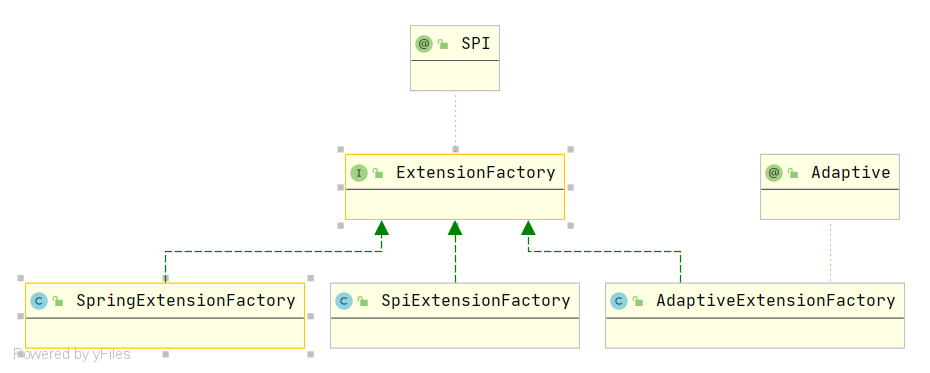
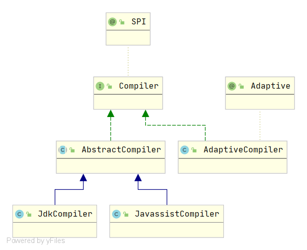
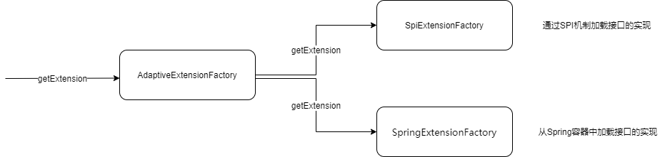
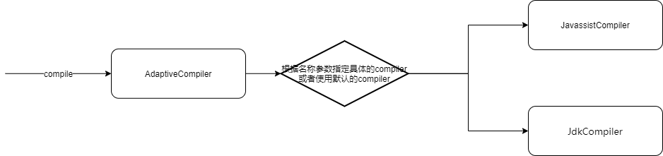
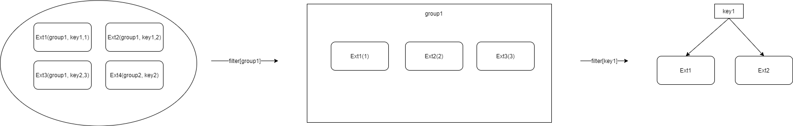

# 1. JAVA SPI的不足

- 需要遍历所有的实现，并实例化，然后我们在循环中才能找到我们需要的实现。
- 配置文件中只是简单的列出了所有的扩展实现，而没有给他们命名。导致在程序中很难去准确的引用它们。
- 扩展如果依赖其他的扩展，做不到自动注入和装配。
- 不提供类似于Spring的IOC和AOP功能。
- 扩展很难和其他的框架集成，比如扩展里面依赖了一个Spring bean，原生的Java SPI不支持。

# 2. Dubbo SPI基本概念

为了解决Java SPI的不足，满足自身框架的要求。Dubbo参考Java SPI，提出了Dubbo SPI机制。

Dubbo SPI机制涉及到概念如下（可以类比Java SPI来理解）：

- **扩展点（Extension Point）**

  extension interface (SPI接口)。

- **扩展（Extension Class）**

  extension class (SPI接口的实现类)。

- **扩展实例（Extension Instance ）**

  extension class instance (SPI接口实现类的实例)。

- **自适应扩展 (Adaptive Extension Class)**

  SPI接口的自适应扩展实现类

- **自适应扩展实例(Adaptive Extension Instance)**

  自适应扩展实例

- **@SPI**

  @SPI注解作用于扩展点的接口上，表明该接口是一个扩展点。可以被Dubbo的ExtensionLoader加载。如果没有此ExtensionLoader调用会异常。

- **@Adaptive**

  作用于类型或方法上，为注入依赖扩展实例提供有用信息。

- **ExtentionLoader**

  类似于Java SPI的ServiceLoader，负责扩展的加载和生命周期的维护。

- **扩展别名**

  和Java SPI不同，Dubbo中的扩展都有一个别名，用于在应用中引用它们。比如：

  ~~~
  random=com.alibaba.dubbo.rpc.cluster.loadbalance.RandomLoadBalance
  roundrobin=com.alibaba.dubbo.rpc.cluster.loadbalance.RoundRobinLoadBalance
  ~~~

  其中的random，roundrobin就是对应扩展的别名。这样我们在配置文件中使用random和roundrobin就可以了。

- **一些路径**

  和Java SPI从/META-INF/services目录加载扩展配置类似，Dubbo也会从以下路径去加载扩展配置文件：

  - META-INF/dubbo/internal
  - META-INF/dubbo
  - META-INF/services

# 3. 扩展点注解：@SPI

@SPI注解可以使用在类、接口和枚举上，Dubbo框架中都是使用在接口上。它的主要作用就是标记这个接口是一个Dubbo SPI接口，即是一个扩展点，可以有多个不同的内置或用户定义的实现。运行时需要通过配置找到具体的实现类。

SPI注解有一个value属性，通过这个属性，我们可以传入不同的参数来设置这个接口的默认实现类。

# 4. 扩展点自适应注解：@Adaptive

接口有多个实现，在运行时如何选择某个实现，需要一种机制来操作。Dubbo的自适应机制就提供了此功能，通过将@Adaptive注解作用于类型或方法之上，使得可以在运行时根据相关的条件选择出正确的接口实现。

## 4.1. 作用于类型上

SPI接口的实现类通过@Adaptive注解后，表示此类是此SPI的自适应扩展，其作用是用于获取SPI的扩展。也就是说自适应扩展通常无具体的功能，而是用于获取SPI的扩展。

Dubbo的源码中AdaptiveExtensionFactory和AdaptiveCompiler是用@Adaptive注解的两个类，这两个类就是相对应的SPI接口的自适应扩展。

### AdaptiveExtensionFactory和AdaptiveCompiler

 **1. AdaptiveExtensionFactory**

类图如下：

**2. AdaptiveCompiler**

类图如下：

从上面的类图可以看到，SPI的自适应扩展和SPI的扩展一样也实现了SPI接口。也就是说用@Adaptive注解的SPI实现类是一种特殊的SPI扩展。既然是也属于SPI接口的实现，那么类的加载也就需要符号Dubbo SPI机制的路径规定，同样的需要像普通的SPI扩展一样进行配置。以AdaptiveExtensionFactory的配置为例，配置如下：

/META-INF/dubbo/internal/org.apache.dubbo.common.extension.ExtensionFactory

~~~
spring=org.apache.dubbo.config.spring.extension.SpringExtensionFactory
adaptive=org.apache.dubbo.common.extension.factory.AdaptiveExtensionFactory
spi=org.apache.dubbo.common.extension.factory.SpiExtensionFactory
~~~

通过ExtensionLoader进行SPI扩展加载时，对于标记有@Adaptive的SPI扩展类，会将其识别为SPI自适应扩展，然后缓存到cachedAdaptiveClass属性中（extension class缓存到cachedClasses映射中），cachedAdaptiveClass是一个单一属性，Dubbo SPI机制规定了对于SPI接口，只能有一个自适应扩展，也就是说SPI接口的实现类只能有一个被标记为@Adaptive，如果出现多个，那么在加载实现的时候就会抛出异常：More than 1 adaptive class found。

**3. AdaptiveExtensionFactory执行原理**

**4. AdaptiveCompiler执行原理**

如果说AdaptiveExtensionFactory的执行看不出来根据条件选择SPI实现，那么从AdaptiveCompiler的执行上就可以看到根据条件选择不同的实现的功能，也就是说自适应功能。

**5. 小结**

@Adaptive作用于类上，表明这个类是SPI接口的自适应扩展，在编译期指定SPI的自适应扩展，其无具体的业务功能，旨在提供自适应功能，也就是根据具体的条件选择SPI的扩展（extension class）。

## 4.2. 作用于方法上

### 4.2.1. 通过示例学习方法上的@Adaptive注解的使用

示例类代码如下：

~~~java
@SPI("dubbo")
public interface MyProtocol {

    void print();

}

public class MyDubboProtocol implements MyProtocol{

    public void print() {
        System.out.println("Dubbo Protocol.");
    }

}

public class MyHttpProtocol implements MyProtocol {

    public void print() {
        System.out.println("Http Protocol.");
    }

}

public class MyProtocolTest {

    public static void main(String[] args) {
        MyProtocol myProtocol = ExtensionLoader.getExtensionLoader(MyProtocol.class).getAdaptiveExtension();
        myProtocol.print();
    }

}
~~~

配置代码：

~~~
dubbo=org.mini.dubbo.common.MyDubboProtocol
http=org.mini.dubbo.common.MyHttpProtocol
~~~

#### a. 自适应方法上需要@Adaptive注解

运行MyProtocolTest测试类，执行异常，异常信息如下：

~~~
No adaptive method exist on extension org.mini.dubbo.common.MyProtocol, refuse to create the adaptive class!
~~~

提示的是MyProtocol上没有adaptive方法。想要方法自适应那么就需要指定自适应方法。上面的print方法加上@Adaptive注解。

~~~java
@SPI("dubbo")
public interface MyProtocol {

	@Adaptive
    void print();

}
~~~

#### b. 自适应方法需要有类型为URL的参数或者是其中属性是URL的参数

继续运行MyProtocolTest类，执行异常，异常信息如下：

~~~
Failed to create adaptive class for interface org.mini.dubbo.common.MyProtocol: not found url parameter or url attribute in parameters of method print
~~~

生成的自适应类中，自适应方法需要有自适应能力，也就是可以根据相关的条件选择MyDubboProtol还是MyHttpProtocol，那么需要就判断依据，对于方法来说判断依据就是方法的参数，Dubbo框架要求和使用Dubbo的URL类型参数来进行条件选择判断。

参数的设置有两种方法：

第一种：添加URL类型的参数。

~~~java
@SPI("dubbo")
public interface MyProtocol {

	@Adaptive
    void print(URL url);

}
~~~

第二种方法：添加属性有URL类型的对象参数。

~~~java
public class MyPara {

    private URL url;

    public URL getUrl() {
        return url;
    }

    public void setUrl(URL url) {
        this.url = url;
    }

}

@SPI("dubbo")
public interface MyProtocol {

    @Adaptive
    void print(MyPara myPara);

}

~~~

#### c. 自适应测试

通过上面的测试，最终整个代码如下：

~~~java
@SPI("dubbo")
public interface MyProtocol {

    @Adaptive
    void print(URL url);

}

public class MyDubboProtocol implements MyProtocol{

    public void print(URL url) {
        System.out.println("Dubbo Protocol.");
    }

}

public class MyHttpProtocol implements MyProtocol {

    public void print(URL url) {
        System.out.println("Http Protocol.");
    }

}

public class MyProtocolTest {

    public static void main(String[] args) {
        URL url = new URL("d", "127.0.0.1", 80);
        MyProtocol myProtocol = ExtensionLoader.getExtensionLoader(MyProtocol.class).getAdaptiveExtension();
        myProtocol.print(url);
    }

}

~~~

测试输出如下：

~~~
Dubbo Protocol.
~~~

@SPI注解中指定了默认的扩展为dubbo，这里输出了MyDubboProtocol实现，测试正确。现在，想要使用MyHttpProtocol，该如何做？根据上面运行的错误提示，方法参数必须有URL信息，那么就可以猜测，Dubbo SPI机制中对于方法自适应是通过URL中的信息来操作的。

这里直接给出使用MyHttpProtocol实现的测试方法：

~~~java
public class MyProtocolTest {

    public static void main(String[] args) {
        URL url = new URL("d", "127.0.0.1", 80);
        url = url.addParameter("my.protocol", "http");
        MyProtocol myProtocol = ExtensionLoader.getExtensionLoader(MyProtocol.class).getAdaptiveExtension();
        myProtocol.print(url);
    }

}

~~~

可以看到上面加了一行代码：

~~~java
 url = url.addParameter("my.protocol", "http");
~~~

my.protocol是参数名，这个参数的参数值是http，这样书写之后，就使用了MyHttpProtocol实现，说明Dubbo SPI方法自适应内部是使用的这个参数来进行SPI实现的选择判断。为什么是my.protocol这个名称？内部需要通过一个参数来判断，我们没有显示指定，那么就需要有一个默认的，默认参数名的生成规则就是：

~~~java
 String splitName = StringUtils.camelToSplitName(type.getSimpleName(), ".");
~~~

还可以通过@Adaptive的value数组显示指定，查找规则就是依次判断是否存在：

~~~java
@SPI("dubbo")
public interface MyProtocol {

    @Adaptive("selection")
    void print(URL url);

}

public class MyProtocolTest {

    public static void main(String[] args) {
        URL url = new URL("d", "127.0.0.1", 80);
        url = url.addParameter("selection", "http");
        MyProtocol myProtocol = ExtensionLoader.getExtensionLoader(MyProtocol.class).getAdaptiveExtension();
        myProtocol.print(url);
    }

}
~~~

### 4.2.2.	示例自适应扩展的源代码

~~~java
MyProtocol myProtocol = ExtensionLoader.getExtensionLoader(MyProtocol.class).getAdaptiveExtension();
~~~

上面示例中，myProtocol就是自适应扩展的实例。Dubbo内部会为MyProtocol SPI接口生成一个自适应扩展类，类的源代码如下：

~~~java
public class MyProtocol$Adaptive implements org.mini.dubbo.common.MyProtocol {

    public void print(org.apache.dubbo.common.URL arg0)  {
        if (arg0 == null)
            throw new IllegalArgumentException("url == null");
        org.apache.dubbo.common.URL url = arg0;
        String extName = url.getParameter("selection", "dubbo");
        if(extName == null)
            throw new IllegalStateException("Failed to get extension (org.mini.dubbo.common.MyProtocol) name from url (" + url.toString() + ") use keys([selection])");
        org.mini.dubbo.common.MyProtocol extension = (org.mini.dubbo.common.MyProtocol)ExtensionLoader.getExtensionLoader(org.mini.dubbo.common.MyProtocol.class).getExtension(extName);
        extension.print(arg0);
    }

}
~~~

# 5. 扩展点自动激活注解：@Activate

扩展点的扩展实现通常有很多，获取某个指定扩展点的其中一种方式就是根据扩展名获取。根据扩展名获取能得到唯一的一个扩展点实现，但是在有些场景下，对于某个操作需要执行多个扩展，比如说过滤功能，多个过滤器共同参与工作，而且同时对于这些过滤器的执行顺序有要求。也就是说根据某个条件获取某个或者多个扩展。因为扩展名唯一确定一个扩展，所以这时候就不能通过扩展名来操作。那么，如何操作呢？

通过分组来实现，将多个扩展分到一个共同的组，通过组来选择。

> 分组：显示得指定扩展属于哪个分组。

对分组后的扩展集，通过键关联来进行进一步刷选。

>键关联：显示得指定扩展与URL中某个参数关联，只有URL中该参数存在，则扩展为候选项。

通过上面两步操作，最终得到了条件刷选后的扩展集，然后再根据排序规则对扩展集中的元素进行排序。

> 排序：显示得指定每个扩展的order，然后在集合中通过这个order来进行排序。

整个扩展选择的流程如下：

Dubbo通过@Activate注解来指定扩展的分组、键关联和顺序信息。

> @Activate的order值越小，表示扩展的执行越靠前。

