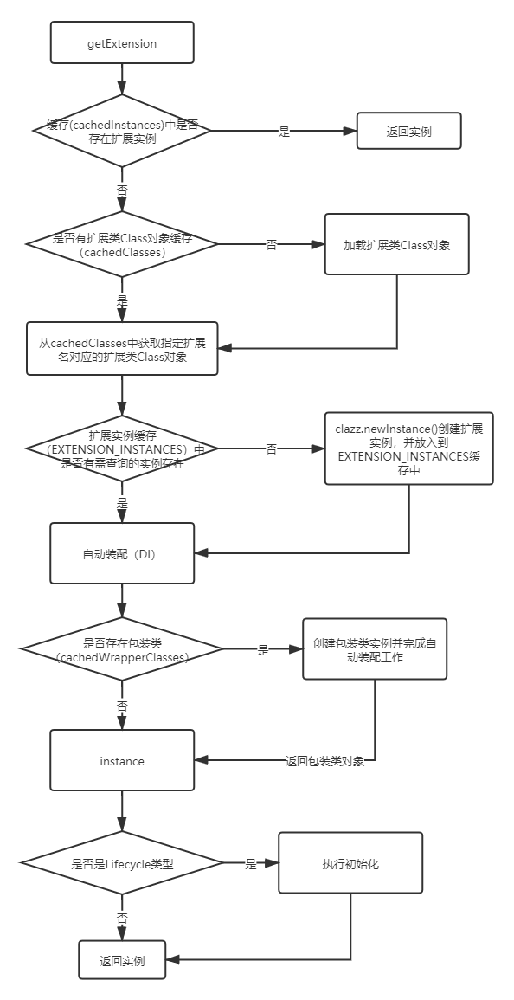
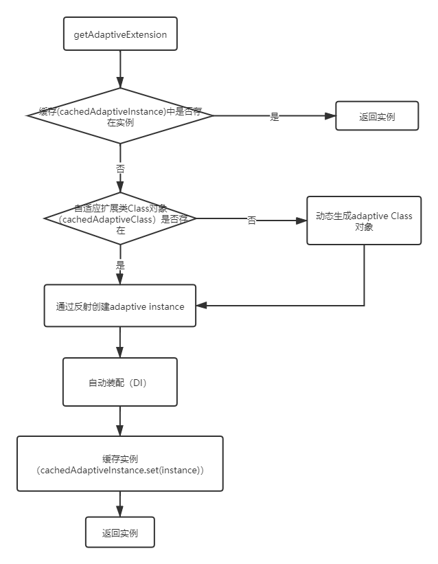

# 一、加载机制概述

## 1.1. JAVA SPI的不足

- 需要遍历所有的实现，并实例化，然后我们在循环中才能找到我们需要的实现。
- 配置文件中只是简单的列出了所有的扩展实现，而没有给他们命名。导致在程序中很难去准确的引用它们。
- 扩展如果依赖其他的扩展，做不到自动注入和装配。
- 不提供类似于Spring的IOC和AOP功能。
- 扩展很难和其他的框架集成，比如扩展里面依赖了一个Spring bean，原生的Java SPI不支持。

## 1.2. Dubbo SPI基本概念

为了解决Java SPI的不足，满足自身框架的要求。Dubbo参考Java SPI，提出了Dubbo SPI机制。

Dubbo SPI机制涉及到概念如下（可以类比Java SPI来理解）：

- **扩展点（Extension Point）**

  extension interface (SPI接口)。

- **扩展（Extension Class）**

  extension class (SPI接口的实现类)。

- **扩展实例（Extension Instance ）**

  extension class instance (SPI接口实现类的实例)。

- **自适应扩展 (Adaptive Extension Class)**

  SPI接口的自适应扩展实现类

- **自适应扩展实例(Adaptive Extension Instance)**

  自适应扩展实例

- **@SPI**

  @SPI注解作用于扩展点的接口上，表明该接口是一个扩展点。可以被Dubbo的ExtensionLoader加载。如果没有此ExtensionLoader调用会异常。

- **@Adaptive**

  作用于类型或方法上，为注入依赖扩展实例提供有用信息。

- **ExtentionLoader**

  类似于Java SPI的ServiceLoader，负责扩展的加载和生命周期的维护。

- **扩展别名**

  和Java SPI不同，Dubbo中的扩展都有一个别名，用于在应用中引用它们。比如：

  ~~~
  random=com.alibaba.dubbo.rpc.cluster.loadbalance.RandomLoadBalance
  roundrobin=com.alibaba.dubbo.rpc.cluster.loadbalance.RoundRobinLoadBalance
  ~~~

  其中的random，roundrobin就是对应扩展的别名。这样我们在配置文件中使用random和roundrobin就可以了。

- **一些路径**

  和Java SPI从/META-INF/services目录加载扩展配置类似，Dubbo也会从以下路径去加载扩展配置文件：

  - META-INF/dubbo/internal
  - META-INF/dubbo
  - META-INF/services

## 1.3. Dubbo SPI特性

- 自动加载
- 自动包装
- 自动激活
- 自适应

# 二、扩展点注解

## 2.1. 扩展点注解：@SPI

@SPI注解可以使用在类、接口和枚举上，Dubbo框架中都是使用在接口上。它的主要作用就是标记这个接口是一个Dubbo SPI接口，即是一个扩展点，可以有多个不同的内置或用户定义的实现。运行时需要通过配置找到具体的实现类。

SPI注解有一个value属性，通过这个属性，我们可以传入不同的参数来设置这个接口的默认实现类。

## 2.2. 扩展点自适应注解：@Adaptive

接口有多个实现，在运行时如何选择某个实现，需要一种机制来操作。Dubbo的自适应机制就提供了此功能，通过将@Adaptive注解作用于类型或方法之上，使得可以在运行时根据相关的条件选择出正确的接口实现。

### 2.2.1. 作用于类型上

SPI接口的实现类通过@Adaptive注解后，表示此类是此SPI的自适应扩展，其作用是用于获取SPI的扩展。也就是说自适应扩展通常无具体的功能，而是用于获取SPI的扩展。

Dubbo的源码中AdaptiveExtensionFactory和AdaptiveCompiler是用@Adaptive注解的两个类，这两个类就是相对应的SPI接口的自适应扩展。

 **1. AdaptiveExtensionFactory**

类图如下：

**2. AdaptiveCompiler**

类图如下：

从上面的类图可以看到，SPI的自适应扩展和SPI的扩展一样也实现了SPI接口。也就是说用@Adaptive注解的SPI实现类是一种特殊的SPI扩展。既然是也属于SPI接口的实现，那么类的加载也就需要符号Dubbo SPI机制的路径规定，同样的需要像普通的SPI扩展一样进行配置。以AdaptiveExtensionFactory的配置为例，配置如下：

/META-INF/dubbo/internal/org.apache.dubbo.common.extension.ExtensionFactory

~~~
spring=org.apache.dubbo.config.spring.extension.SpringExtensionFactory
adaptive=org.apache.dubbo.common.extension.factory.AdaptiveExtensionFactory
spi=org.apache.dubbo.common.extension.factory.SpiExtensionFactory
~~~

通过ExtensionLoader进行SPI扩展加载时，对于标记有@Adaptive的SPI扩展类，会将其识别为SPI自适应扩展，然后缓存到cachedAdaptiveClass属性中（extension class缓存到cachedClasses映射中），cachedAdaptiveClass是一个单一属性，Dubbo SPI机制规定了对于SPI接口，只能有一个自适应扩展，也就是说SPI接口的实现类只能有一个被标记为@Adaptive，如果出现多个，那么在加载实现的时候就会抛出异常：More than 1 adaptive class found。

**3. AdaptiveExtensionFactory执行原理**

**4. AdaptiveCompiler执行原理**

如果说AdaptiveExtensionFactory的执行看不出来根据条件选择SPI实现，那么从AdaptiveCompiler的执行上就可以看到根据条件选择不同的实现的功能，也就是说自适应功能。

**5. 小结**

@Adaptive作用于类上，表明这个类是SPI接口的自适应扩展，在编译期指定SPI的自适应扩展，其无具体的业务功能，旨在提供自适应功能，也就是根据具体的条件选择SPI的扩展（extension class）。

### 2.2.2. 作用于方法上

#### 通过示例学习方法上的@Adaptive注解的使用

示例类代码如下：

~~~java
@SPI("dubbo")
public interface MyProtocol {

    void print();

}

public class MyDubboProtocol implements MyProtocol{

    public void print() {
        System.out.println("Dubbo Protocol.");
    }

}

public class MyHttpProtocol implements MyProtocol {

    public void print() {
        System.out.println("Http Protocol.");
    }

}

public class MyProtocolTest {

    public static void main(String[] args) {
        MyProtocol myProtocol = ExtensionLoader.getExtensionLoader(MyProtocol.class).getAdaptiveExtension();
        myProtocol.print();
    }

}
~~~

配置代码：

~~~
dubbo=org.mini.dubbo.common.MyDubboProtocol
http=org.mini.dubbo.common.MyHttpProtocol
~~~

**a. 自适应方法上需要@Adaptive注解**

运行MyProtocolTest测试类，执行异常，异常信息如下：

~~~
No adaptive method exist on extension org.mini.dubbo.common.MyProtocol, refuse to create the adaptive class!
~~~

提示的是MyProtocol上没有adaptive方法。想要方法自适应那么就需要指定自适应方法。上面的print方法加上@Adaptive注解。

~~~java
@SPI("dubbo")
public interface MyProtocol {

	@Adaptive
    void print();

}
~~~

**b. 自适应方法需要有类型为URL的参数或者是其中属性是URL的参数**

继续运行MyProtocolTest类，执行异常，异常信息如下：

~~~
Failed to create adaptive class for interface org.mini.dubbo.common.MyProtocol: not found url parameter or url attribute in parameters of method print
~~~

生成的自适应类中，自适应方法需要有自适应能力，也就是可以根据相关的条件选择MyDubboProtol还是MyHttpProtocol，那么需要就判断依据，对于方法来说判断依据就是方法的参数，Dubbo框架要求和使用Dubbo的URL类型参数来进行条件选择判断。

参数的设置有两种方法：

第一种：添加URL类型的参数。

~~~java
@SPI("dubbo")
public interface MyProtocol {

	@Adaptive
    void print(URL url);

}
~~~

第二种方法：添加属性有URL类型的对象参数。

~~~java
public class MyPara {

    private URL url;

    public URL getUrl() {
        return url;
    }

    public void setUrl(URL url) {
        this.url = url;
    }

}

@SPI("dubbo")
public interface MyProtocol {

    @Adaptive
    void print(MyPara myPara);

}

~~~

**c. 自适应测试**

通过上面的测试，最终整个代码如下：

~~~java
@SPI("dubbo")
public interface MyProtocol {

    @Adaptive
    void print(URL url);

}

public class MyDubboProtocol implements MyProtocol{

    public void print(URL url) {
        System.out.println("Dubbo Protocol.");
    }

}

public class MyHttpProtocol implements MyProtocol {

    public void print(URL url) {
        System.out.println("Http Protocol.");
    }

}

public class MyProtocolTest {

    public static void main(String[] args) {
        URL url = new URL("d", "127.0.0.1", 80);
        MyProtocol myProtocol = ExtensionLoader.getExtensionLoader(MyProtocol.class).getAdaptiveExtension();
        myProtocol.print(url);
    }

}

~~~

测试输出如下：

~~~
Dubbo Protocol.
~~~

@SPI注解中指定了默认的扩展为dubbo，这里输出了MyDubboProtocol实现，测试正确。现在，想要使用MyHttpProtocol，该如何做？根据上面运行的错误提示，方法参数必须有URL信息，那么就可以猜测，Dubbo SPI机制中对于方法自适应是通过URL中的信息来操作的。

这里直接给出使用MyHttpProtocol实现的测试方法：

~~~java
public class MyProtocolTest {

    public static void main(String[] args) {
        URL url = new URL("d", "127.0.0.1", 80);
        url = url.addParameter("my.protocol", "http");
        MyProtocol myProtocol = ExtensionLoader.getExtensionLoader(MyProtocol.class).getAdaptiveExtension();
        myProtocol.print(url);
    }

}

~~~

可以看到上面加了一行代码：

~~~java
 url = url.addParameter("my.protocol", "http");
~~~

my.protocol是参数名，这个参数的参数值是http，这样书写之后，就使用了MyHttpProtocol实现，说明Dubbo SPI方法自适应内部是使用的这个参数来进行SPI实现的选择判断。为什么是my.protocol这个名称？内部需要通过一个参数来判断，我们没有显示指定，那么就需要有一个默认的，默认参数名的生成规则就是：

~~~java
 String splitName = StringUtils.camelToSplitName(type.getSimpleName(), ".");
~~~

还可以通过@Adaptive的value数组显示指定，查找规则就是依次判断是否存在：

~~~java
@SPI("dubbo")
public interface MyProtocol {

    @Adaptive("selection")
    void print(URL url);

}

public class MyProtocolTest {

    public static void main(String[] args) {
        URL url = new URL("d", "127.0.0.1", 80);
        url = url.addParameter("selection", "http");
        MyProtocol myProtocol = ExtensionLoader.getExtensionLoader(MyProtocol.class).getAdaptiveExtension();
        myProtocol.print(url);
    }

}
~~~

#### 示例中自适应扩展的源代码

~~~java
MyProtocol myProtocol = ExtensionLoader.getExtensionLoader(MyProtocol.class).getAdaptiveExtension();
~~~

上面示例中，myProtocol就是自适应扩展的实例。Dubbo内部会为MyProtocol SPI接口生成一个自适应扩展类，类的源代码如下：

~~~java
public class MyProtocol$Adaptive implements org.mini.dubbo.common.MyProtocol {

    public void print(org.apache.dubbo.common.URL arg0)  {
        if (arg0 == null)
            throw new IllegalArgumentException("url == null");
        org.apache.dubbo.common.URL url = arg0;
        String extName = url.getParameter("selection", "dubbo");
        if(extName == null)
            throw new IllegalStateException("Failed to get extension (org.mini.dubbo.common.MyProtocol) name from url (" + url.toString() + ") use keys([selection])");
        org.mini.dubbo.common.MyProtocol extension = (org.mini.dubbo.common.MyProtocol)ExtensionLoader.getExtensionLoader(org.mini.dubbo.common.MyProtocol.class).getExtension(extName);
        extension.print(arg0)
            ;
    }

}
~~~

## 2.3. 扩展点自动激活注解：@Activate

扩展点的扩展实现通常有很多，获取某个指定扩展点的其中一种方式就是根据扩展名获取。根据扩展名获取能得到唯一的一个扩展点实现，但是在有些场景下，对于某个操作需要执行多个扩展，比如说过滤功能，多个过滤器共同参与工作，而且同时对于这些过滤器的执行顺序有要求。也就是说根据某个条件获取某个或者多个扩展。因为扩展名唯一确定一个扩展，所以这时候就不能通过扩展名来操作。那么，如何操作呢？

通过分组来实现，将多个扩展分到一个共同的组，通过组来选择。

> 分组：显示得指定扩展属于哪个分组。

对分组后的扩展集，通过键关联来进行进一步刷选。

>键关联：显示得指定扩展与URL中某个参数关联，只有URL中该参数存在，则扩展为候选项。

通过上面两步操作，最终得到了条件刷选后的扩展集，然后再根据排序规则对扩展集中的元素进行排序。

> 排序：显示得指定每个扩展的order，然后在集合中通过这个order来进行排序。

整个扩展选择的流程如下：

Dubbo通过@Activate注解来指定扩展的分组、键关联和顺序信息。

> @Activate的order值越小，表示扩展的执行越靠前。

### 2.3.1. @Activate使用示例

~~~java
@SPI("impl1")
public interface ActivateExt1 {
    String echo(String msg);
}

@Activate(group = {"default_group"})
public class ActivateExt1Impl1 implements ActivateExt1 {

    public String echo(String msg) {
        return msg;
    }

}

@Activate(group = {"group1", "group2"})
public class GroupActivateExtImpl implements ActivateExt1 {

    public String echo(String msg) {
        return msg;
    }
}

@Activate(order = 1, group = {"order"})
public class OrderActivateExtImpl1 implements ActivateExt1 {

    public String echo(String msg) {
        return msg;
    }
}

@Activate(order = 2, group = {"order"})
public class OrderActivateExtImpl2 implements ActivateExt1 {

    public String echo(String msg) {
        return msg;
    }

}

@Activate(value = {"value"}, group = {"value"})
public class ValueActivateExtImpl implements ActivateExt1 {

    public String echo(String msg) {
        return msg;
    }
}

~~~

单元测试类：

~~~java
public class ActivateTest {

    @Test
    public void testLoadActivateExtension() throws Exception {
        // test default
        URL url = URL.valueOf("test://localhost/test");
        List<ActivateExt1> list = ExtensionLoader.getExtensionLoader(ActivateExt1.class).getActivateExtension(url, new String[]{}, "default_group");
        Assertions.assertEquals(1, list.size());
        Assertions.assertSame(list.get(0).getClass(), ActivateExt1Impl1.class);

        // test group
        list = ExtensionLoader.getExtensionLoader(ActivateExt1.class)
                .getActivateExtension(url, new String[]{}, "group1");
        Assertions.assertEquals(1, list.size());
        Assertions.assertSame(list.get(0).getClass(), GroupActivateExtImpl.class);

        // test value
        url = url.addParameter("value", "1");
        list = ExtensionLoader.getExtensionLoader(ActivateExt1.class)
                .getActivateExtension(url, new String[]{}, "value");
        Assertions.assertEquals(1, list.size());
        Assertions.assertSame(list.get(0).getClass(), ValueActivateExtImpl.class);

        // test order
        url = URL.valueOf("test://localhost/test");
        list = ExtensionLoader.getExtensionLoader(ActivateExt1.class)
                .getActivateExtension(url, new String[]{}, "order");
        Assertions.assertEquals(2, list.size());
        Assertions.assertSame(list.get(0).getClass(), OrderActivateExtImpl1.class);
        Assertions.assertSame(list.get(1).getClass(), OrderActivateExtImpl2.class);
    }

}
~~~

### 2.3.2. 默认激活

Dubbo除了提供根据组和URL参数刷选扩展之外，还提供了默认激活功能。何为默认激活功能呢？默认激活功能就是显示得指定激活的扩展，而忽略组合URL参数的过滤。

这个功能是通过在URL中显示指定需要激活的扩展的扩展名来实现的，比如说：

~~~java
URL url = URL.valueOf("test://localhost/test?ext=order1");
        List<ActivateExt1> list = getExtensionLoader(ActivateExt1.class)
                .getActivateExtension(url, "ext", "default_group");
~~~

这里默认选择的是属于"default_group"的扩展，但是上面的代码执行，order1这个扩展也会被激活，因为getActivateExtension方法的第二个参数指定了从url中哪个参数获取默认激活的扩展。

Dubbo在实施默认激活功能的时候，还提出了"default"的关键字，这个关键字的作用是控制默认激活扩展与条件刷选出的扩展在最终扩展列表中的顺序。

~~~java
public class ActivateTest {

    @Test
    public void testLoadDefaultActivateExtension() throws Exception {
        // test default
        URL url = URL.valueOf("test://localhost/test?ext=order1,default");
        List<ActivateExt1> list = ExtensionLoader.getExtensionLoader(ActivateExt1.class)
                .getActivateExtension(url, "ext", "default_group");
        Assertions.assertEquals(2, list.size());
        Assertions.assertSame(list.get(0).getClass(), OrderActivateExtImpl1.class);
        Assertions.assertSame(list.get(1).getClass(), ActivateExt1Impl1.class);

        url = URL.valueOf("test://localhost/test?ext=default,order1");
        list = ExtensionLoader.getExtensionLoader(ActivateExt1.class)
                .getActivateExtension(url, "ext", "default_group");
        Assertions.assertEquals(2, list.size());
        Assertions.assertSame(list.get(0).getClass(), ActivateExt1Impl1.class);
        Assertions.assertSame(list.get(1).getClass(), OrderActivateExtImpl1.class);

        url = URL.valueOf("test://localhost/test?ext=order1,order2");
        list = ExtensionLoader.getExtensionLoader(ActivateExt1.class)
                .getActivateExtension(url, "ext", "default_group");
        Assertions.assertEquals(3, list.size());
        Assertions.assertSame(list.get(0).getClass(), ActivateExt1Impl1.class);
        Assertions.assertSame(list.get(1).getClass(), OrderActivateExtImpl1.class);
        Assertions.assertSame(list.get(2).getClass(), OrderActivateExtImpl2.class);

        url = URL.valueOf("test://localhost/test?ext=order1,default,order2");
        list = ExtensionLoader.getExtensionLoader(ActivateExt1.class)
                .getActivateExtension(url, "ext", "default_group");
        Assertions.assertEquals(3, list.size());
        Assertions.assertSame(list.get(0).getClass(), OrderActivateExtImpl1.class);
        Assertions.assertSame(list.get(1).getClass(), ActivateExt1Impl1.class);
        Assertions.assertSame(list.get(2).getClass(), OrderActivateExtImpl2.class);

        url = URL.valueOf("test://localhost/test?ext=value, order1,default,order2");
        list = ExtensionLoader.getExtensionLoader(ActivateExt1.class)
                .getActivateExtension(url, "ext", "default_group");
        Assertions.assertEquals(4, list.size());
        Assertions.assertSame(list.get(0).getClass(), ValueActivateExtImpl.class);
        Assertions.assertSame(list.get(1).getClass(), OrderActivateExtImpl1.class);
        Assertions.assertSame(list.get(2).getClass(), ActivateExt1Impl1.class);
        Assertions.assertSame(list.get(3).getClass(), OrderActivateExtImpl2.class);
    }

}
~~~

"default"关键字控制顺序，扩展列表中扩展的顺序如下：

~~~reStructuredText
1. default关键字前面的扩展
2. 条件刷选出的扩展 
3. default关键字后面的扩展
~~~

# 三、扩展点依赖注入（IOC）

学过Spring，那么对IOC就不陌生，其实现方式就是DI（依赖注入）。Spring容器管理所有bean，拥有bean的控制权，当容器需要创建一个对象A，而成功创建对象A需要获取另外一个对象B时，容器就会创建并获取B对象，注入到A中。

> 控制反转（Inversion of Control，缩写为IoC），是面向对象编程中的一种设计原则，可以用来减低计算机代码之间的耦合度。其中最常见的方式叫做依赖注入（Dependency Injection，简称DI），还有一种方式叫“依赖查找”（Dependency Lookup）。通过控制反转，对象在被创建的时候，由一个调控系统内所有对象的外界实体将其所依赖的对象的引用传递给它。也可以说，依赖被注入到对象中。

SPI的扩展中，也会出现A依赖B的这种情况，那么在创建一个SPI扩展时，就需要把其依赖的扩展注入进来。Java SPI不提供扩展依赖注入的功能，而Dubbo SPI机制提供了这种功能，可以注入SPI扩展或者是Spring Bean。

## 3.1. Dubbo IOC示例

~~~java
@SPI("injection")
public interface InjectExt {
    String echo(String msg);
}

public class InjectExtImpl implements InjectExt {

    private SimpleExt simpleExt;

    private SimpleExt simpleExt1;

    private Object genericType;

    public void setSimpleExt(SimpleExt simpleExt) {
        this.simpleExt = simpleExt;
    }

    @DisableInject
    public void setSimpleExt1(SimpleExt simpleExt1) {
        this.simpleExt1 = simpleExt1;
    }

    public void setGenericType(Object genericType) {
        this.genericType = genericType;
    }

    @Override
    public String echo(String msg) {
        return null;
    }

    public SimpleExt getSimpleExt() {
        return simpleExt;
    }

    public SimpleExt getSimpleExt1() {
        return simpleExt1;
    }

    public Object getGenericType() {
        return genericType;
    }

}

@SPI("impl1")
public interface SimpleExt {

    // @Adaptive example, do not specify a explicit key.
    @Adaptive
    String echo(URL url, String s);

    @Adaptive({"key1", "key2"})
    String yell(URL url, String s);

    // no @Adaptive
    String bang(URL url, int i);

}

public class SimpleExtImpl1 implements SimpleExt {

    public String echo(URL url, String s) {
        return "Ext1Impl1-echo";
    }

    public String yell(URL url, String s) {
        return "Ext1Impl1-yell";
    }

    public String bang(URL url, int i) {
        return "bang1";
    }

}

public class SimpleExtImpl2 implements SimpleExt {

    public String echo(URL url, String s) {
        return "Ext1Impl2-echo";
    }

    public String yell(URL url, String s) {
        return "Ext1Impl2-yell";
    }

    public String bang(URL url, int i) {
        return "bang2";
    }

}

public class SimpleExtImpl3 implements SimpleExt {

    public String echo(URL url, String s) {
        return "Ext1Impl3-echo";
    }

    public String yell(URL url, String s) {
        return "Ext1Impl3-yell";
    }

    public String bang(URL url, int i) {
        return "bang3";
    }

}
~~~

单元测试类：

~~~java
public class InjectExtensionTest {

    @Test
    public void testInjectExtension() {
        // test default
        InjectExt injectExt = ExtensionLoader.getExtensionLoader(InjectExt.class).getExtension("injection");
        InjectExtImpl injectExtImpl = (InjectExtImpl) injectExt;
        Assertions.assertNotNull(injectExtImpl.getSimpleExt());
        Assertions.assertNull(injectExtImpl.getSimpleExt1());
        Assertions.assertNull(injectExtImpl.getGenericType());
    }

}
~~~

从单元测试中可以知道：SPI扩展中的普通对象属性和被标记为@DisableInject（取消注入）的SPI扩展属性未被自动注入。

## 3.2. 依赖注入原理

Dubbo源码中通过org.apache.dubbo.common.extension.ExtensionLoader#injectExtension方法来进行依赖的注入。

### 3.2.1. ExtensionFactory支持

依赖注入的对象，可能是一个Dubbo SPI的扩展，也可能是一个Spring Bean。而注入对象的第一步就是找到对象（未创建先创建），查找依赖对象的功能是通过ExtensionFactory的扩展实现的，使用的是自适应扩展类AdaptiveExtensionFactory，其负责从SPI扩展和Spring容器中寻找指定类型和名称的对象（先查找Spring容器，找到返回；未找到，查找SPI实现）。

### 3.2.2. 注入SPI实现：注入的是自适应扩展

AdaptiveExtensionFactory对于查找自适应，查找SPI实现的具体类是SpiExtensionFactory。源码如下：

~~~java
public class SpiExtensionFactory implements ExtensionFactory {

    @Override
    public <T> T getExtension(Class<T> type, String name) {
        if (type.isInterface() && type.isAnnotationPresent(SPI.class)) {
            ExtensionLoader<T> loader = ExtensionLoader.getExtensionLoader(type);
            if (!loader.getSupportedExtensions().isEmpty()) {
                return loader.getAdaptiveExtension();
            }
        }
        return null;
    }

}
~~~

从上面可以看到，返回的是SPI接口的自适应扩展，而不是普通的extension class。也就是说对于依赖注入的SPI接口，如果Dubbo无法为其生成自适应扩展，那么依赖注入它就会失败。

~~~java
@SPI("impl1")
public interface SimpleExt {

    // @Adaptive example, do not specify a explicit key.
    //@Adaptive
    String echo(URL url, String s);

    //@Adaptive({"key1", "key2"})
    String yell(URL url, String s);

    // no @Adaptive
    String bang(URL url, int i);

}
~~~

对SimpleExt进行修改，所有的方法都没有用@Adaptive修饰，那么无法为SimpleExt生成自适应扩展类，InjectExtImpl注入时久会报错。

> 注：依赖注入的是SPI的自适应实现（运行时生成），不会出现类似Spring的循环依赖问题。

### 3.2.3. 依赖注入流程

Dubbo IOC是通过setter方法注入依赖。Dubbo首先会通过反射获取实例的所有方法，然后再遍历方法列表，检测方法名是否有setter方法特征。若有，则通过ObjectFactory获取依赖对象，最后通过反射调用setter方法将依赖设置到目标对象中。

# 四、AOP功能

Spring提供了AOP功能，实现了对目标对象的方法执行前后的控制功能，实现原理是使用代理模式。通过代理模式控制对目标对象的访问。Dubbo也提供了AOP功能，它的实现方式是使用装饰器模式，以增强的方式提供对对象方法的控制能力。

> 代理模式强调的是控制，装饰模式强调的是增强。

## 4.1. AOP示例

~~~java
@SPI("dubbo")
public interface MyRPC {

    void print();

}

public class MyDubboRPC implements MyRPC{

    @Override
    public void print() {
        System.out.println("Dubbo RPC");
    }

}

public class MyHttpRPC implements MyRPC {

    @Override
    public void print() {
        System.out.println("Http RPC");
    }

}

public class MyWrapperRPC implements MyRPC {

    private MyRPC myRPC;

    public MyWrapperRPC(MyRPC myRPC) {
        this.myRPC = myRPC;
    }

    @Override
    public void print() {
        System.out.println("before");
        myRPC.print();
        System.out.println("after");
    }

}
~~~

配置：

~~~reStructuredText
dubbo=org.mini.dubbo.common.aop.MyDubboRPC
http=org.mini.dubbo.common.aop.MyHttpRPC
xx=org.mini.dubbo.common.aop.MyWrapperRPC
~~~

测试：

~~~java
public class WrapperTest {

    @Test
    public void test() {
        MyRPC myRPC = ExtensionLoader.getExtensionLoader(MyRPC.class).getDefaultExtension();
        myRPC.print();

        System.out.println("=====================");

        myRPC = ExtensionLoader.getExtensionLoader(MyRPC.class).getExtension("http");
        myRPC.print();
        
        System.out.println("====================");

        myRPC = ExtensionLoader.getExtensionLoader(MyRPC.class).getExtension("xx");
        myRPC.print();
    }

}

~~~

输出结果：

~~~
before
Dubbo RPC
after
=====================
before
Http RPC
after
====================

java.lang.IllegalStateException: No such extension org.mini.dubbo.common.aop.MyRPC by name xx
~~~

从执行结果中可以看到，执行MyDubboRPC和MyHttpRPC的方法，前后输出了MyWrapperRPC中的方法执行前后控制逻辑。无法通过扩展名获取MyWrapperRPC，说明MyWrapperRPC不是一个普通的extension class。不过通过引入MyWrapperRPC，实现了AOP的功能，控制了SPI实现类方法的访问。MyWrapperRPC就是一个Wrapper类。

## 4.2. Wrapper类

Dubbo通过使用装饰器模式，以增强控制的方式提供了AOP功能。增强逻辑书写在Wrapper类中。Wrapper类的定义符合装饰器模式的定义规则：Wrapper类持有增强对象的引用，通过构造函数注入方式在运行时注入被包装对象。在Dubbo实现中，SPI扩展的Wrapper类也同样实现了SPI接口。

~~~java
public SPIWrapper implements SPI {
    
    private SPI spi;
    
    public SPIWrapper(SPI spi) {
        this.spi = spi;
    }
    
    @Override
    public void m() {
        // before logic
        spi.m();
        // after logic
    }
    
}
~~~

源码中判断一个SPI实现是不是一个Wrapper类的逻辑如下：

~~~java
private boolean isWrapperClass(Class<?> clazz) {
    try {
        clazz.getConstructor(type);// type为SPI接口类型
        return true;
    } catch (NoSuchMethodException e) {
        return false;
    }
}
~~~

可以认为它是一个特殊的SPI实现，同样需要在配置文件中进行配置。

## 4.3. 执行原理

- 第一步：Wrapper类的加载

  Wrapper类被配置在dubbo的SPI实现目录下，被ExtensionLoader加载时，判断其是一个Wrapper类，则特殊处理，缓存在cachedWrapperClasses集合中；

- 第二步：扩展获取

  通过ExtensionLoader获取SPI的实现，在通过扩展名获取到指定的SPI实现并实例化后，会判断对于当前SPI是否有缓存的wrapper类存在，若有，则通过反射调用wrapper类的构造方法（当前SPI实现作为参数），创造出Wrapper类实例返回。

  ~~~java
   Set<Class<?>> wrapperClasses = cachedWrapperClasses;
   if (CollectionUtils.isNotEmpty(wrapperClasses)) {
  	for (Class<?> wrapperClass : wrapperClasses) {
                      instance = injectExtension((T)wrapperClass.getConstructor(type).newInstance(instance));
       }
   }
  ~~~

  也就是说ExtensionLoader通过扩展名获取SPI实现，其实返回的是Wrapper类。

  ~~~
  MyRPC myRPC = ExtensionLoader.getExtensionLoader(MyRPC.class).getDefaultExtension();
  ...
  myRPC = ExtensionLoader.getExtensionLoader(MyRPC.class).getExtension("http");
  ~~~

  这里myRPC的运行时的实际类型都是MyWrapperRPC。

# 五、ExtensionLoader类

## 5.1. getExtension

获取普通扩展类。

执行流程如下：

## 5.2. getAdaptiveExtension

获取自适应扩展类。

执行流程如下：

## 5.3. getActivateExtension

获取自动激活的扩展类。

执行流程如下：

