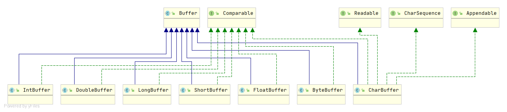
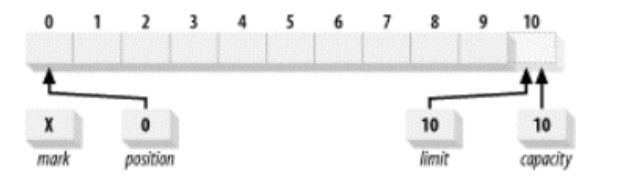

# 一、缓冲区基础

**存放特定基本类型数据的容器。**

概念上，缓冲区是包含在一个对象内的基本数据元素数组。Buffer类相比一个简单数组的优点是它将关于数据的数据内容和信息包含在一个单一的对象中。

## 1.1. capacity, position, limit和mark

### 容量（Capacity）

缓冲区能够容纳的数据元素的最大数量。这一容量在缓冲区创建时被设定，并且永远不能被改变。

### 上界（Limit）

缓冲区的第一个不能被读或写的元素。或者说，缓冲区中现存元素的计数。

### 位置（Position）

下一个要被读或写的元素的索引。位置会自动由相应的get()和put()函数更新。

### 标记（Mark）

一个备忘位置。调用mark()来设定mark=position。调用reset()设定position=mark。标记在设定前是未定义的（undefined）。

这四个属性之间总是遵循以下关系：

~~~java
mark <= position <= limit <= capacity
~~~

位置被设为0，而且容量和上界被设为10，刚好经过缓冲区能够容纳的最后一个字节。标记最初未定义。容量是固定的，但另外的三个属性可以在使用缓冲区时改变。

## 1.2. Clearing, flipping和rewinding

- `clear()` makes a buffer ready for a new sequence of channel-read or relative put operations: It sets the limit to the capacity and the position to zero.
- `flip()` makes a buffer ready for a new sequence of channel-write or relative get operations: It sets the limit to the current position and then sets the position to zero.
- `rewind()` makes a buffer ready for re-reading the data that it already contains: It leaves the limit unchanged and sets the position to zero.

### clear

一旦缓冲区对象完成填充并释放，它就可以被重新使用了。clear()函数将缓冲区重置为空状态。它并不改变缓冲区中的任何数据元素，而是仅仅将上界设为容量的值，并把位置设回0。

~~~java
public final Buffer clear() {
    position = 0;
    limit = capacity;
    mark = -1;
    return this;
}
~~~

### flip

flip()函数将一个能够继续添加数据元素的填充状态的缓冲区翻转成一个准备读出元素的释放状态。

~~~java
public final Buffer flip() {
    limit = position;
    position = 0;
    mark = -1;
    return this;
}
~~~

### rewind

~~~java
public final Buffer rewind() {
    position = 0;
    mark = -1;
    return this;
}
~~~

## 1.3. 只读buffers

Every buffer is readable, but not every buffer is writable. The mutation methods of each buffer class are specified as optional operations that will throw a ReadOnlyBufferException when invoked upon a read-only buffer. A read-only buffer does not allow its content to be changed, but its mark, position, and limit values are mutable. Whether or not a buffer is read-only may be determined by invoking its isReadOnly method.

所有的缓冲区都是可读的，但并非所有都可写。

## 1.4. 线程安全

Buffers are not safe for use by multiple concurrent threads. If a buffer is to be used by more than one thread then access to the buffer should be controlled by appropriate synchronization.

## 1.5. 比较

两个缓冲区被认为相等的充要条件是：

- 两个对象类型相同。包含不同数据类型的buffer永远不会相等，而且buffer绝不会等于非buffer对象。
- 两个对象都剩余同样数量的元素。Buffer的容量不需要相同，而且缓冲区中剩余数据的索引也不必相同。但每个缓冲区中剩余元素的数目（从位置到上界）必须相同。
- 在每个缓冲区中应被Get()函数返回的剩余数据元素序列必须一致。

如果不满足以上任意条件，就会返回false。

# 二、创建缓冲区

有七种主要的缓冲区类，每一种都具有一种Java语言中的非布尔类型的原始类型数据。这些类没有一种能够直接实例化。它们都是抽象类，但是都包含静态工厂方法用来创建相应类的新实例。

新的缓冲区是由分配或包装操作创建的。分配操作创建一个缓冲区对象并分配一个私有的空间来储存容量大小的数据元素。包装操作创建一个缓冲区对象但是不分配任何空间来储存数据元素。它使用您所提供的数组作为存储空间来储存缓冲区中的数据元素。

# 三、复制缓冲区

### duplicate

### slice

# 四、字节缓冲区

## 4.1. 直接缓冲区

