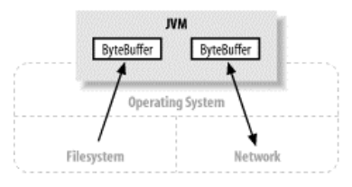

# 一、通道基础

Channel用于在字节缓冲区和位于通道另一侧的实体（通常是一个文件或套接字）之间有效地传输数据。

与缓冲区不同，通道API主要由接口指定。不通的操作系统上通道实现（Channel Implementation）会有根本性的差异，所以通道API仅仅描述了可以做什么。因此很自然地，通道实现经常使用操作系统的本地代码。通道接口允许您以一种受控且可移植的方式来访问底层的I/O服务。

通道会连接一个特定I/O服务且通道实例（channel instance）的性能受它所连接的I/O服务的特征限制，记住这很重要。

# 二、Scatter（分散）/Gather（聚集）

分散（scatter）从Channel中读取是指在读操作时将读取的数据写入多个buffer中。因此，Channel将从Channel中读取的数据“分散（scatter）”到多个Buffer中。
聚集（gather）写入Channel是指在写操作时将多个buffer的数据写入同一个Channel，因此，Channel 将多个Buffer中的数据“聚集（gather）”后发送到Channel。

## 2.1. 分散读

## 2.2. 聚集写

# 三、文件通道

文件通道总是阻塞式的，因此不能被置于非阻塞模式。

每个FileChannel对象都同一个文件描述符（file descriptor）有一对一的关系。

# 四、Socket通道

# 五、管道（Pipe）

广义上讲，管道就是一个用来在两个实体之间单向传输数据的导管。管道的概念对于Unix（和类Unix）操作系统的用户来说早就很熟悉了。Unix系统中，管道被用来连接一个进程的输出和另一个进程的输入。Pipe类实现一个管道范例，不过它所创建的管道是进程内（在Java虚拟机进程内部）而非进程间使用的。

