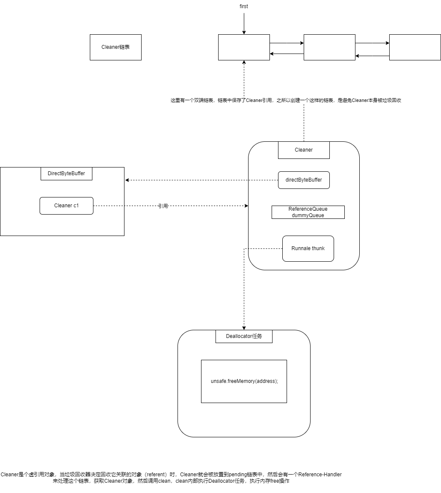

# 简介

# 构造

~~~
DirectByteBuffer(int cap) {
	super(-1, 0, cap, cap);
	boolean pa = VM.isDirectMemoryPageAligned();
	int ps = Bits.pageSize();
	long size = Math.max(1L, (long)cap + (pa ? ps : 0));
	Bits.reserveMemory(size, cap);

	long base = 0;
	try {
		base = unsafe.allocateMemory(size);
	} catch (OutOfMemoryError x) {
		Bits.unreserveMemory(size, cap);
		throw x;
	}
	unsafe.setMemory(base, size, (byte) 0);
	if (pa && (base % ps != 0)) {
		// Round up to page boundary
		address = base + ps - (base & (ps - 1));
	} else {
		address = base;
	}
	cleaner = Cleaner.create(this, new Deallocator(base, size, cap));
	att = null;
}
~~~

# Java直接内存是属于内核态还是用户态

## 摘抄1

A DirectBuffer is allocated in user space, but outside the JVM heap. Note that when talking about socket I/O, this *still* involves a copy from the kernel buffers to the user space buffers. However, it does eliminate the need for *intermediate* user-space buffers that the JVM would need to use to copy to/from the heap. As such, I/O operations can happen directly on the native user-space buffer, as if you were running C code.

## 摘抄2

先说结论，DirectByteBuffer属于user space,也就是用户态。

平时说的java内存普遍指的是jvm中的堆内存，但是一个java进程的内存大小一般约等于堆内存+堆外内存(native memory)。可以通过-XX:MaxDirectMemorySize 参数来设置大小，不设置的情况下会使用 -Xmx:HeapMaxMemorySize 参数的大小。

再说说为什么DirectByteBuffer是如何优化io性能。

其实本质是减少内存之间拷贝的次数，因为DirectMemory直接分配的是用户空间的内存，所以不再需要用户空间和jvm的heap之间的拷贝，所以少了一次拷贝，节省了时间。然而这只是用户态上的空间优化，那么用户态和内核态之间是否又被优化了呢。

用户态和内核态之间的拷贝其实也被优化了，本质上是因为用户态的逻辑地址和内核态的逻辑地址使用的是同一个，所以相当于用户态和内核态也不存在拷贝

## 摘抄3

我们先不说Java，我们从c说起。从Linux系统角度出发，内存分为俩块

1. 内核态，由操作系统内核操作，读写磁盘，读写网络都是由这负责
2. 用户态，我们的c应用程序能访问到的部分

当我们要读文件的时候，首先由内核态负责将数据从磁盘读到内核态里，再从内核态拷贝到我们用户态弄内存里，c程序里操作的也就是这部分用户态的内存。

说完c我们再说说Java，jvm启动的时候会在用户态申请一块内存，申请的这块内存中有一部分会被称为堆，一般我我们申请的对象就会放在这个堆上，堆上的对象是受gc管理的。

那么除了堆内的内存，其他的内存都被称为对外内存。在堆外内存中如果我们是通过Java的directbuffer申请的，那么这块内存其实也是间接受gc管理的，而如果我们通过jni直接调用c函数申请一块堆外内存，那么这块内存就只能我们自己手动管理了。

当我们在Java中发起一个文件读操作会发生什么呢？首先内核会将数据从磁盘读到内存，再从内核拷贝到用户态的堆外内存(这部分是jvm实现)，然后再将数据从堆外拷贝到堆内。拷贝到堆内其实就是我们在Java中自己手动申请的byte数组中。

以上是Java传统io的方式，我们发现经过了俩次内存拷贝，而nio中只需要使用directbuffer，就不必将数据从堆外拷贝到堆内了，减少了一次内存拷贝，降低了内存的占用，减轻了gc的压力。

Java中的零拷贝其实是直接调用的Linux系统调用，直接在内核态进行设备间的内存操作，二不必拷贝到用户态中

# 回收（Cleaner）

# Direct *vs.* non-direct buffers

A byte buffer is either *direct* or *non-direct*. Given a direct byte buffer, the Java virtual machine will make a best effort to perform native I/O operations directly upon it. That is, it will attempt to avoid copying the buffer's content to (or from) an intermediate buffer before (or after) each invocation of one of the underlying operating system's native I/O operations.

A direct byte buffer may be created by invoking the [`allocateDirect`](https://docs.oracle.com/javase/7/docs/api/java/nio/ByteBuffer.html#allocateDirect(int)) factory method of this class. The buffers returned by this method typically have somewhat higher allocation and deallocation costs than non-direct buffers. The contents of direct buffers may reside outside of the normal garbage-collected heap, and so their impact upon the memory footprint of an application might not be obvious. It is therefore recommended that direct buffers be allocated primarily for large, long-lived buffers that are subject to the underlying system's native I/O operations. In general it is best to allocate direct buffers only when they yield a measureable gain in program performance.

A direct byte buffer may also be created by [``mapping``](https://docs.oracle.com/javase/7/docs/api/java/nio/channels/FileChannel.html#map(java.nio.channels.FileChannel.MapMode, long, long)) a region of a file directly into memory. An implementation of the Java platform may optionally support the creation of direct byte buffers from native code via JNI. If an instance of one of these kinds of buffers refers to an inaccessible region of memory then an attempt to access that region will not change the buffer's content and will cause an unspecified exception to be thrown either at the time of the access or at some later time.

Whether a byte buffer is direct or non-direct may be determined by invoking its [`isDirect`](https://docs.oracle.com/javase/7/docs/api/java/nio/ByteBuffer.html#isDirect()) method. This method is provided so that explicit buffer management can be done in performance-critical code.

# 为什么说direct memory更适合IO操作

因为在JVM层面来看，所谓的direct memory就是在进程空间中申请的一段内存，而且指向direct memory的指针是**固定不变**的，因此可以直接用direct memory作为参数来执行各种系统调用，比方说read/pread/mmap等。

而为什么heap memory不能直接用于系统IO呢，因为GC会移动heap memory里的对象的位置。如果强行用heap memory来搞系统IO的话，IO操作的中途出现的GC会导致缓冲区位置移动，然后程序就跑飞了。

除非采用一定的手段将这个对象pin住，但是hotspot不提供单个对象层面的object pinning，一定要pin的话就只能暂时禁用gc了，也就是把整个Java堆都给pin住，这显然代价太高了。

总结一下就是：heap memory不可能直接用于系统IO，数据只能先读到direct memory里去，然后再复制到heap memory。

就用[上一篇](http://www.cnblogs.com/stevenczp/p/7506033.html)中提到的FileChannel.read()方法作为例子，而且使用heap memory作为缓冲区，其调用流程如下：

1. 先申请一块临时的direct memory

2. 调用native的FileDispatcherImpl.pread0或者FileDispatcherImpl.read0，将step1中申请的direct memory的地址传进去

3. jvm调用Linux提供的read或者pread系统调用，传入direct memory对应的内存空间指针，以及正在操作的fd

4. **触发中断，进程从用户态进入到内核态（1-3步全是在用户态中完成）**

5. 操作系统检查kernel中维护的buffer cache是否有数据，如果没有，给磁盘发送命令，让磁盘将数据拷贝到buffer cache里

6. 操作系统将buffer cache中的数据复制到step3中传入的指针对应的内存里

   **7. 触发中断，进程从内核态退回到用户态（5-6步全在内核态中完成）**

8. FileDispatcherImpl.pread0或者FileDispatcherImpl.read0方法返回，此时临时创建的direct memory中已经有用户需要的数据了

9. 将direct memory里的数据复制到heap memory中（这中间又要调用Unsafe里的一些方法，例如copyMemory）

10. 现在heap memory中终于有我们想要的数据了。

总结一下，数据的流转过程是：hard disk -> kernel buffer cache -> direct memory -> heap memory

中间调用了一次系统调用，触发了两次中断。

流程看起来相当复杂，有优化的办法吗？当然是有的：

a. 可以直接使用direct memory作为缓冲区，这样就砍掉了direct memory -> heap memory的耗费

b. 也可以使用内存映射文件，也就是FileChannel.map，砍掉中间的kernel buffer cache这一段。

# 直接内存的缺点

- 使用直接内存的缺点
  - 分配回收成本较高
  - 不受JVM内存回收管理
- 直接内存大小可以通过MaxDirectMemorySize设置
- 如果不指定，默认与堆的最大值一Xmx参数值一致

# 直接内存的回收

那么如何通过构建垃圾回收追踪对象Cleaner实现堆外内存释放呢？

Cleaner继承自Java四大引用类型之一的虚引用PhantomReference（众所周知，无法通过虚引用获取与之关联的对象实例，且当对象仅被虚引用引用时，在任何发生GC的时候，其均可被回收），通常PhantomReference与引用队列ReferenceQueue结合使用，可以实现虚引用关联对象被垃圾回收时能够进行系统通知、资源清理等功能。如下图所示，当某个被Cleaner引用的对象将被回收时，JVM垃圾收集器会将此对象的引用放入到对象引用中的pending链表中，等待Reference-Handler进行相关处理。其中，Reference-Handler为一个拥有最高优先级的守护线程，会循环不断的处理pending链表中的对象引用，执行Cleaner的clean方法进行相关清理工作。

