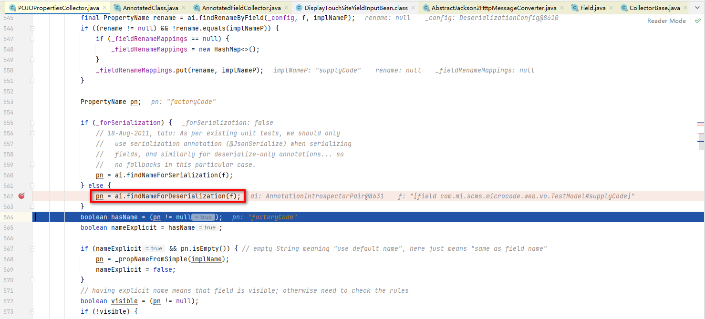
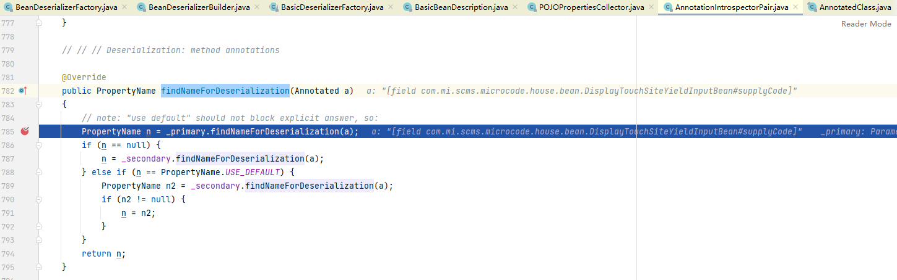
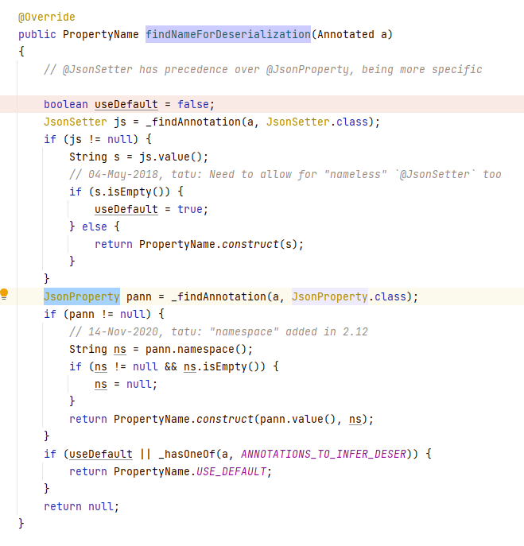

com.fasterxml.jackson.databind.introspect.AnnotatedFieldCollector#_findFields

# @JsonProperty

起作用在此处：

~~~java
com.fasterxml.jackson.databind.introspect.POJOPropertiesCollector#_addFields
~~~

~~~
com.fasterxml.jackson.databind.introspect.AnnotationIntrospectorPair#findNameForDeserialization
~~~

~~~
com.fasterxml.jackson.databind.introspect.JacksonAnnotationIntrospector#findNameForDeserialization
~~~

@JsonProperty注解解析。

