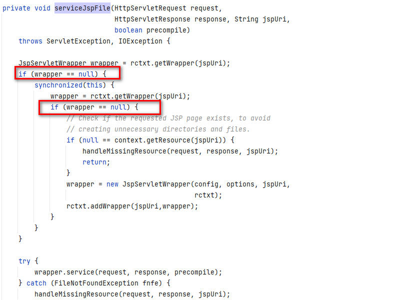

# 源码应用

tomcat的源码中可以看到这样的一段逻辑：

org.apache.jasper.servlet.JspServlet#serviceJspFile

~~~
 private void serviceJspFile(HttpServletRequest request,
                                HttpServletResponse response, String jspUri,
                                boolean precompile)
	throws ServletException, IOException {

	JspServletWrapper wrapper = rctxt.getWrapper(jspUri);
	if (wrapper == null) {
		synchronized(this) {
			wrapper = rctxt.getWrapper(jspUri);
			if (wrapper == null) {
				// Check if the requested JSP page exists, to avoid
				// creating unnecessary directories and files.
				if (null == context.getResource(jspUri)) {
					handleMissingResource(request, response, jspUri);
					return;
				}
				wrapper = new JspServletWrapper(config, options, jspUri,
												rctxt);
				rctxt.addWrapper(jspUri,wrapper);
			}
		}
	}
~~~

