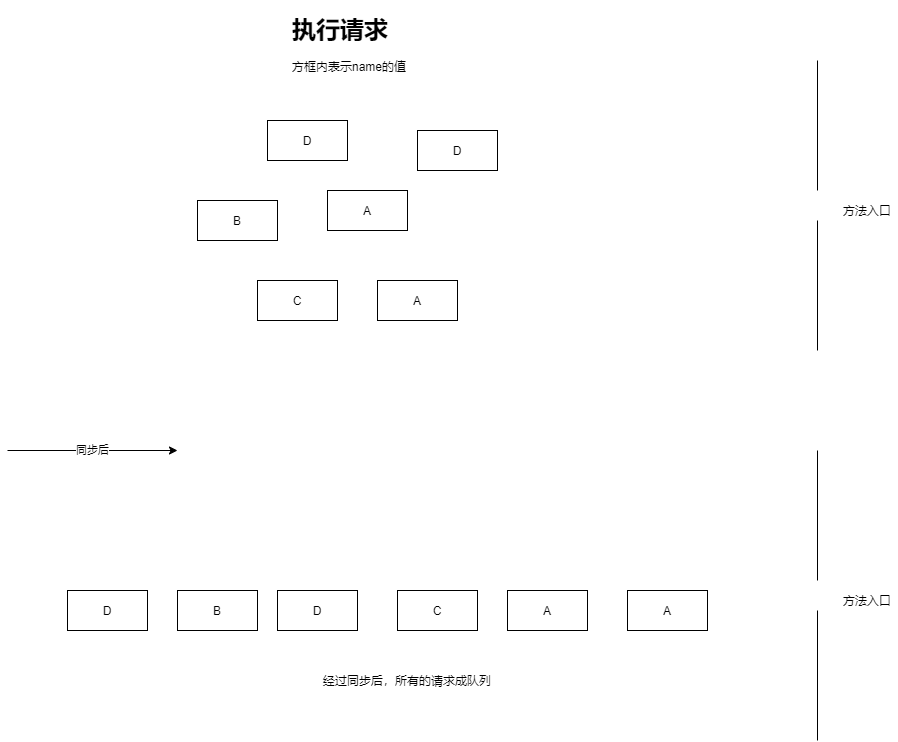
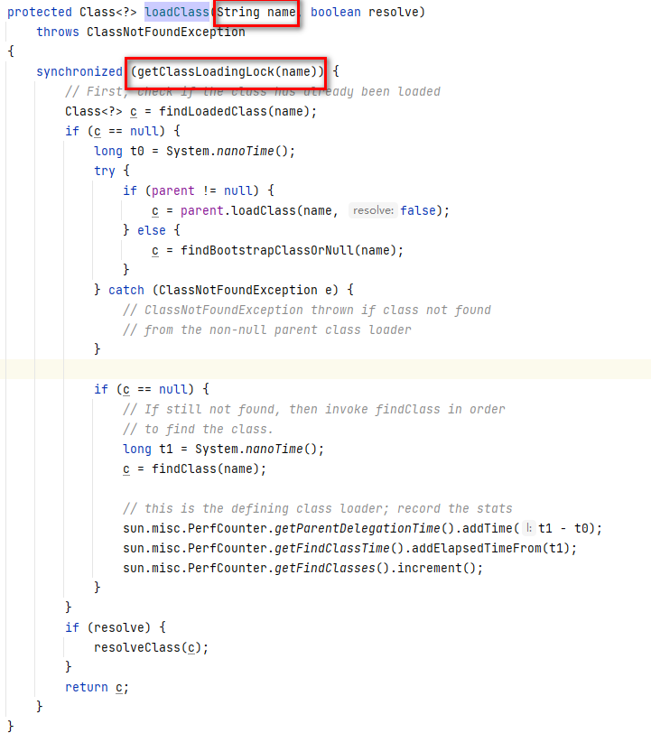

# 需求

有这样的一种需求，某段逻辑代码需保证只能执行一次，但是不是全局只执行一次，而是有条件参数的，比如说下面的方法：

~~~
public void initialize(String name)
~~~

这是个做初始化逻辑的方法，同时它有参数，并不是全局只执行一次，而是相同name保证只执行一次。

# 初级写法

下面是初级的写法，全局同步：

~~~
public synchronized void initialize(String name) {
	if (从某个地方发现跟name关联的东西存在) {
		return;
	}
	
	// 执行初始化逻辑
}
~~~

分析：

通过同步可以保证只执行一次的需求，但是这里有个问题，A、B、C、D互相是没有影响的，也就是说是可以并发执行的，通过同步之后就变得互相有影响了。也就是说这里的同步加锁应根据参数来区分。

如何改进呢？使用分段锁可以解决这个问题，jdk源代码中有相关的使用。

# JDK源码

方法：

~~~
java.lang.ClassLoader#loadClass(java.lang.String, boolean)
~~~

代码片段：

上述是ClassLoader中加载类的方法逻辑，这里和上述说的需求是一样的：

1. 一个name代表的类只加载一次
2. 不通的name互不影响
3. 支持并发处理

可以看到，JDK源码中并没有在方法上加锁，而是通过同步代码快来做，关键就是同步代码块中锁对象的选取。不用看具体的逻辑也应该清除这个用来通过的锁对象是跟name有关联的，也就是不同的name获取到的是不同的锁对象，同一个name获取到的是同一个锁对象。这就是分段锁的应用。

## getClassLoadingLock

~~~
/**
*Returns the lock object for class loading operations. For backward compatibility, the default implementation of this method    *behaves as follows. If this ClassLoader object is registered as parallel capable, the method returns a dedicated object *associated with the specified class name. Otherwise, the method returns this ClassLoader object.
*/
protected Object getClassLoadingLock(String className) {
	Object lock = this;
	if (parallelLockMap != null) {
		Object newLock = new Object();
		lock = parallelLockMap.putIfAbsent(className, newLock);
		if (lock == null) {
			lock = newLock;
		}
	}
	return lock;
}
~~~

这里的parallelLockMap的定义如下：

~~~
private final ConcurrentHashMap<String, Object> parallelLockMap; 
~~~

下一个比较重要的就是putIfAbsent方法，这个方法的作用如下：

~~~
If the specified key is not already associated with a value (or is mapped to null) associates it with the given value and returns null, else returns the current value.
~~~

