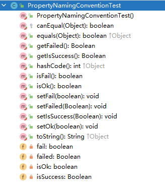

# 一、布尔型命名

## IDE自动生成

~~~java
public class PropertyNamingConventionTest {

    private Boolean isSuccess;
    private boolean isOk;
    private Boolean failed;
    private boolean fail;

    public Boolean getSuccess() {
        return isSuccess;
    }

    public void setSuccess(Boolean success) {
        isSuccess = success;
    }

    public boolean isOk() {
        return isOk;
    }

    public void setOk(boolean ok) {
        isOk = ok;
    }

    public Boolean getFailed() {
        return failed;
    }

    public void setFailed(Boolean failed) {
        this.failed = failed;
    }

    public boolean isFail() {
        return fail;
    }

    public void setFail(boolean fail) {
        this.fail = fail;
    }
    
}
~~~

从上面可以看到：

1. 带is和不带is有区别
2. 基本类型和封装类型有区别

为了避免这种问题，规定布尔类型不能以is开头。

## Lombok自动生成

## 问题

因为当类进行序列化时，有些框架的序列化会根据JavaBean的属性进行序列化，而部分框架是根据JavaBean的getter方法进行序列化，这就会导致在反序列化时与实体类的属性对应不上。

# 二、单小写字母开头

## IDE自动生成

~~~
public class PropertyNamingConventionTest {

    private String a;
    private String ab;
    private String aOrder;
    private String abLes;

    public String getA() {
        return a;
    }

    public void setA(String a) {
        this.a = a;
    }
    
    public String getAb() {
        return ab;
    }

    public void setAb(String ab) {
        this.ab = ab;
    }

    public String getaOrder() {
        return aOrder;
    }

    public void setaOrder(String aOrder) {
        this.aOrder = aOrder;
    }

    public String getAbLes() {
        return abLes;
    }

    public void setAbLes(String abLes) {
        this.abLes = abLes;
    }

}

~~~

## Lombok 自动生成

