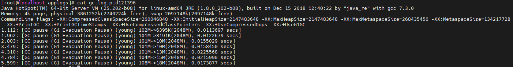
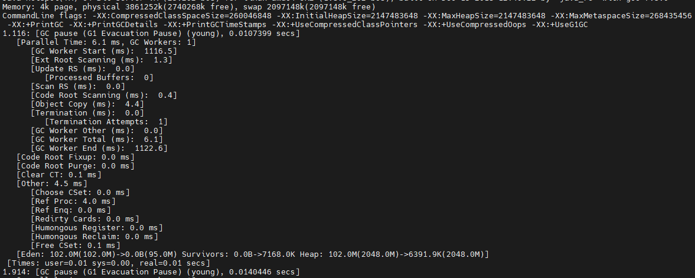
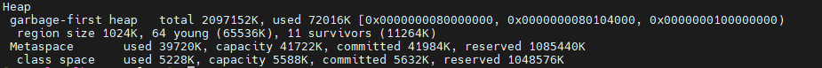
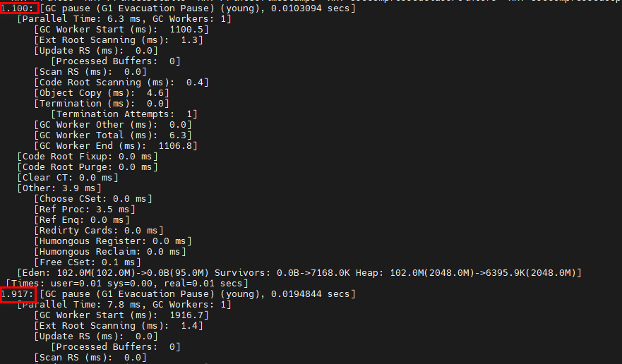
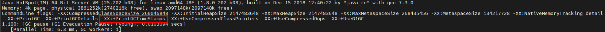
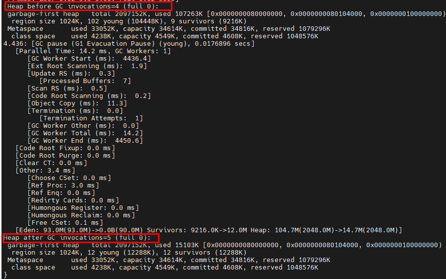
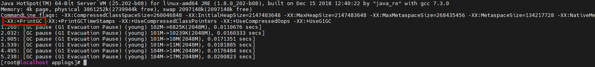
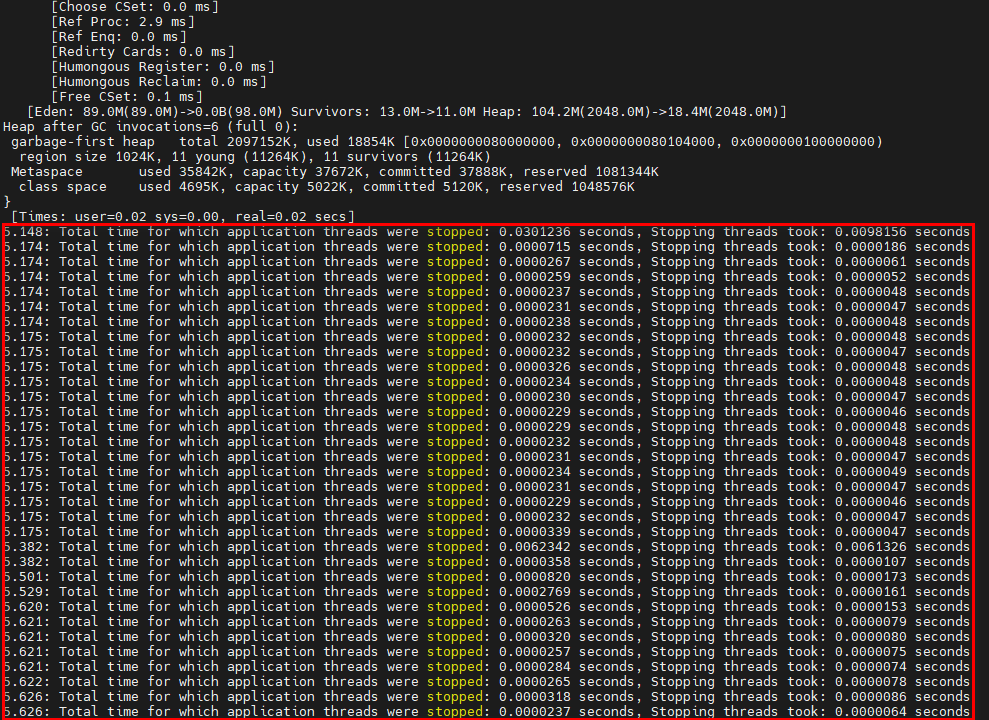
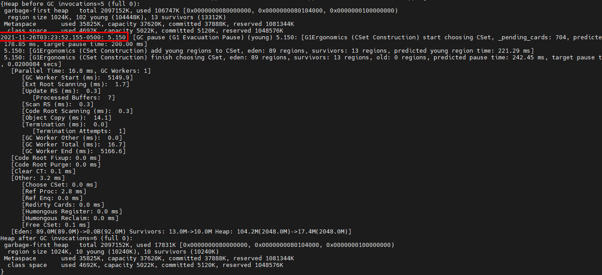

https://www.oracle.com/java/technologies/javase/vmoptions-jsp.html

https://docs.oracle.com/javase/8/docs/technotes/tools/windows/java.html

https://www.cnblogs.com/chanshuyi/p/jvm_serial_14_jvm_param_gc_log.html

# -XX:PrintGC

**官网解释：**Enables printing of messages at every GC. By default, this option is disabled.

~~~
[root@localhost applogs]# java -XX:+PrintFlagsFinal -version | grep PrintGC
     bool PrintGC                                   = false                               {manageable}
     bool PrintGCApplicationConcurrentTime          = false                               {product}
     bool PrintGCApplicationStoppedTime             = false                               {product}
     bool PrintGCCause                              = true                                {product}
     bool PrintGCDateStamps                         = false                               {manageable}
     bool PrintGCDetails                            = false                               {manageable}
     bool PrintGCID                                 = false                               {manageable}
     bool PrintGCTaskTimeStamps                     = false                               {product}
     bool PrintGCTimeStamps                         = false                               {manageable}
~~~

**作用：**打印GC日志。

**日志：**

你会发现使用 PrintGC 参数打印出来的日志比较简单，无法查看更详细的信息。

# -XX:+PrintGCDetails

**官网解释：**Enables printing of detailed messages at every GC. By default, this option is disabled.

默认是关闭的。

~~~
[root@localhost 8020]# java -XX:+PrintFlagsFinal -version | grep PrintGCDetails
     bool PrintGCDetails                            = false                               {manageable}
java version "1.8.0_202"
Java(TM) SE Runtime Environment (build 1.8.0_202-b08)
Java HotSpot(TM) 64-Bit Server VM (build 25.202-b08, mixed mode)
~~~

**作用：**打印详细GC日志

**日志：**

**补充**：

该参数还会在退出之前打印出整个堆的详细信息。

# **-XX:+PrintGCTimeStamps**

**官网解释：**Enables printing of time stamps at every GC. By default, this option is disabled.

~~~
[root@localhost 8020]# java -XX:+PrintFlagsFinal -version | grep PrintGCTimeStamps
     bool PrintGCTimeStamps                         = false                               {manageable}
~~~

**作用：**这个参数非常简单，就是在每次 GC 日志的前面加上一个时间戳。这个时间戳表示 JVM 启动后到现在所逝去的时间。

**日志：**

红色标记出就是启用这个参数后的显示体现：

**补充**：启用了PrintGCDetails或PrintGC后，PrintGCTimeStamps会自动开启。

下面是启动的时候只加了-XX:+PrintGCDetails，后GC时候的日志。

# -XX:+PrintHeapAtGC

**官网解释：**未找到官网描述。

~~~
[root@localhost 8020]# java -XX:+PrintFlagsFinal -version | grep PrintHeapAtGC
     bool PrintHeapAtGC                             = false                               {product rw}
     bool PrintHeapAtGCExtended                     = false                               {product rw}
~~~

**作用**：

一般来说，JVM在运行中，是没法直接了解到堆的概况的，只有程序结束后，才会在最后输出堆的概况。而如果想要知道每次GC前后，GC堆的概况，就可以加上这个参数。

- The "-XX:+PrintHeapAtGC" option did provide two snapshots of the heap usage, one before the GC and another one after the GC. This definitely helps us to understand how what the GC did to the different parts of the heap memory.
- But the message size is big. So you will get a very log file if you are running a Java application for a long period of time.

**日志：**

**补充**：

启用这个参数后，日志的文件会比较大。

# -**verbose:gc**

**官方解释**：Reports on each garbage collection event.

**作用：**这个参数的作用和-XX:+PrintGC是一样的。

~~~
In JDK 8 -verbose:gc is an exact alias for -XX:+PrintGC.

However, -verbose:gc is a standard option, while -XX:+PrintGC is not.

-XX:+PrintGC is deprecated since JDK 9 in favor of unified logging option -Xlog:gc, see JEP 158.
-verbose:gc still works in JDK 9 and 10.
~~~

**日志：**

**补充：**

Logs containing detailed GC information are generated when a Java application is run with the `-verbose:gc` flag turned on. With earlier JDK versions, specifying this twice on the command line, increased the GC info printed out, and this could then be analyzed. Similar and more richer output is available with JDK 1.4.1 VM, but instead of specifying the -verbose:gc option twice, the below options provide a more detailed output that can be analyzed:

~~~
-XX:+PrintGCDetails -XX:+PrintGCTimeStamps -XX:+PrintHeapAtGC
~~~

Using -XX:+PrintHeapAtGC generates lot of information. If there are a lot of GCs, and log size is a concern, then this option might be omitted. The collected information is not self-explanatory but can still be processed by the analyzer.

# -Xloggc:*file*

**官方解释：**

~~~
Sets the file to which verbose GC events information should be redirected for logging. The information written to this file is similar to the output of -verbose:gc with the time elapsed since the first GC event preceding each logged event. The -Xloggc option overrides -verbose:gc if both are given with the same java command.

Example:

-Xloggc:garbage-collection.log
~~~

Reports on each garbage collection event, as with `-verbose:gc`, but logs this data to a file. In addition to the information `-verbose:gc` gives, each reported event will be preceded by the time (in seconds) since the first garbage-collection event.Always use a local file system for storage of this file to avoid stalling the Java VM due to network latency. The file may be truncated in the case of a full file system and logging will continue on the truncated file. This option overrides `-verbose:gc` when both are specified on the command line.

# -XX:-PrintAdaptiveSizePolicy

**官方解释：**Enables printing of information about adaptive generation sizing. By default, this option is disabled.

**作用：**

可以打印出survivor的一些详细信息，关于survivor区间是否溢出，是否有对象转移到老年代。

**补充**：

One piece of information in the log messages generated from the "-XX:+PrintAdaptiveSizePolicy" JVM option, tells us the amount of data survived in Young generation and the amount of data promoted to Tenured generation for each Minor GC:

~~~
[GC (Allocation Failure) AdaptiveSizePolicy::update_averages: 
   survived: 17064240  promoted: 5247056  overflow: false
~~~

This information is useful if you want to know what exactly happened at each Minor GC.

http://www.herongyang.com/Java-8-GC/Parallel-Collector-Adaptive-Size-Minor-GC.html

# -XX:-DisableExplicitGC

**官方解释**：Enables the option that disables processing of calls to `System.gc()`. This option is disabled by default, meaning that calls to `System.gc()` are processed. If processing of calls to `System.gc()` is disabled, the JVM still performs GC when necessary.

~~~
[root@localhost 8020]# java -XX:+PrintFlagsFinal -version | grep DisableExplicitGC
     bool DisableExplicitGC                         = false                               {product}
java version "1.8.0_202"
Java(TM) SE Runtime Environment (build 1.8.0_202-b08)
Java HotSpot(TM) 64-Bit Server VM (build 25.202-b08, mixed mode)
~~~

**作用：**

这是一个开关参数，默认是开启的，其作用是禁止代码中显示的调用GC。代码如何显示调用GC呢，通过System.gc()函数调用。如果加上了这个JVM启动参数，那么代码中调用System.gc()将没有任何效果

**补充：**

Many applications still make an excessive number of explicit calls to System.gc() to request garbage collection. In many cases, these calls degrade performance through premature garbage collection and compactions. However, you cannot always remove the calls from the application.

The **-Xdisableexplicitgc** parameter allows the JVM to ignore these garbage collection suggestions. Typically, system administrators use this parameter in applications that show some benefit from its use.

By default, calls to System.gc() trigger a garbage collection.

# -XX:+PrintGCApplicationStoppedTime

**官方解释**：Enables printing of how much time the pause (for example, a GC pause) lasted. By default, this option is disabled.

~~~
[root@localhost 8020]# java -XX:+PrintFlagsFinal -version | grep PrintGCApplicationStoppedTime
     bool PrintGCApplicationStoppedTime             = false                               {product}
~~~

**作用**:

打印应用由于GC而产生的停顿时间。

**日志**：

# -XX:+PrintGCDateStamps

**官方解释**：

Enables printing of a date stamp at every GC. By default, this option is disabled.

**作用**：

输出GC的时间戳（以日期的形式，如 2019-11-30T17:54:12.986-0800）。

**日志**：

# -XX:-HeapDumpOnOutOfMemoryError

**官方解释：**

Enables the dumping of the Java heap to a file in the current directory by using the heap profiler (HPROF) when a `java.lang.OutOfMemoryError` exception is thrown. You can explicitly set the heap dump file path and name using the `-XX:HeapDumpPath` option. By default, this option is disabled and the heap is not dumped when an `OutOfMemoryError` exception is thrown.

# -XX:HeapDumpPath=./java_pid<pid>.hprof

**官方解释：**

Sets the path and file name for writing the heap dump provided by the heap profiler (HPROF) when the `-XX:+HeapDumpOnOutOfMemoryError` option is set. By default, the file is created in the current working directory, and it is named `java_pid`*pid*`.hprof` where *pid* is the identifier of the process that caused the error. The following example shows how to set the default file explicitly (`%p` represents the current process identificator):

`-XX:HeapDumpPath=./java_pid%p.hprof `

The following example shows how to set the heap dump file to `C:/log/java/java_heapdump.log`:

`-XX:HeapDumpPath=C:/log/java/java_heapdump.log`

# **-XX:MinHeapFreeRatio**

**官方解释**：

Sets the minimum allowed percentage of free heap space (0 to 100) after a GC event. If free heap space falls below this value, then the heap will be expanded. By default, this value is set to 40%.

The following example shows how to set the minimum free heap ratio to 25%:

-XX:MinHeapFreeRatio=25

~~~
[root@64d479b9b-2fdzq applogs]# jinfo -flag MinHeapFreeRatio 1
-XX:MinHeapFreeRatio=40
~~~

**作用**：

设置GC事件后允许的最小空闲堆空间百分比(0到100)。如果空闲堆空间低于此值，则将扩展堆。默认情况下，该值被设置为40%。

**补充**：

当-Xmx与-Xms相等时，该配置无效。

# **-XX:MaxHeapFreeRatio**

**官方解释**：

Sets the maximum allowed percentage of free heap space (0 to 100) after a GC event. If free heap space expands above this value, then the heap will be shrunk. By default, this value is set to 70%.

The following example shows how to set the maximum free heap ratio to 75%:

-XX:MaxHeapFreeRatio=75

~~~
[root@64d479b9b-2fdzq applogs]# jinfo -flag MaxHeapFreeRatio 1
-XX:MaxHeapFreeRatio=70
~~~

**作用**：

设置GC事件后允许的最大空闲堆空间百分比(0到100)。如果空闲堆空间扩展到这个值以上，那么堆将收缩。默认情况下，该值被设置为70%。

**补充**：

当-Xmx与-Xms相等时，该配置无效。

# -XX:GCTimeRatio

**官方解释**：

Throughput: The throughput goal is measured in terms of the time spent doing garbage collection versus the time spent outside of garbage collection, referred to as *application time*. The goal is specified by the command-line option `-XX:GCTimeRatio=`*<N>*, which sets the ratio of garbage collection time to application time to `1 / (1 + `*<N>*`)`.

For example, `-XX:GCTimeRatio=19` sets a goal of 1/20 or 5% of the total time in garbage collection. The default value is 99, resulting in a goal of 1% of the time in garbage collection.

**作用**：

设置垃圾回收时间比例。

**补充**：

虽然GCTimeRatio字面上翻译是垃圾回收时间比率，但是其值并不是这样得，这个值不是%值，但是这个值可以用来计算垃圾回收时间与应用程序时间（应用程序时间不包括垃圾回收时间）的比率，计算公式为1 / (1 + GCTimeRatio)，也就是说：
这个GCTimeRatio值越大，垃圾回收时间与应用程序时间（应用程序时间不包括垃圾回收时间）的比率越小，
也就是应用程序时间（应用程序时间不包括垃圾回收时间）与垃圾回收时间的比率越大，
也就是吞吐量越大，**最后的结论就是GCTimeRatio值越大，吞吐量越大，**两者是正相关的，
但是其值的大小在官方文档中并没有指出，但是经过测试，必须要>=0，也就是说1 / (1 + GCTimeRatio)一定是<=100%的。

别在想当然的认为GCTimeRatio是垃圾回收时间比率啦！只是GCTimeRatio的值越大，垃圾回收时间比率越小，吞吐量越大的等价关系罢了。
