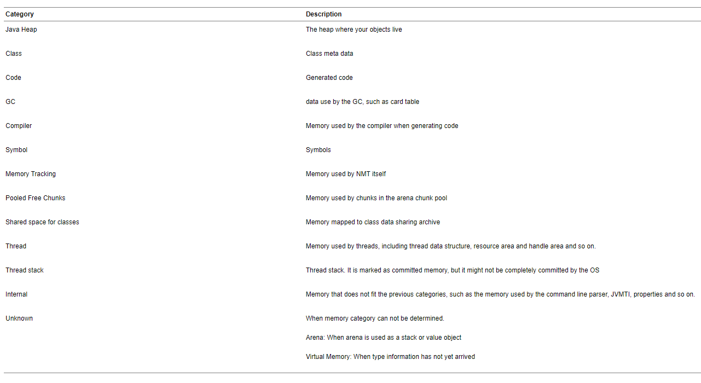

https://docs.oracle.com/javase/8/docs/technotes/guides/vm/nmt-8.html

https://docs.oracle.com/javase/8/docs/technotes/guides/troubleshoot/tooldescr007.html

# 启用

~~~
-XX:NativeMemoryTracking=detail
~~~

# 查看

~~~
[root@localhost 8020]# jcmd 13439 VM.native_memory detail scale=MB >temp.txt
~~~

如果想JVM退出时打印退出时的内存使用情况，可以通过如下配置项:

```
-XX:+UnlockDiagnosticVMOptions -XX:+PrintNMTStatistics
```

# NMT Memory Categories

https://docs.oracle.com/javase/8/docs/technotes/guides/troubleshoot/tooldescr022.html#BABHIFJC



# 建立基线(baseline)

~~~
[root@localhost 8020]# jcmd 13930 VM.native_memory baseline
13930:
Baseline succeeded
[root@localhost 8020]# jcmd 13930 VM.native_memory detail.diff
13930:

Native Memory Tracking:

Total: reserved=3634679KB +39KB, committed=2348947KB +39KB

-                 Java Heap (reserved=2097152KB, committed=2097152KB)
                            (mmap: reserved=2097152KB, committed=2097152KB)

-                     Class (reserved=1092739KB, committed=50691KB)
                            (classes #9038)
                            (malloc=1155KB #11133)
                            (mmap: reserved=1091584KB, committed=49536KB)

-                    Thread (reserved=35062KB, committed=35062KB)
                            (thread #35)
                            (stack: reserved=34912KB, committed=34912KB)
                            (malloc=110KB #174)
                            (arena=40KB #66)

-                      Code (reserved=251435KB, committed=11847KB)
                            (malloc=1835KB #4036)
                            (mmap: reserved=249600KB, committed=10012KB)

-                        GC (reserved=119605KB, committed=119605KB)
                            (malloc=9013KB #15006)
                            (mmap: reserved=110592KB, committed=110592KB)

-                  Compiler (reserved=158KB, committed=158KB)
                            (malloc=27KB #290)
                            (arena=131KB #5)

-                  Internal (reserved=19852KB, committed=19852KB)
                            (malloc=19820KB #14612)
                            (mmap: reserved=32KB, committed=32KB)

-                    Symbol (reserved=11899KB, committed=11899KB)
                            (malloc=9941KB #96938)
                            (arena=1958KB #1)

-    Native Memory Tracking (reserved=2503KB +39KB, committed=2503KB +39KB)
                            (malloc=229KB +32KB #3242 +445)
                            (tracking overhead=2275KB +7KB)

-               Arena Chunk (reserved=177KB, committed=177KB)
                            (malloc=177KB)

-                   Unknown (reserved=4096KB, committed=0KB)
                            (mmap: reserved=4096KB, committed=0KB)

[0x00007f5466425730] MallocAllocationSiteWalker::do_malloc_site(MallocSite const*)+0x40
[0x00007f5466404fc8] MallocSiteTable::walk_malloc_site(MallocSiteWalker*)+0xb8
[0x00007f5466420ee4] MemBaseline::baseline_allocation_sites()+0x54
[0x00007f54664214d3] MemBaseline::baseline(bool)+0x3e3
                             (malloc=21KB type=Native Memory Tracking +17KB #295 +242)

[0x00007f5466420d4b] MemBaseline::aggregate_virtual_memory_allocation_sites()+0x13b
[0x00007f5466420fbc] MemBaseline::baseline_allocation_sites()+0x12c
[0x00007f54664214d3] MemBaseline::baseline(bool)+0x3e3
[0x00007f546649ca01] NMTDCmd::execute(DCmdSource, Thread*)+0x171
                             (malloc=1KB type=Native Memory Tracking +1KB #20 +20)

[0x00007f546642629b] VirtualMemoryAllocationWalker::do_allocation_site(ReservedMemoryRegion const*)+0x10b
[0x00007f54666891d8] VirtualMemoryTracker::walk_virtual_memory(VirtualMemoryWalker*)+0x78
[0x00007f5466420f70] MemBaseline::baseline_allocation_sites()+0xe0
[0x00007f54664214d3] MemBaseline::baseline(bool)+0x3e3
                             (malloc=7KB type=Native Memory Tracking +7KB #114 +114)

[0x00007f54664261db] VirtualMemoryAllocationWalker::do_allocation_site(ReservedMemoryRegion const*)+0x4b
[0x00007f54666891d8] VirtualMemoryTracker::walk_virtual_memory(VirtualMemoryWalker*)+0x78
[0x00007f5466420f70] MemBaseline::baseline_allocation_sites()+0xe0
[0x00007f54664214d3] MemBaseline::baseline(bool)+0x3e3
                             (malloc=6KB type=Native Memory Tracking +6KB #64 +64)
~~~

