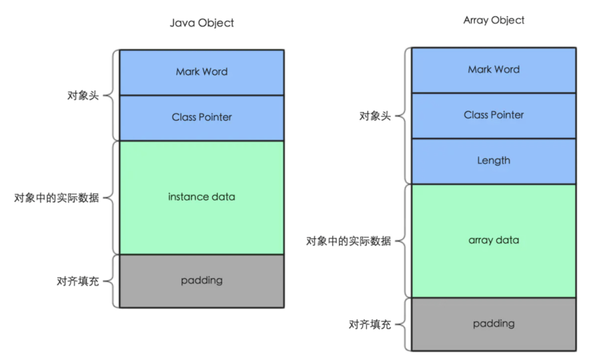

**对象头**

对象头又分为 MarkWord 和 Class Pointer 两部分。

- MarkWord：包含一系列的标记位，比如轻量级锁的标记位、偏向锁标记位、gc记录信息等等。在32位系统占4字节，在64位系统中占8字节。

- ClassPointer：用来指向对象对应的Class对象（其对应的元数据对象）的内存地址。在32位系统占4字节，在64位系统中占8字节。

  > 注意：64位系统开启了UseCompressedClassPointer则占用4个字节

- Length：只在数组对象中存在，用来记录数组的长度，占用4字节。

**Instance data**

- Interface data：对象实际数据。对象实际数据包括了对象的所有成员变量，其大小由各个成员变量的大小决定。(这里不包括静态成员变量，因为它是在方法区维护的)

**Padding**

- Padding：Java 对象占用空间是 8 字节对齐的，即所有 Java 对象占用 bytes 数必须是 8 的倍数。这是因为当我们从磁盘中取一个数据时，不会说我想取一个字节就是一个字节，都是按照一块儿一块儿来取的。这一块大小是 8 个字节，所以为了完整，padding 的作用就是补充字节，保证对象是 8 字节的整数倍。

