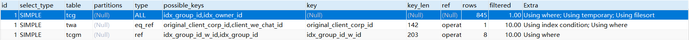

# 一、LEFT JOIN使用示例

测试数据：

~~~sql
select * from tb_name;

id  name sex dt
1	aaa	F	20190905
2	bbb	M	20190905
3	ccc	F	20190905
4	ddd	F	20190906
5	eee	M	20190906
6	fff	F	20190907

select * from tb_age;

id	dt			age	province
1	20190905	23	beijing
2	20190906	24	shanghai
5	20190906	29	guangdong
~~~

## 1.1. 一对一

~~~sql
select * from tb_name a left join tb_age b on a.id=b.id

1	aaa	F	20190905	1	20190905	23	beijing
2	bbb	M	20190905	2	20190906	24	shanghai
5	eee	M	20190906	5	20190906	29	guangdong
3	ccc	F	20190905				
4	ddd	F	20190906				
6	fff	F	20190907				
~~~

## 1.2. 一对多

~~~sql
select * from tb_age a left join tb_name b on a.dt = b.dt

1	20190905	23	beijing	1	aaa	F	20190905
1	20190905	23	beijing	2	bbb	M	20190905
1	20190905	23	beijing	3	ccc	F	20190905
2	20190906	24	shanghai	4	ddd	F	20190906
5	20190906	29	guangdong	4	ddd	F	20190906
2	20190906	24	shanghai	5	eee	M	20190906
5	20190906	29	guangdong	5	eee	M	20190906
~~~

## 1.3. 多对多

~~~sql
select * from tb_name a left join tb_age b on a.dt = b.dt

1	aaa	F	20190905	1	20190905	23	beijing
2	bbb	M	20190905	1	20190905	23	beijing
3	ccc	F	20190905	1	20190905	23	beijing
4	ddd	F	20190906	2	20190906	24	shanghai
5	eee	M	20190906	2	20190906	24	shanghai
4	ddd	F	20190906	5	20190906	29	guangdong
5	eee	M	20190906	5	20190906	29	guangdong
6	fff	F	20190907				
~~~

# 二、Where和ON使用对比

测试数据：

~~~sql
SELECT * FROM classes;

id    name
1    一班
2    二班
3    三班
4    四班

SELECT * FROM students;

id  class_id  name   gender
1    1        小明        M
2    1        小红        F
3    1        小军        M
4    1        小米        F
5    2        小白        F
6    2        小兵        M
7    2        小林        M
8    3        小新        F
9    3        小王        M
10    3        小丽       F
~~~

连接查询分别使用where和on限制条件的结果对比：

~~~sql
select * from tb_classes c left join tb_students s on s.class_id = c.id where c.name='一班'

1	一班	1	1	小明	M
1	一班	2	1	小红	F
1	一班	3	1	小军	M
1	一班	4	1	小米	F
~~~

~~~sql
select * from tb_classes c left join tb_students s on s.class_id = c.id and c.name='一班'

1	一班	1	1	小明	M
1	一班	2	1	小红	F
1	一班	3	1	小军	M
1	一班	4	1	小米	F
2	二班				
3	三班				
4	四班				
~~~

结果解析（先看第三节内容）：

# 三、 LEFT JOIN实现原理

**mysql** 对于`left join`的采用类似**嵌套循环**的方式来进行从处理，以下面的语句为例：

~~~sql
SELECT * FROM LT LEFT JOIN RT ON P1(LT,RT)) WHERE P2(LT,RT)
~~~

其中`P1`是`on`过滤条件，缺失则认为是`TRUE`，`P2`是`where`过滤条件，缺失也认为是`TRUE`，该语句的执行逻辑可以描述为：

~~~
FOR each row lt in LT {// 遍历左表的每一行
  BOOL b = FALSE;
  FOR each row rt in RT such that P1(lt, rt) {// 遍历右表每一行，找到满足join条件的行
    IF P2(lt, rt) {//满足 where 过滤条件
      t:=lt||rt;//合并行，输出该行
    }
    b=TRUE;// lt在RT中有对应的行
  }
  IF (!b) { // 遍历完RT，发现lt在RT中没有有对应的行，则尝试用null补一行
    IF P2(lt,NULL) {// 补上null后满足 where 过滤条件
      t:=lt||NULL; // 输出lt和null补上的行
    }         
  }
}
~~~

当然，实际情况中MySQL会使用buffer的方式进行优化，减少行比较次数，不过这不影响关键的执行流程，不在本文讨论范围之内。

从这个伪代码中，我们可以看出两点：

1. 如果想对右表进行限制，则一定要在`on`条件中进行，若在`where`中进行则可能导致数据缺失，导致左表在右表中无匹配行的行在最终结果中不出现，违背了我们对`left join`的理解。因为对左表无右表匹配行的行而言，遍历右表后`b=FALSE`,所以会尝试用`NULL`补齐右表，但是此时我们的`P2`对右表行进行了限制，NULL若不满足`P2`(`NULL`一般都不会满足限制条件，除非`IS NULL`这种)，则不会加入最终的结果中，导致结果缺失。
2. 如果没有`where`条件，无论`on`条件对左表进行怎样的限制，左表的每一行都至少会有一行的合成结果，对左表行而言，若右表若没有对应的行，则右表遍历结束后`b=FALSE`，会用一行`NULL`来生成数据，而这个数据是多余的。所以对左表进行过滤必须用where。

总结：

通过上面的问题现象和分析，可以得出了结论：在`left join`语句中，左表过滤必须放where条件中，右表过滤必须放on条件中，这样结果才能不多不少，刚刚好。

# 四、参考资料

https://developer.aliyun.com/article/718897

https://zhuanlan.zhihu.com/p/85856388

# 五、LEFT JOIN中存在Using temporary; Using filesort

https://www.cnblogs.com/silyvin/p/9106655.html

~~~sql
CREATE TABLE `tb_chat_group`  (
  `id` int(11) UNSIGNED NOT NULL AUTO_INCREMENT COMMENT '主键id',
  `group_id` varchar(50) CHARACTER SET utf8mb4 COLLATE utf8mb4_general_ci NULL DEFAULT '' COMMENT '微信群id',
  `group_name` varchar(300) CHARACTER SET utf8mb4 COLLATE utf8mb4_general_ci NULL DEFAULT NULL COMMENT '群名称',
  `group_notice` text CHARACTER SET utf8mb4 COLLATE utf8mb4_general_ci NULL COMMENT '群公告',
  `group_type` tinyint(2) NULL DEFAULT 1 COMMENT '是否是系统群（1:内部群;2：外部群）',
  `profile_image_url` text CHARACTER SET utf8mb4 COLLATE utf8mb4_general_ci NULL COMMENT '群头像',
  `id_group_chat` tinyint(2) NULL DEFAULT 1 COMMENT '群聊（1:是;0：否）',
  `owner_id` varchar(50) CHARACTER SET utf8mb4 COLLATE utf8mb4_general_ci NULL DEFAULT '' COMMENT '群主微信id',
  `seq_no` varchar(128) CHARACTER SET utf8mb4 COLLATE utf8mb4_general_ci NULL DEFAULT '' COMMENT '序列号',
  `deleted` tinyint(4) NOT NULL DEFAULT 0 COMMENT '是否删除 0 未删除 1 删除',
  `create_by` varchar(100) CHARACTER SET utf8mb4 COLLATE utf8mb4_general_ci NULL DEFAULT NULL COMMENT '创建人',
  `update_by` varchar(100) CHARACTER SET utf8mb4 COLLATE utf8mb4_general_ci NULL DEFAULT NULL COMMENT '更新人',
  `create_time` datetime(0) NOT NULL DEFAULT CURRENT_TIMESTAMP(0) COMMENT '创建时间',
  `update_time` datetime(0) NOT NULL DEFAULT CURRENT_TIMESTAMP(0) ON UPDATE CURRENT_TIMESTAMP(0) COMMENT '更新时间',
  `corp_id` varchar(30) CHARACTER SET utf8mb4 COLLATE utf8mb4_general_ci NULL DEFAULT NULL COMMENT '企业id',
  `device_id` varchar(200) CHARACTER SET utf8mb4 COLLATE utf8mb4_general_ci NULL DEFAULT NULL COMMENT '设备id',
  PRIMARY KEY (`id`) USING BTREE,
  UNIQUE INDEX `idx_group_id`(`group_id`) USING BTREE,
  INDEX `idx_create_time`(`create_time`) USING BTREE,
  INDEX `idx_update_time`(`update_time`) USING BTREE,
  INDEX `idx_owner_id`(`owner_id`) USING BTREE
) ENGINE = InnoDB AUTO_INCREMENT = 1222 CHARACTER SET = utf8mb4 COLLATE = utf8mb4_general_ci COMMENT = '微信群信息表' ROW_FORMAT = Dynamic;

CREATE TABLE `tb_chat_group_member`  (
  `id` int(11) UNSIGNED NOT NULL AUTO_INCREMENT COMMENT '主键id',
  `group_id` varchar(50) CHARACTER SET utf8mb4 COLLATE utf8mb4_general_ci NULL DEFAULT '' COMMENT '微信群id',
  `we_chat_id` varchar(50) CHARACTER SET utf8mb4 COLLATE utf8mb4_general_ci NULL DEFAULT '' COMMENT '群主微信id',
  `manage_level` tinyint(4) NOT NULL DEFAULT 0 COMMENT '管理员 0会员 1管理员 群主',
  `deleted` tinyint(4) NOT NULL DEFAULT 0 COMMENT '是否删除 0 未删除 1 删除',
  `create_by` varchar(100) CHARACTER SET utf8mb4 COLLATE utf8mb4_general_ci NULL DEFAULT NULL COMMENT '创建人',
  `update_by` varchar(100) CHARACTER SET utf8mb4 COLLATE utf8mb4_general_ci NULL DEFAULT NULL COMMENT '更新人',
  `create_time` datetime(0) NOT NULL DEFAULT CURRENT_TIMESTAMP(0) COMMENT '创建时间',
  `update_time` datetime(0) NOT NULL DEFAULT CURRENT_TIMESTAMP(0) ON UPDATE CURRENT_TIMESTAMP(0) COMMENT '更新时间',
  PRIMARY KEY (`id`) USING BTREE,
  UNIQUE INDEX `idx_group_id_w_id`(`group_id`, `we_chat_id`) USING BTREE,
  INDEX `idx_create_time`(`create_time`) USING BTREE,
  INDEX `idx_update_time`(`update_time`) USING BTREE,
  INDEX `idx_we_chat_id`(`we_chat_id`) USING BTREE,
  INDEX `idx_group_id`(`group_id`) USING BTREE
) ENGINE = InnoDB AUTO_INCREMENT = 18102 CHARACTER SET = utf8mb4 COLLATE = utf8mb4_general_ci COMMENT = '微信群成员信息表' ROW_FORMAT = Dynamic;

CREATE TABLE `tb_wechat_account_server_account`  (
  `id` bigint(20) UNSIGNED NOT NULL AUTO_INCREMENT COMMENT '主键',
  `original_client_corp_id` varchar(35) CHARACTER SET utf8mb4 COLLATE utf8mb4_general_ci NULL DEFAULT NULL COMMENT 'hook账号原始属于公司id',
  `client_we_chat_id` varchar(35) CHARACTER SET utf8mb4 COLLATE utf8mb4_general_ci NULL DEFAULT NULL COMMENT 'hook微信id',
  `pull_in_client_corp_id` varchar(35) CHARACTER SET utf8mb4 COLLATE utf8mb4_general_ci NULL DEFAULT NULL COMMENT '拉入者公司id',
  `server_we_chat_id` varchar(35) CHARACTER SET utf8mb4 COLLATE utf8mb4_general_ci NULL DEFAULT NULL COMMENT 'server端映射账号',
  `is_inner` tinyint(1) NULL DEFAULT NULL COMMENT '是否内部账号',
  `is_enterprise` tinyint(1) NULL DEFAULT NULL COMMENT '是否企业账号',
  `create_client_we_chat_id` varchar(35) CHARACTER SET utf8mb4 COLLATE utf8mb4_general_ci NULL DEFAULT NULL COMMENT '创建者微信id',
  `update_client_we_chat_id` varchar(35) CHARACTER SET utf8mb4 COLLATE utf8mb4_general_ci NULL DEFAULT NULL COMMENT '更新者微信id',
  `create_time` timestamp(0) NOT NULL DEFAULT CURRENT_TIMESTAMP(0) COMMENT '创建时间',
  `update_time` timestamp(0) NOT NULL DEFAULT CURRENT_TIMESTAMP(0) ON UPDATE CURRENT_TIMESTAMP(0) COMMENT '更新时间',
  `deleted` tinyint(1) NOT NULL DEFAULT 0 COMMENT '是否删除',
  `is_send` tinyint(1) NOT NULL DEFAULT 0 COMMENT '是否发送过消息',
  PRIMARY KEY (`id`) USING BTREE,
  UNIQUE INDEX `pull_in_client_corp_id`(`client_we_chat_id`, `pull_in_client_corp_id`) USING BTREE,
  UNIQUE INDEX `pull_in_client_corp_id_2`(`server_we_chat_id`, `pull_in_client_corp_id`) USING BTREE,
  UNIQUE INDEX `pull_in_client_corp_id_3`(`pull_in_client_corp_id`, `client_we_chat_id`, `server_we_chat_id`) USING BTREE
) ENGINE = InnoDB AUTO_INCREMENT = 357 CHARACTER SET = utf8mb4 COLLATE = utf8mb4_general_ci COMMENT = '用户关联server用户' ROW_FORMAT = Dynamic;
~~~

执行sql：

~~~sql
SELECT
	tcgm.we_chat_id,
	tcgm.group_id,
	tcgm.id,
	tcg.group_name,
	tcg.group_type,
	tcg.create_time,
	tcg.profile_image_url AS group_profile_image_url,
	tcg.owner_id AS group_owner_id,
	twa.alias AS group_owner_alias_name,
	twa.nick_name AS group_owner_nick_name,
	twa.profile_image_url AS group_owner_profile_image_url
FROM
	tb_chat_group_member tcgm
	left JOIN tb_chat_group tcg ON tcgm.group_id = tcg.group_id
	left JOIN tb_wechat_account twa ON tcg.owner_id = twa.client_we_chat_id
WHERE
	tcgm.deleted = '0'
	AND tcg.deleted = '0'
	AND tcg.id_group_chat='1'
	AND twa.deleted = '0'
ORDER BY tcgm.id DESC;
~~~

执行计划：

