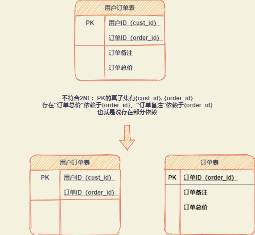
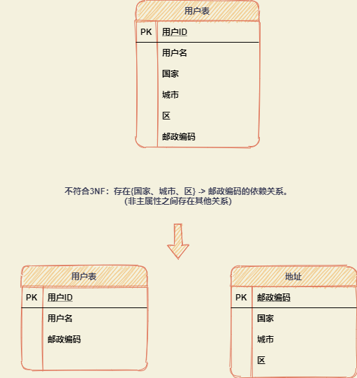

数据库表设计中的标准化规范。

# 1NF（First Normal Form）

规则：

1. 单值属性：一个列只能包含一个值。

# 2NF（Second Normal Form）

规则：要求数据表里的所有非主属性都要和该数据表的[主键](https://baike.baidu.com/item/主键/1232239)有完全依赖关系。

目的：消除部分依赖。

所谓完全依赖是指不能存在仅依赖[主关键字](https://baike.baidu.com/item/主关键字)一部分的属性，理解了完全依赖和部分依赖，就很容易理解第二范式。

> 函数依赖简单点说就是：某个属性集决定另一个属性集时，称另一属性集依赖于该属性集。
>
> 完全函数依赖(Full functional dependency)：在一个关系中，若某个非主属性[数据项](https://baike.baidu.com/item/数据项/3227309)依赖于全部关键字称之为完全函数依赖。
>
> 部分函数依赖（partial functional dependency）是一个数学用语。在[关系模式](https://baike.baidu.com/item/关系模式/1237324)R(U)中，如果X→Y，并且存在X的一个真子集X0，使得X0→Y，则称Y对X部分函数依赖。
>
> 如果A包含于B,且A不等于B,就说集合A是集合B的真子集。

如果有哪些非主属性只和主键的一部份有关的话，它就不符合第二范式。同时可以得出：如果一个数据表的主键只有单一一个字段的话，它就一定符合第二范式(前提是该数据表符合第一范式)。

参考：https://www.tutorialspoint.com/sql/second-normal-form.htm

# 3NF（Third Normal Form）

第三范式(Third Normal Form,3rd NF)就是指表中的所有数据元素不但要能唯一地被主关键字所标识,而且它们之间还必须相互独立,不存在其他的函数关系。也就是说，对于一个满足2nd NF 的数据结构来说，表中有可能存在某些数据元素依赖于其他非关键字数据元素的现象,必须消除。

目的：消除非主属性中的关系，避免传递依赖关系。

参考：https://www.tutorialspoint.com/sql/third-normal-form.htm