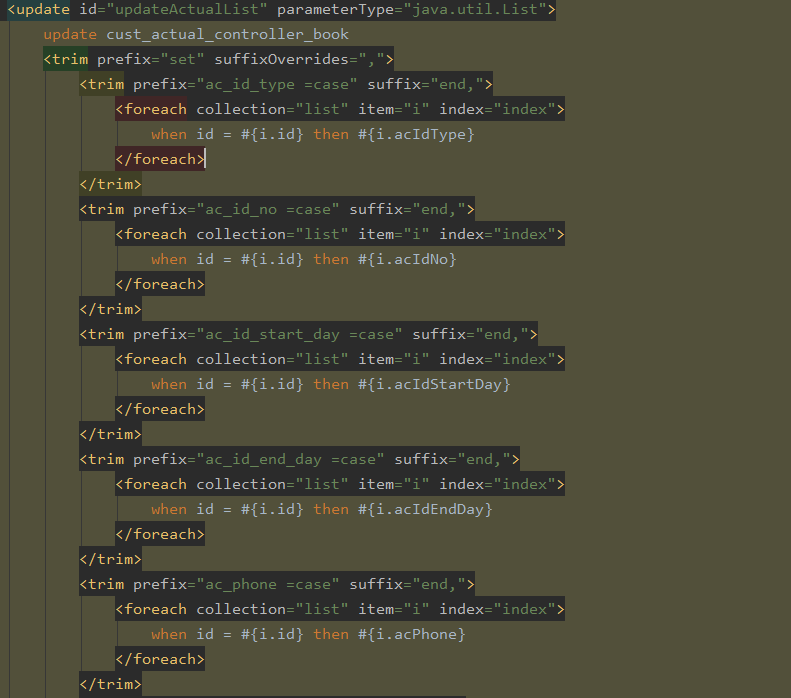

# 批量插入

~~~
mysql> show variables like 'max_allowed_packet';
+--------------------+---------+
| Variable_name      | Value   |
+--------------------+---------+
| max_allowed_packet | 4194304 |
+--------------------+---------+
1 row in set, 1 warning (0.01 sec)
~~~

https://stackoverflow.com/questions/2714587/mysql-on-duplicate-key-update-for-multiple-rows-insert-in-single-query

https://www.plus2net.com/sql_tutorial/sql_update-on-duplicate-key.php

~~~sql
//syntax to insert on duplicate update with one row
//INSERT INTO users (val1, val2, val3, val4) VALUES (1, 2, 3, 4) 
//ON DUPLICATE KEY UPDATE val1=1, val2=2, val3=3, val4=4;

INSERT INTO users (listid,email,age,name) VALUES (3,'john@gmail.com',26,"John"),
(3,'bob@gmail.com',32,"Bob"),
(3,'matt@gmail.com',29,"Matt"),
(2,'john@gmail.com',25,"John"),
ON DUPLICATE KEY UPDATE listid=VALUES(listid), 
email=VALUES(email), 
age=VALUES(age), 
name=VALUES(name);
~~~

https://segmentfault.com/q/1010000007955329/a-1020000008385759

https://stackoverflow.com/questions/548541/insert-ignore-vs-insert-on-duplicate-key-update

https://chartio.com/resources/tutorials/how-to-insert-if-row-does-not-exist-upsert-in-mysql/

https://dev.mysql.com/doc/refman/8.0/en/insert-on-duplicate.html

https://www.tutorialspoint.com/mysql/mysql-handling-duplicates.htm

https://www.zybuluo.com/eternity/note/363928

https://stackoverflow.com/questions/35726910/bulk-update-mysql-with-where-statement

~~~sql
INSERT into `table` (id, fruit)
    VALUES (1, 'apple'), (2, 'orange'), (3, 'peach')
    ON DUPLICATE KEY UPDATE fruit = VALUES(fruit);
~~~

## 批量插入去重

### INSERT IGNORE

~~~sql
 @Insert("")
~~~

### INSERT INTO ... ON DUPLICATE KEY UPDATE

Beginning with MySQL 8.0.19 you can use an alias for that row:

~~~
INSERT INTO beautiful (name, age)
    VALUES
    ('Helen', 24),
    ('Katrina', 21),
    ('Samia', 22),
    ('Hui Ling', 25),
    ('Yumie', 29)
    AS new
ON DUPLICATE KEY UPDATE
    age = new.age
    ...
~~~

For earlier versions use the keyword `VALUES`:

~~~
INSERT INTO beautiful (name, age)
    VALUES
    ('Helen', 24),
    ('Katrina', 21),
    ('Samia', 22),
    ('Hui Ling', 25),
    ('Yumie', 29)
ON DUPLICATE KEY UPDATE
    age = VALUES(age),
     ...
~~~

### REPLACE...INTO...

## 总结

- 这三种方法都能避免主键或者唯一索引重复导致的插入失败问题。
- insert ignore能忽略重复数据，只插入不重复的数据。
- replace into和insert ... on duplicate key update，都是替换原有的重复数据，区别在于replace into是删除原有的行后，在插入新行，如有自增id，这个会造成自增id的改变；insert ... on duplicate key update在遇到重复行时，会直接更新原有的行，具体更新哪些字段怎么更新，取决于update后的语句。

　　**修改后的插入操作能够提高程序的插入效率。这里第二种SQL执行效率高的主要原因是: (1)通过合并SQL语句，同时也能减少SQL语句解析的次数，减少了数据库连接的I/O开销，一般会把多条数据插入放在一条SQL语句中一次执行; (2)合并后日志量（MySQL的binlog和innodb的事务让日志）减少了，降低日志刷盘的数据量和频率，从而提高效率。**

# 批量更新

~~~sql
UPDATE tb_union_match_record 
SET STATUS =
CASE
		
		WHEN id = 2 THEN
		4 
		WHEN id = 7 THEN
		4 
	END,
	external_user_id =
CASE
		
		WHEN id = 2 THEN
	NULL 
		WHEN id = 7 THEN
		
	END,
	remark =
CASE
		
		WHEN id = 2 THEN
	NULL 
		WHEN id = 7 THEN
	NULL 
	END 
WHERE
	id IN ( 2, 7 );
~~~

~~~sql
@Update("")
~~~

#  INSERT ... ON DUPLICATE KEY UPDATE Statement

Affected rows: 2

https://dev.mysql.com/doc/refman/8.0/en/insert-on-duplicate.html

With `ON DUPLICATE KEY UPDATE`, the affected-rows value per row is 1 if the row is inserted as a new row, 2 if an existing row is updated, and 0 if an existing row is set to its current values. If you specify the `CLIENT_FOUND_ROWS` flag to the [`mysql_real_connect()`](https://dev.mysql.com/doc/c-api/8.0/en/mysql-real-connect.html) C API function when connecting to [**mysqld**](https://dev.mysql.com/doc/refman/8.0/en/mysqld.html), the affected-rows value is 1 (not 0) if an existing row is set to its current values.

~~~
I just wonder what would be the rationale behind it.. clearly, it could have been returned as response code instead of number of rows affected to make it less confusing
~~~

Affected rows返回值含义：

- 1：无重复执行插入操作
- 2：有重复执行其他字段的更新操作
- 0：有重复无其他字段更新

