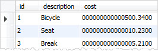

MySQL DECIMAL数据类型用于在数据库中存储精确的数值。对于保持精确精度的列，我们通常使用DECIMAL数据类型，例如会计系统中的货币数据。

要定义数据类型为DECIMAL的列，使用以下语法：

~~~sql
column_name  DECIMAL(P,D);
~~~

在上面的语法中：

- P是表示有效位数的精度。P的范围是1到65。
- D表示小数点后的位数。D的范围是0到30。MySQL要求D小于或等于（<=）P。

DECIMAL（P，D）表示该列最多可以存储带D位小数的P位数。小数列的实际范围取决于精度和小数位数。

除了DECIMAL关键字外，还可以使用DEC、FIXED或NUMERIC，因为它们是DECIMAL的同义词。

与INT数据类型一样，DECIMAL类型也具有UNSIGNED和ZEROFILL属性。如果我们使用UNSIGNED属性，则定义为DECIMAL UNSIGNED的列将不接受负值。

在使用ZEROFILL的情况下，MySQL将显示值填充0，直到列定义指定的显示宽度。另外，如果对DECIMAL列使用ZEROFILL，MySQL会自动向列中添加UNSIGNED属性。

下面的示例使用DECIMAL数据类型定义amount列。

~~~sql
amount DECIMAL(6,2);
~~~

在本例中，amount列可以存储6位数字（2位小数）；因此，amount列的范围是从9999.99到-9999.99。

MySQL允许我们使用以下语法：

~~~sql
column_name DECIMAL(P);
~~~

这相当于：

~~~sql
column_name DECIMAL(P,0);
~~~

在本例中，列不包含小数部分或小数点。

此外，我们甚至可以使用以下语法。

~~~sql
column_name DECIMAL;
~~~

在这种情况下，P的默认值是10。

# DECIMAL存储

MySQL分别为整数部分和小数部分分配存储空间。MySQL使用二进制格式存储十进制值。它把9个数字压缩成4个字节。

对于每个部分，存储每9位数字需要4个字节。剩余数字所需的存储如下表所示:

| **剩下的数字** | **字节数** |
| :------------- | :--------- |
| 0              | 0          |
| 1–2            | 1          |
| 3–4            | 2          |
| 5–6            | 3          |
| 7–9            | 4          |

例如，DECIMAL（19,9）的小数部分为9位，整数部分为19-9=10位。小数部分需要4个字节。整数部分的前9位需要4个字节，剩余的1位需要1个字节。DECIMAL（19,9）列总共需要9个字节。

# DECIMAL数据类型示例

首先，创建一个名为materials的新表，其中包含三列：id、description和cost。

~~~sql
CREATE TABLE materials (
    id INT AUTO_INCREMENT PRIMARY KEY,
    description VARCHAR(255),
    cost DECIMAL(19 , 4 ) NOT NULL
);
~~~

第二，在materials表中插入数据。

~~~sql
INSERT INTO materials(description,cost)
VALUES('Bicycle', 500.34),('Seat',10.23),('Break',5.21);
~~~

第三，从materials表中查询数据。

~~~sql
SELECT 
    *
FROM
    materials;
~~~

第四，更改cost列以包含ZEROFILL属性。

~~~sql
ALTER TABLE materials
MODIFY cost DECIMAL(19,4) zerofill;
~~~

再次查询materials表。

~~~sql
SELECT 
    *
FROM
    materials;
~~~

如您所见，我们在输出值中填充了许多零。