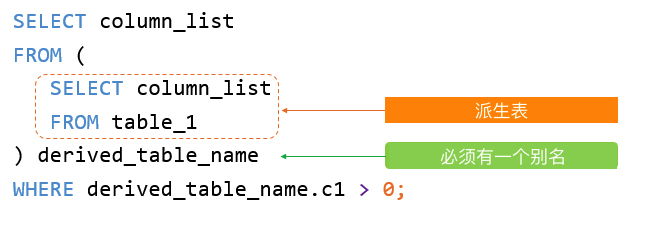

派生表是主查询的FROM子句中的SELECT子查询。它被视为一个表，因为它有列和返回行。它可以用来代替FROM子句中的表。

A derived table is a [SELECT subquery](https://www.databasestar.com/sql-subqueries/) within the FROM clause of your main query. It’s treated like a table because it has columns and returns rows. It can be used in place of a table in the [FROM clause](https://www.databasestar.com/sql-select-statement/)

如果派生表没有别名，MySQL将发出以下错误：

~~~
Every derived table must have its own alias.
~~~

