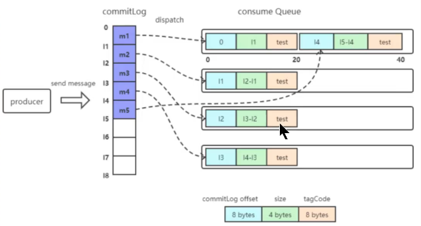

# 一、CommitLog

## 1.1. mapped file

mappedFile文件大小为1G（小于等于1），文件名由20位十进制数构成，表示当前文件的第一条消息的起始位移偏移量。

需要注意的是，一个Broker中仅包含一个commitlog目录，所有的mappedFile文件都是存放在该目录中的。即无论当前Broker中存放着多少Topic的消息，这些消息都是被顺序写入到mappedFile文件中的。也就是说，这些消息在Broker中存放时并没有按照Topic进行分类存放。

### 消息存储单元

mappedFile文件由一个个的消息单元构成。每个消息单元中包含消息总长度MsgLen、消息的物理位置physicalOffset、消息体内容Body、消息长度BodyLength、消息主题Topic、Topic长度TopicLength、消息生成者BornHost、消息发送时间戳BornTimestamp、消息所在的队列QueueId、消息在Queue中存储量的偏移量QueueOffset等20个属性。

# 二、consumequeue

为了提高效率，会为每个Topic在~/store/consumequeue中创建一个目录，目录名为Topic名称。在该Topic目录下，会再为每个该Topic的Queue建立一个目录，目录名为queueId。每个目录中存放着若干consumequeue文件，consumequeue文件是commitlog的索引文件，可以根据consumequeue定位到具体的消息。

consumequeu文件名也有20位数字组成，表示当前文件的第一个索引条目的起始位移偏移量。与mappedFile文件名不同的是，其后续文件名是固定的。因为consumequeue文件大小是固定不变的。

## 索引条目

每个consumequeue文件可以包含30w个索引条目，每个索引条目包含三个消息重要属性：消息在mappedFile文件中的偏移量CommitLog Offset、消息长度、消息Tag的hashcode值。这三个属性占20个字节，所以每个文件的大小是固定的30w*20字节。

> 一个consumequeue文件中所有消息的Topic一定是相同的。但每条消息的Tag可能是不同的。

# 三、对文件的读写

## 消息写入

一条消息进入到Broker后经历了以下几个过程才最终被持久化：

- Broker根据queueId，获取到该消息对应索引条目要在consumequeue目录中的写入偏移量，即QueueOffset。
- 将queueId、queueOffset等数据，与消息一起封装为消息单元
- 将消息写入到commitlog
- 同时，形成消息索引条目
- 将消息索引条目分发到相应的consumequeue

## 消息拉取

当Consumer来拉取消息时会经历以下几个步骤：

- Consumer获取到其要消费消息所在Queue的`消费偏移量offset`，计算出其要消费消息的`消息offset`。

  > 消费offset即消费进度，consumer对某个Queue的消费offset，即消费到了该Queue的第几条消息。
  >
  > 消息offset = 消费offset + 1

- Consumer向Broker发送拉取请求，其中会包含其要拉取消息的Queue、消息offset及消息Tag。

- Broker计算在该consumequeue中的queueOffset。

  > queueOffset = 消息offset * 20字节

- 从该queueOffset处开始向后查找第一个指定Tag的索引条目。

- 解析该索引条目的前8个字节，即可定位到该消息在commitlog中的commitlog offset。

- 从对应commitlog offset中读取消息单元，并发送给consumer。

## 性能提升

RocketMQ中，无论是消息本身还是消息索引，都是存储在磁盘上的。其不会影响消息的消费吗？当然不会。其实RocketMQ的性能在目前的MQ产品中性能是非常高的。因为系统通过一系列相关机制大大提升了性能。

首先，RocketMQ对文件的读写操作是通过`mmap零拷贝`进行的，将对文件的操作转化为直接对内存地址进行操作，从而极大地提高了文件的读写效率。

其次，consumequeue中的数据是顺序存放的，还引入了`PageCage的预读取机制`，使得对consumequeue文件的读取几乎接近于内存读取，即使在消息堆积情况下也不会影响性能。

> PageCache机制，页缓存机制，是OS对文件的缓存机制。
>
> - 写操作：OS会将数据写入到PageCache中，随后会以异步方式由pdflush（page dirty flush）内核线程将Cache中的数据刷盘到物理磁盘
> - 读操作：若用户要读取数据，其首先会从PageCache中读取，若没有命中，则OS再从物理磁盘上加载该数据到PageCache的同时，也会顺序对其相邻数据块中的数据进行预读取。

RocketMQ中可能会影响性能的是commitlog文件的读取。因为对commitlog文件来说，读取消息时会产生大量的随机访问，而随机访问会严重影响性能。不过，如果选择合适的系统IO调度算法，比如设置调度算法为Deadline（采用SSD固态硬盘的话），随机读的性能也会有所提升。

# 四、indexFile

除了通过通常的指定Topic进行消息消费外，RocketMQ还提供过了根据key进行消息查询的功能。该查询时通过store目录中的index子目录中的indexFile进行索引实现的快速查询。当然，这个indexFile中的索引数据是在`包含了key的消息`被发送到Broker时写入的。如果消息中没有包含key，则不会写入。

## 4.1. 索引条目结构

每个Broker中会包含一组indexFile，每个indexFile都是以一个`时间戳`命名的（这个indexFile被创建时的时间戳）。每个indexFile文件由三部分构成：indexHeader、slots槽位、indexes索引数据。每个indexFile文件中包含500w个slot槽。而每个slot槽又可能会挂载很多的index索引单元。

indexHeader固定40个字节，其存放着如下数据：

- beginTimestamp：该indexFile中第一条消息的存储时间
- endTimestamp：该indexFile中最后一条消息存储时间
- beginPhyoffset：该indexFile中第一条消息在commitlog中的偏移量commitlog offset
- endPhyoffset：该indexFile中最后一条消息在commitlog中的偏移量commitlog offset
- hashSlotCount：已经填充有index的slot数量（并不是每个slot槽下都挂载有index索引单元，这里统计的是所有挂载了index索引单元的slot槽的数量）

- indexCount：该indexFile中包含的索引个数（统计出当前indexFile中所有slot槽下挂载的所有index索引单元的数量之和）

indexFile中最复杂的是Slots与Indexes间的关系。在实际存储时，Indexes是在Slots后面的，但为了便于理解，将它们的关系展示为如下形式：

