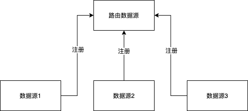
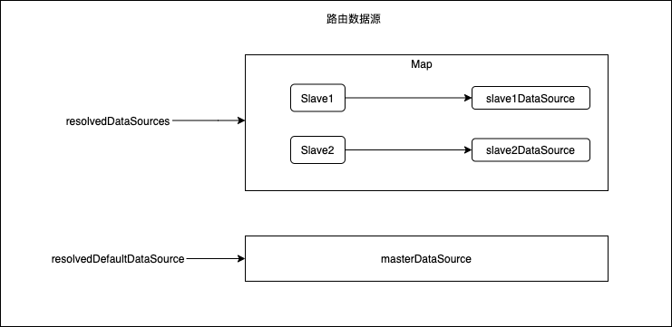

主要类：org.springframework.jdbc.datasource.lookup.AbstractRoutingDataSource

# **第一步：多数据源配置**

配置真实的数据源。

~~~xml
<bean id="masterDataSource" parent="parentDataSource">
    <property name="url" value="${master.jdbc.url}" />
    <property name="username" value="${master.jdbc.username}" />
    <property name="password" value="${master.jdbc.password}" />
    <property name="driverClassName" value="${master.jdbc.driver}" />
    <property name="maxActive" value="15" />
</bean>

<bean id="slave1DataSource" parent="parentDataSource">
    <property name="url" value="${slave1.jdbc.url}" />
    <property name="username" value="${slave1.jdbc.username}" />
    <property name="password" value="${slave1.jdbc.password}" />
    <property name="driverClassName" value="${slave1.jdbc.driver}" />
</bean>

<bean id="slave2DataSource" parent="parentDataSource">
    <property name="url" value="${slave2.jdbc.url}" />
    <property name="username" value="${slave2.jdbc.username}" />
    <property name="password" value="${slave2.jdbc.password}" />
    <property name="driverClassName" value="${slave2.jdbc.driver}" />
</bean>
~~~

# **第二步：配置路由数据源**

真实数据源注册。

路由数据源不配置真实的数据库连接，而是管理真实的数据源。

~~~xml
<bean id="dataSource" class="org.framework.learning.spring.routingdatasource.DynamicRoutingDataSource">
    <property name="targetDataSources">
        <map key-type="org.framework.learning.spring.routingdatasource.RoutingStrategy">
            <entry key="Slave1" value-ref="slave1DataSource" />
            <entry key="Slave2" value-ref="slave2DataSource" />
        </map>
    </property>
    <property name="defaultTargetDataSource" ref="masterDataSource" />
</bean>
~~~

上述配置之后，路由数据源内部就管理了三个数据源。内部数据结构如下：

# **第三步：设置当前线程数据源查找Key**

执行业务逻辑，需要确定访问哪个数据源，路由数据源中已经对可访问的数据源进行了注册，存储为key-value这样的形式，那么就可以通过传递路由key的方式从路由数据源注册中心寻找需要的数据源。这一步就是设置目标数据源查找key。

使用ThreadLocal来存储当前key。使得线程安全，而且同一线程任何代码位置共享。

~~~java
public class DynamicRoutingContextHolder {

    private static final ThreadLocal<RoutingStrategy> contextHolder =
            new ThreadLocal<>();

    public static void setRouteStrategy(RoutingStrategy customerType) {
        Assert.notNull(customerType, "customerType cannot be null");
        contextHolder.set(customerType);
    }

    public static RoutingStrategy getRouteStrategy() {
        return (RoutingStrategy) contextHolder.get();
    }

    public static void clearRouteStrategy() {
        contextHolder.remove();
    }

}
~~~

业务逻辑的代码执行的时候需要先执行上述红色标记的方法。为了通用和侵入性可以使用AOP来操作。

# **第四步：获取路由key**

当执行到从数据源获取Connection的代码时，需要通过路由key来从数据源注册中心进行查找，那么就需要知道当前路由key。

路由数据源类AbstractRoutingDataSource定义了一个由子类实现的方法determineCurrentLookupKey，其通过这个方法来获取当前的路由key。工程代码需要实现这个方法，来自定义获取规则。

上面的一步设定了路由key的设置方法已经存储位置，那么determineCurrentLookupKey方法就从上一步的存储中获取。也就是从ThreadLocal中获取。

~~~java
public class DynamicRoutingDataSource extends AbstractRoutingDataSource {

    @Override
    protected Object determineCurrentLookupKey() {
        return DynamicRoutingContextHolder.getRouteStrategy();
    }
}
~~~

# **第五步：根据路由key查找目标数据源**

访问数据库需要获取Connection对象，而Connection对象从数据源中获取，并且是从真实的数据源中获取。而真实的数据源的访问现在因为引入了路由数据源而不能直接操作。所有的操作对象都是路由数据源。那么路由数据源也就相当于真实数据源的代理，代理了获取Connection对象的操作。

~~~java
@Override
public Connection getConnection() throws SQLException {
    return determineTargetDataSource().getConnection();
}
~~~

~~~java
protected DataSource determineTargetDataSource() {
    Assert.notNull(this.resolvedDataSources, "DataSource router not initialized");
    Object lookupKey = determineCurrentLookupKey();
    DataSource dataSource = this.resolvedDataSources.get(lookupKey);
    if (dataSource == null && (this.lenientFallback || lookupKey == null)) {
        dataSource = this.resolvedDefaultDataSource;
    }
    if (dataSource == null) {
        throw new IllegalStateException("Cannot determine target DataSource for lookup key [" + lookupKey + "]");
    }
    return dataSource;
}
~~~

根据路由key从resolvedDataSources中查找数据源（可以看到，还是从真实的数据源中获取Connection）。

若未从resolvedDataSources中查到路由key对应的数据源，则使用默认的数据源resolvedDefaultDataSource。

