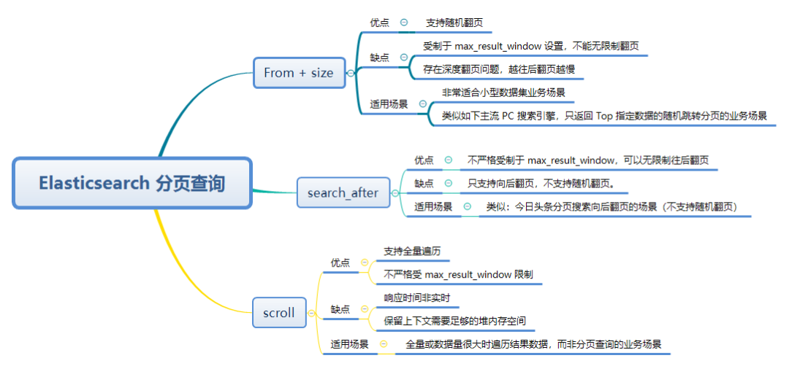

https://www.elastic.co/guide/cn/elasticsearch/guide/current/pagination.html

和 SQL 使用 `LIMIT` 关键字返回单个 `page` 结果的方法相同，Elasticsearch 接受 `from` 和 `size` 参数：

- **`size`**

  显示应该返回的结果数量，默认是 `10`

- **`from`**

  显示应该跳过的初始结果数量，默认是 `0`

如果每页展示 5 条结果，可以用下面方式请求得到 1 到 3 页的结果：

~~~
curl -X GET "localhost:9200/_search?size=5&pretty"
curl -X GET "localhost:9200/_search?size=5&from=5&pretty"
curl -X GET "localhost:9200/_search?size=5&from=10&pretty"
~~~

考虑到分页过深以及一次请求太多结果的情况，结果集在返回之前先进行排序。 但请记住一个请求经常跨越多个分片，每个分片都产生自己的排序结果，这些结果需要进行集中排序以保证整体顺序是正确的。

> **在分布式系统中深度分页**
>
> 理解为什么深度分页是有问题的，我们可以假设在一个有5个主分片的索引中搜索。当我们请求结果的第一页（结果从1到10），每一个分片产生前10个结果，并且返回给协调节点，协调接口对50个结果排序得到全部结果的前10个。
>
> 现在假设我们请求第1000页——结果从10001到10010。所有都以相同的方式工作除了每个分片不得不产生前10010个结果以为。然后协调节点对全部50050个结果排序最后丢弃掉这些结果中的50040个结果。
>
> 可以看到，在分布式系统中，对结果排序的成本随分页的深度成指数上升。这就是 web 搜索引擎对任何查询都不要返回超过 1000 个结果的原因。

# 三种分页方式



## 浅分页(from + size)

~~~json
curl -H 'Content-type: application/json' -X GET 'http://vpc-fat-133.zmaxis.com:9200/chat_message_v01_bak/_search' -d'
{
  "query": {
    "match_all": {}
  },
  "size": 10,
  "from": 0,
  "sort": [
    {
      "_id": {
        "unmapped_type": "keyword",
        "order": "asc"
      }
    }
  ]
}
'
~~~

elasticsearch默认采用的分页方式是from+size的形式，但是在深度分页的情况下，这种使用方式的效率是非常低的，比如from=5000,size=10，es需要在各个分片上匹配排序并得到5000*10条有效数据，然后在结果集中取最后10条数据返回。除了会遇到效率上的问题，还有一个无法解决的问题是es目前支持最大的skip值max_result_window默认为10000，也就是说当from+size > max_result_window时，es将返回错误。

https://www.elastic.co/guide/cn/elasticsearch/guide/2.x/_query_phase.html

### 原理

查询阶段包含以下三个步骤:

1. 客户端发送一个 `search` 请求到 `Node 3` ， `Node 3` 会创建一个大小为 `from + size` 的空优先队列。
2. `Node 3` 将查询请求转发到索引的每个主分片或副本分片中。每个分片在本地执行查询并添加结果到大小为 `from + size` 的本地有序优先队列中。
3. 每个分片返回各自优先队列中所有文档的 ID 和排序值给协调节点，也就是 `Node 3` ，它合并这些值到自己的优先队列中来产生一个全局排序后的结果列表。

### max_result_window

做分页查询，当分页达到一定量的时候，报如下错误：

```
Result window is too large, from + size must be less than or equal to: [10000] but was [78020]. See the scroll api for a more efficient way to request large data sets. This limit can be set by changing the [index.max_result_window] index level setting.
```

es对from + size的大小进行限制，必须小于等于10000。

 **解决方案**

- 在业务中限制分页大小，使`from+size<=10000`;
- 动态更改索引设置，为`max_result_window`参数赋值足够大的值；

```json
PUT index/_settings
{
  "index":{
    "max_result_window":100000000
  }
}
```

推荐使用第一种解决方案，因为es的优势在于搜索，不在于分页，对此做限制就是为不影响其性。就es的默认配置，假设每页10条记录，也有1000页，如果业务上实在不妥协，则使用第二种方案。

## scroll深分页

scroll 类似于sql中的cursor，使用scroll，每次只能获取一页的内容，然后会返回一个scroll_id。根据返回的这个scroll_id可以不断地获取下一页的内容，所以scroll并不适用于有跳页的情景。scroll 的方式，官方的建议不用于实时的请求（一般用于数据导出），因为每一个scroll_id 不仅会占用大量的资源，而且会生成历史快照，对于数据的变更不会反映到快照上。

> 有效生存时间：
>
> It must be less than (1d). This limit can be set by changing the [search.max_keep_alive] cluster level setting.]]
>
> To prevent against issues caused by having too many scrolls open, the user is not allowed to open scrolls past a certain limit. By default, the maximum number of open scrolls is 500. This limit can be updated with the `search.max_open_scroll_context` cluster setting.

#### 原理

**流程：**为了满足深度分页的场景，es 提供了 scroll 的方式进行分页读取（先从各个分片根据搜索结果获取文档ID排序后返回到协调节点，协调节点再进行排序，第一次和from+size流程一样，区别在于通过scroll会把这次搜索的文档ID都汇总到协调节点并缓存起来，下次根据分页获取的时候不再重新构造，而是直接从缓存里获取）具体就是原理上是对某次查询生成一个游标 scroll_id ， 后续的查询只需要根据这个游标去取数据，直到结果集中返回的 hits 字段为空，就表示遍历结束。具体参考官网https://www.elastic.co/guide/en/elasticsearch/reference/current/paginate-search-results.html

ES的搜索是分2个阶段进行的，即Query阶段和Fetch阶段。 Query阶段比较轻量级，通过查询倒排索引，获取满足查询结果的文档ID列表。 而Fetch阶段比较重，需要将每个shard的结果取回，在协调结点进行**全局**排序。 通过From+size这种方式分批获取数据的时候，随着from加大，需要全局排序并丢弃的结果数量随之上升，性能越来越差。

Scroll查询，先做轻量级的Query阶段以后，免去了繁重的全局排序过程。 它只是将查询结果集，也就是doc id列表保留在一个上下文里， 之后每次分批取回的时候，只需根据设置的size，在每个shard内部按照一定顺序（默认doc_id续)， 取回这个size数量的文档即可。

Query阶段并不需要fetch真实的数据，只需要拿到满足条件的doc id列表。 即使有100万个doc id的列表存放并不需要耗费多少内存，因为ES使用了非常紧凑的数据结构和压缩算法来存放这些ID。 所以Query阶段是轻量级的， 真正耗费内存是在fetch阶段的全局排序。 仔细阅读以上上面的文档，有讲到全局排序的原理以及为什么深度分页时，开销越来越高。 

**缺点**：由于scroll_id 不仅会占用大量的资源（特别是排序的请求），而且是生成的历史快照，对于数据的变更不会反映到快照上。这种方式往往用于非实时处理大量数据的情况。

**先获取第一个scroll_id**

先获取第一个scroll_id，url参数包括index和scroll，scroll字段指定了scroll_id的有效生存时间，过期后会被es自动清理。

~~~json
curl -H 'Content-type: application/json' -XGET 'http://vpc-fat-133.zmaxis.com:9200/chat_message_v01_bak/_search?pretty&scroll=2m' -d '
{
  "query": {
    "match_all": {}
  },
  "size": 10,
  "from": 0,
  "sort": [
    {
      "_id": {
        "unmapped_type": "keyword",
        "order": "asc"
      }
    }
  ]
}
'
~~~

~~~json
{ 
  "_scroll_id": "DXF1ZXJ5QW5kRmV0Y2gBAAAAAAKzbLcWcVpHUkhwWkZRMDJZalRqZG1mRUFjUQ==",
  ......
}
~~~

**带scroll id请求**

在遍历时候，拿到上一次遍历中的_scroll_id，然后带scroll参数，重复上一次的遍历步骤，直到返回的数据为空，表示遍历完成。每次都要传参数scroll，刷新搜索结果的缓存时间，另外不需要指定index（不要把缓存的时时间设置太长，占用内存）后续查询：

~~~json
curl -H 'Content-type: application/json' -XGET 'http://vpc-fat-133.zmaxis.com:9200/_search/scroll?pretty' -d '
{
  "scroll_id": "DXF1ZXJ5QW5kRmV0Y2gBAAAAAAKzgtAWcVpHUkhwWkZRMDJZalRqZG1mRUFjUQ==",
  "scroll": "2m"
}
'
~~~

~~~json
{ - 
  "_scroll_id": "DXF1ZXJ5QW5kRmV0Y2gBAAAAAAKzgtAWcVpHUkhwWkZRMDJZalRqZG1mRUFjUQ==",
  ......
}
~~~

> **scroll id删除**
>
> 根据官方文档的说法，scroll的搜索上下文会在scroll的保留时间截止后自动清除，但是我们知道scroll是非常消耗资源的，所以一个建议就是当不需要了scroll数据的时候，尽可能快的把scroll_id显式删除掉。
>
> 清除指定的scroll_id：
>
> ~~~json
> DELETE _search/scroll 
> {
>     "scroll_id" : "DXF1ZXJ5QW5kRmV0Y2gBAAAAAAKzh6sWcVpHUkhwWkZRMDJZalRqZG1mRUFjUQ=="
> }
> 
> 删除多个：
> 
> {
>     "scroll_id" : [
>       "DXF1ZXJ5QW5kRmV0Y2gBAAAAAAAAAD4WYm9laVYtZndUQlNsdDcwakFMNjU1QQ==", "DnF1ZXJ5VGhlbkZldGNoBQAAAAAAAAABFmtSWWRRWUJrU2o2ZExpSGJCVmQxYUEAAAAAAAAAAxZrUllkUVlCa1NqNmRMaUhiQlZkMWFBAAAAAAAAAAIWa1JZZFFZQmtTajZkTGlIYkJWZDFhQQAAAAAAAAAFFmtSWWRRWUJrU2o2ZExpSGJCVmQxYUEAAAAAAAAABBZrUllkUVlCa1NqNmRMaUhiQlZkMWFB"
>     ]
> }
> ~~~
>
> 清除所有的scroll：
>
> ~~~
> DELETE _search/scroll/_all
> ~~~

## search_after深分页

search_after分页的方式是根据上一页的最后一条数据来确定下一页的位置，同时在分页请求的过程中，如果有索引数据的增删改查，这些变更也会实时的反映到游标上。但是需要注意，因为每一页的数据依赖于上一页最后一条数据，所以无法跳页请求。

> 使用search_after必须要设置from=0。
> 这里我使用_id作为唯一值排序。
> 我们在返回的最后一条数据里拿到sort属性的值传入到search_after。

为了找到每一页最后一条数据，每个文档那个必须有一个全局唯一值，官方推荐使用_uuid作为全局唯一值，当然在业务上的id也可以。

~~~json
curl -H 'Content-type: application/json' -XGET 'http://vpc-fat-133.zmaxis.com:9200/chat_message_v01_bak/_search?pretty' -d '
{
  "query": {
    "match_all": {}
  },
  "size": 3,
  "from": 0,
  "sort": [
    {
      "_id": {
        "unmapped_type": "keyword",
        "order": "asc"
      }
    }
  ]
}
'
~~~

~~~json
{
	"took": 172,
	"timed_out": false,
	"_shards": {
		"total": 1,
		"successful": 1,
		"skipped": 0,
		"failed": 0
	},
	"hits": {
		"total": {
			"value": 10000,
			"relation": "gte"
		},
		"max_score": null,
		"hits": [
			{
				"_index": "chat_message_v01_bak",
				"_type": "colse",
				"_id": "--0RYXXxRkGEym8",
				"_score": null,
				"_source": {
					"fileName": null,
					"loginId": "1688852022706519",
					"corporationId": 1,
					"serverWeChatId": "tian",
					"isRecvMsg": 0,
					"deviceId": null,
					"serverId": "1273336",
					"content": "6666",
					"senderId": "1688852022706519",
					"contentType": "0x2",
					"chatType": 1,
					"clientId": "--0RYXXxRkGEym8",
					"corpId": "1970325139148973",
					"offset": 30420,
					"conversationId": "R:10696051277016237",
					"url": null,
					"sendTime": 1607453304,
					"sequence": "12521780",
					"@timestamp": "2020-12-11T09:49:08.482308Z",
					"recverId": "10696051277016237",
					"atList": null
				},
				"sort": [
					"--0RYXXxRkGEym8"
				]
			},
			{
				"_index": "chat_message_v01_bak",
				"_type": "colse",
				"_id": "--48zY4WTwa9n-O",
				"_score": null,
				"_source": {
					"contentType": "0x2",
					"corpId": "1970325139148973",
					"loginId": "1688852022700275",
					"chatType": 1,
					"deviceId": null,
					"serverId": "1445644",
					"sequence": "7823549",
					"isRecvMsg": 0,
					"recverId": "10696051277016234",
					"senderId": "1688852022700275",
					"serverWeChatId": "D00227",
					"conversationId": "R:10696051277016234",
					"content": "📚今天鑫鑫老师给您分享数学思维小习题来啦[愉快]\n🔍没有收到小习题的家长，回复我一下哦~\n🖇只说2个事情：\n🔹今晚8点还有一场直播活动，可以直播抽奖的哦~\n🔹后天开始，介绍朋友买课，由“每门年课返50元”改为“只有首单返50”啦~",
					"clientId": "--48zY4WTwa9n-O",
					"sendTime": 1609329229,
					"offset": 524,
					"url": null,
					"fileName": null,
					"atList": null,
					"corporationId": 1
				},
				"sort": [
					"--48zY4WTwa9n-O"
				]
			},
			{
				"_index": "chat_message_v01_bak",
				"_type": "colse",
				"_id": "--6-crbSRnGSLfu",
				"_score": null,
				"_source": {
					"fileName": null,
					"loginId": "1688852022706519",
					"corporationId": 1,
					"serverWeChatId": "tian",
					"isRecvMsg": 0,
					"deviceId": null,
					"serverId": "1291030",
					"content": "6666",
					"senderId": "1688852022706519",
					"contentType": "0x2",
					"chatType": 1,
					"clientId": "--6-crbSRnGSLfu",
					"corpId": "1970325139148973",
					"offset": 33369,
					"conversationId": "R:10696051277016237",
					"url": null,
					"sendTime": 1607462328,
					"sequence": "12530627",
					"@timestamp": "2020-12-11T09:49:22.802397Z",
					"recverId": "10696051277016237",
					"atList": null
				},
				"sort": [
					"--6-crbSRnGSLfu"
				]
			}
		]
	}
}
~~~

使用sort返回的值搜索下一页：

~~~json
curl -H 'Content-type: application/json' -XGET 'http://vpc-fat-133.zmaxis.com:9200/chat_message_v01_bak/_search?pretty' -d '
{
  "query": {
    "match_all": {}
  },
  "size": 3,
  "from": 0,
  "search_after": [
    "--6-crbSRnGSLfu"
  ],
  "sort": [
    {
      "_id": {
        "unmapped_type": "keyword",
        "order": "asc"
      }
    }
  ]
}
'
~~~

~~~json
{
	"took": 141,
	"timed_out": false,
	"_shards": {
		"total": 1,
		"successful": 1,
		"skipped": 0,
		"failed": 0
	},
	"hits": {
		"total": {
			"value": 10000,
			"relation": "gte"
		},
		"max_score": null,
		"hits": [
			{
				"_index": "chat_message_v01_bak",
				"_type": "colse",
				"_id": "--7Iz7fvT0SxNed",
				"_score": null,
				"_source": {
					"fileName": null,
					"loginId": "1688852022706519",
					"corporationId": 1,
					"serverWeChatId": "tian",
					"isRecvMsg": 0,
					"deviceId": null,
					"serverId": "1198832",
					"content": "6666",
					"senderId": "1688852022706519",
					"contentType": "0x2",
					"chatType": 1,
					"clientId": "--7Iz7fvT0SxNed",
					"corpId": "1970325139148973",
					"offset": 18018,
					"conversationId": "R:10696051277016238",
					"url": null,
					"sendTime": 1607413894,
					"sequence": "12484539",
					"@timestamp": "2020-12-11T09:47:47.054480Z",
					"recverId": "10696051277016238",
					"atList": null
				},
				"sort": [
					"--7Iz7fvT0SxNed"
				]
			},
			{
				"_index": "chat_message_v01_bak",
				"_type": "colse",
				"_id": "--B7ryEhTGCVS27",
				"_score": null,
				"_source": {
					"contentType": "0x2",
					"corpId": "1970325139148973",
					"loginId": "1688852951816966",
					"chatType": 1,
					"deviceId": null,
					"serverId": "1233554",
					"sequence": "3438223",
					"isRecvMsg": 1,
					"recverId": "1970324961140744",
					"senderId": "1688853104638131",
					"serverWeChatId": "wordACEgAAX5JWZ5hm42AteF9c8eT9tg",
					"conversationId": "R:1970324961140744",
					"content": "98889",
					"clientId": "--B7ryEhTGCVS27",
					"sendTime": 1607393729,
					"offset": 605,
					"url": null,
					"fileName": null,
					"atList": null,
					"corporationId": 1
				},
				"sort": [
					"--B7ryEhTGCVS27"
				]
			},
			{
				"_index": "chat_message_v01_bak",
				"_type": "colse",
				"_id": "--BN8dIaR_ah51_",
				"_score": null,
				"_source": {
					"fileName": null,
					"loginId": "1688852022706519",
					"corporationId": 1,
					"serverWeChatId": "tian",
					"isRecvMsg": 0,
					"deviceId": null,
					"serverId": "1277804",
					"content": "6666",
					"senderId": "1688852022706519",
					"contentType": "0x2",
					"chatType": 1,
					"clientId": "--BN8dIaR_ah51_",
					"corpId": "1970325139148973",
					"offset": 30925,
					"conversationId": "R:10696051277016232",
					"url": null,
					"sendTime": 1607455584,
					"sequence": "12524014",
					"@timestamp": "2020-12-11T09:49:11.966881Z",
					"recverId": "10696051277016232",
					"atList": null
				},
				"sort": [
					"--BN8dIaR_ah51_"
				]
			}
		]
	}
}
~~~

# 代码示例

https://blog.csdn.net/lsqingfeng/article/details/108572402?utm_medium=distribute.pc_relevant.none-task-blog-baidujs_baidulandingword-0&spm=1001.2101.3001.4242

## 浅分页

## scroll分页

## search_after分页

# 参考文档

https://juejin.cn/post/6890891504630366215
