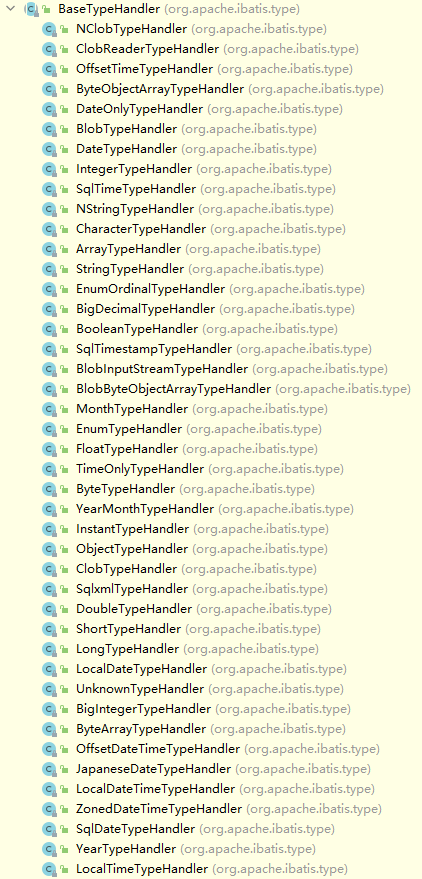
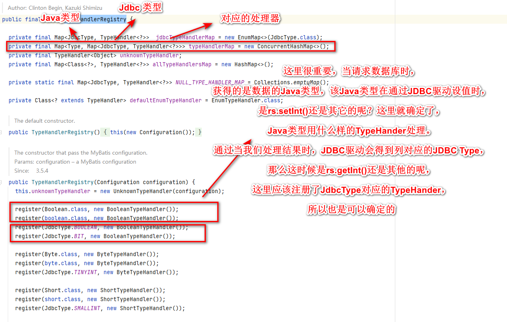
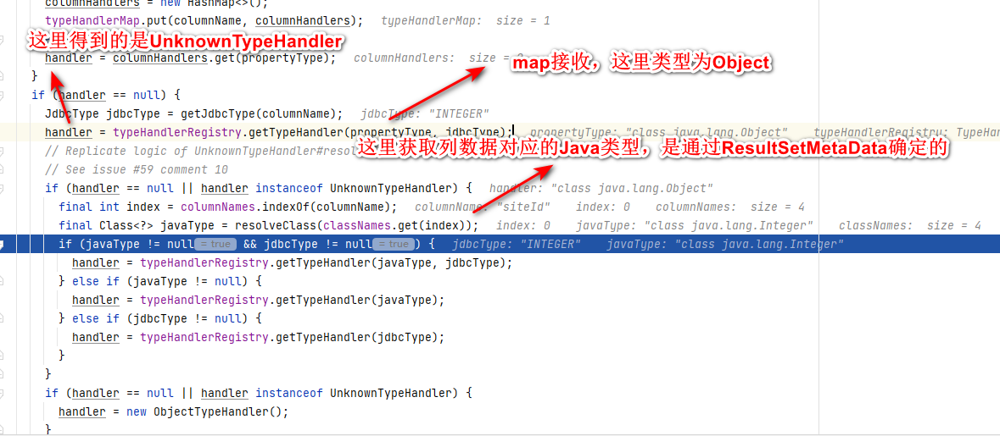
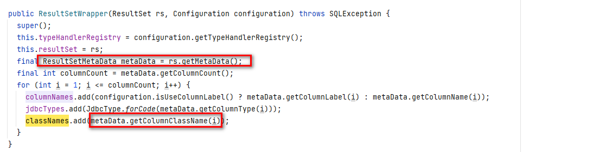
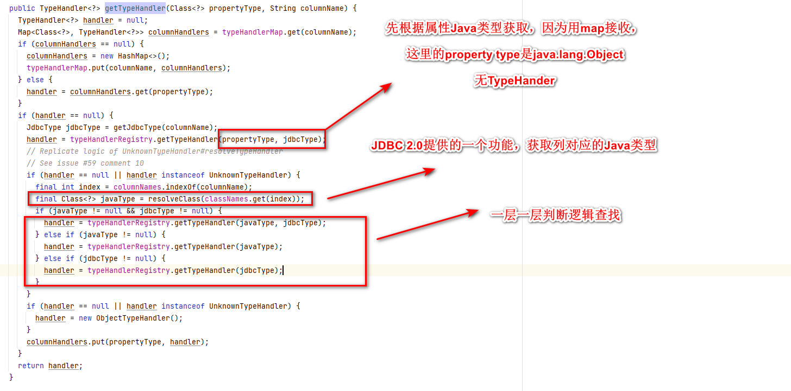
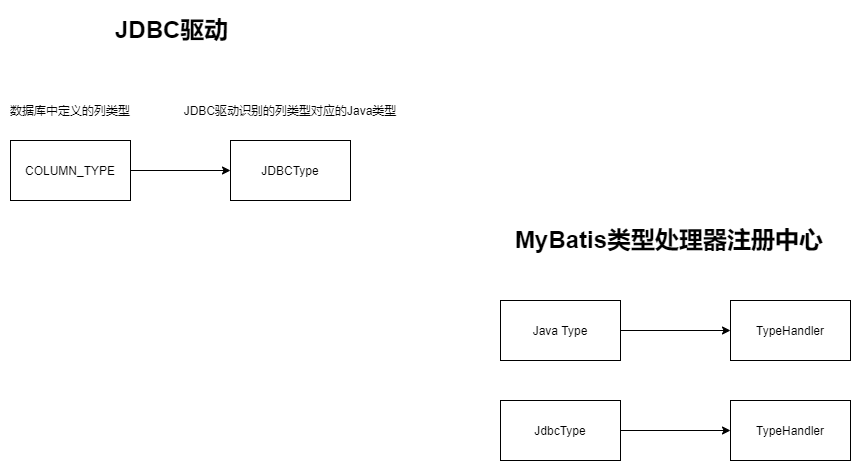

# MySQL列类型和JdbcType的对应关系

# 执行流程

org.apache.ibatis.executor.resultset.DefaultResultSetHandler#handleRowValues

->
org.apache.ibatis.executor.resultset.DefaultResultSetHandler#handleRowValuesForSimpleResultMap

->

org.apache.ibatis.executor.resultset.DefaultResultSetHandler#getRowValue(org.apache.ibatis.executor.resultset.ResultSetWrapper, org.apache.ibatis.mapping.ResultMap, java.lang.String)

->

# Auto-mapping

https://mybatis.org/mybatis-3/sqlmap-xml.html#Auto-mapping

# TypeHandler是怎么确定的

org.apache.ibatis.executor.resultset.DefaultResultSetHandler#createAutomaticMappings

org.apache.ibatis.executor.resultset.ResultSetWrapper#getTypeHandler

~~~
handler = typeHandlerRegistry.getTypeHandler(propertyType, jdbcType);
~~~

## TypeHandlerRegistry

org.apache.ibatis.type.TypeHandlerRegistry

这里很重要，当请求数据库时，获得的是数据的Java类型，该Java类型在通过JDBC驱动设值时，是rs.setInt()还是其它的呢？这里就确定了，Java类型用什么样的TypeHander处理。通过当我们处理结果时，JDBC驱动会得到列对应的JDBC Type，那么这时候是rs.getInt()还是其他的呢，这里应该注册了JdbcType对应的TypeHander，所以也是可以确定的。

## TypeHandler的确定

org.apache.ibatis.executor.resultset.ResultSetWrapper#getTypeHandler

## 列对应的Java类型的确定

## Java类型为Object，如何确定TypeHandler

# 整体逻辑

# 自动映射处理

org.apache.ibatis.executor.resultset.DefaultResultSetHandler#getRowValue(org.apache.ibatis.executor.resultset.ResultSetWrapper, org.apache.ibatis.mapping.ResultMap, java.lang.String)

~~~
private Object getRowValue(ResultSetWrapper rsw, ResultMap resultMap, String columnPrefix) throws SQLException {
	final ResultLoaderMap lazyLoader = new ResultLoaderMap();
	Object rowValue = createResultObject(rsw, resultMap, lazyLoader, columnPrefix);
	if (rowValue != null && !hasTypeHandlerForResultObject(rsw, resultMap.getType())) {
	  final MetaObject metaObject = configuration.newMetaObject(rowValue);
	  boolean foundValues = this.useConstructorMappings;
	  if (shouldApplyAutomaticMappings(resultMap, false)) {
		foundValues = applyAutomaticMappings(rsw, resultMap, metaObject, columnPrefix) || foundValues;
	  }
	  foundValues = applyPropertyMappings(rsw, resultMap, metaObject, lazyLoader, columnPrefix) || foundValues;
	  foundValues = lazyLoader.size() > 0 || foundValues;
	  rowValue = foundValues || configuration.isReturnInstanceForEmptyRow() ? rowValue : null;
	}
	return rowValue;
}
~~~

org.apache.ibatis.executor.resultset.DefaultResultSetHandler#applyAutomaticMappings

~~~
private boolean applyAutomaticMappings(ResultSetWrapper rsw, ResultMap resultMap, MetaObject metaObject, String columnPrefix) throws SQLException {
    List<UnMappedColumnAutoMapping> autoMapping = createAutomaticMappings(rsw, resultMap, metaObject, columnPrefix);
    boolean foundValues = false;
    if (!autoMapping.isEmpty()) {
      for (UnMappedColumnAutoMapping mapping : autoMapping) {
        final Object value = mapping.typeHandler.getResult(rsw.getResultSet(), mapping.column);
        if (value != null) {
          foundValues = true;
        }
        if (value != null || (configuration.isCallSettersOnNulls() && !mapping.primitive)) {
          // gcode issue #377, call setter on nulls (value is not 'found')
          metaObject.setValue(mapping.property, value);
        }
      }
    }
    return foundValues;
}
~~~

org.apache.ibatis.executor.resultset.DefaultResultSetHandler#createAutomaticMappings

~~~
private List<UnMappedColumnAutoMapping> createAutomaticMappings(ResultSetWrapper rsw, ResultMap resultMap, MetaObject metaObject, String columnPrefix) throws SQLException {
    final String mapKey = resultMap.getId() + ":" + columnPrefix;
    List<UnMappedColumnAutoMapping> autoMapping = autoMappingsCache.get(mapKey);
    if (autoMapping == null) {
      autoMapping = new ArrayList<>();
      final List<String> unmappedColumnNames = rsw.getUnmappedColumnNames(resultMap, columnPrefix);
      for (String columnName : unmappedColumnNames) {
        String propertyName = columnName;
        if (columnPrefix != null && !columnPrefix.isEmpty()) {
          // When columnPrefix is specified,
          // ignore columns without the prefix.
          if (columnName.toUpperCase(Locale.ENGLISH).startsWith(columnPrefix)) {
            propertyName = columnName.substring(columnPrefix.length());
          } else {
            continue;
          }
        }
        final String property = metaObject.findProperty(propertyName, configuration.isMapUnderscoreToCamelCase());
        if (property != null && metaObject.hasSetter(property)) {
          if (resultMap.getMappedProperties().contains(property)) {
            continue;
          }
          final Class<?> propertyType = metaObject.getSetterType(property);
          if (typeHandlerRegistry.hasTypeHandler(propertyType, rsw.getJdbcType(columnName))) {
            final TypeHandler<?> typeHandler = rsw.getTypeHandler(propertyType, columnName);
            autoMapping.add(new UnMappedColumnAutoMapping(columnName, property, typeHandler, propertyType.isPrimitive()));
          } else {
            configuration.getAutoMappingUnknownColumnBehavior()
                .doAction(mappedStatement, columnName, property, propertyType);
          }
        } else {
          configuration.getAutoMappingUnknownColumnBehavior()
              .doAction(mappedStatement, columnName, (property != null) ? property : propertyName, null);
        }
      }
      autoMappingsCache.put(mapKey, autoMapping);
    }
    return autoMapping;
}
~~~

