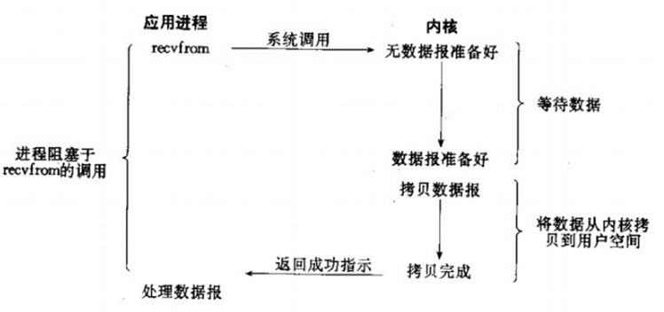
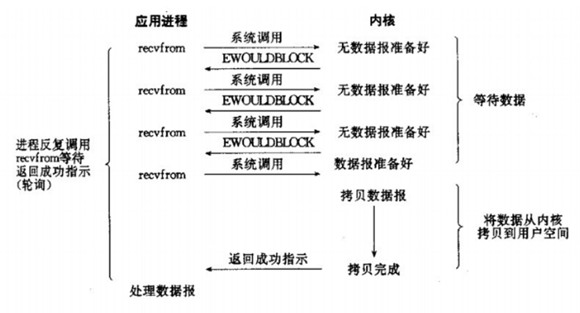
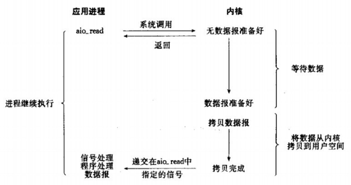
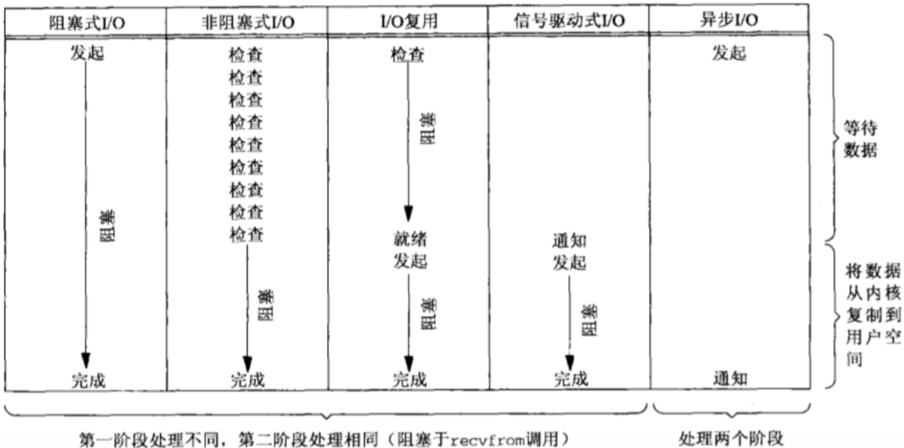

# 1. BIO、NIO和AIO模型的区别

## BIO

## NIO

## AIO

## BIO、NIO和AIO对比

# 2. 同步与异步、阻塞与非阻塞的区别

# 3. select、poll、epoll的机制及其区别

# 4. Netty底层操作与Java NIO操作对应关系如何

# 5. Netty的线程模型是怎样的，与Redis线程模型有区别吗

# 6. 说说Reactor响应式编程是怎么回事

# 7. Netty的粘包/拆包是怎么处理的，有哪些实现

https://www.cnblogs.com/rickiyang/p/12904552.html

# 8. Netty的protobuf编解码机制是怎样的

# 9. Netty如何实现断线自动重连

重写channelInactive方法。

# 10. Netty如何支持单机百万连接

# 11. 说说Netty零拷贝的原理

# 12. 说说Netty如何实现长连接心跳保活机制

 IdleStateHandler 可以实现心跳功能，当服务器和客户端没有任何读写交互时，并超过了给定的时间，则会
触发用户 handler 的 userEventTriggered 方法。用户可以在这个方法中尝试向对方发送信息，如果发送失败，则关 闭连接。

# 13. Netty的内存池是怎么实现的

# 14. Netty是如何解决NIO底层epoll空轮询导致CPU 100%的bug

# 15. Netty高并发高性能体现在哪些方面

# 16. 基于Netty如何设计微信钉钉后端高并发IM架构

