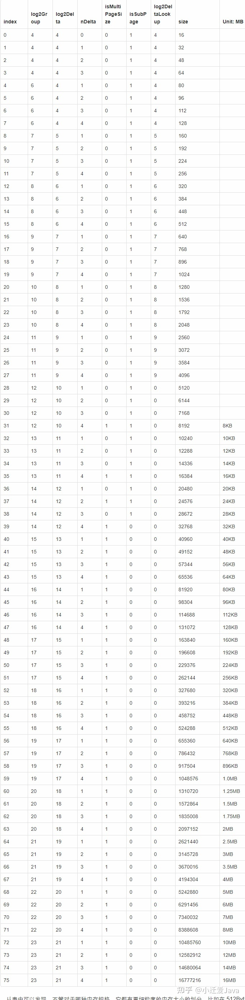

# 一、属性

## smallSubpagePools

~~~
private final PoolSubpage<T>[] smallSubpagePools
~~~

> 39个元素，对照下面的规格表看。

# 二、方法

## io.netty.buffer.SizeClasses#size2SizeIdx

功能：根据请求的字节数大小确定在内存规格表中的索引。

比如说申请的128字节，可以查出在内存规格表中的索引为7，得到这个索引就可以确定申请的这个内存大小是什么规格，也就是说是small还是Normal，small最大的内存大小为28kb，索引为38，也就是说只要索引小于等于38，则按small规格来分配。

## io.netty.buffer.PoolArena#allocate(io.netty.buffer.PoolThreadCache, io.netty.buffer.PooledByteBuf<T>, int)

