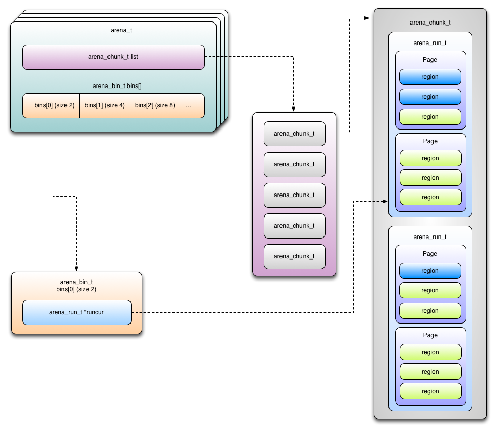
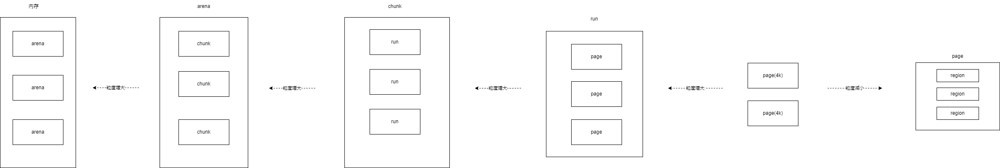

jemalloc 是由 Jason Evans 在 FreeBSD 项目中引入的新一代内存分配器。它是一个通用的 malloc 实现，侧重于减少内存碎片和提升高并发场景下内存的分配效率，其目标是能够替代 malloc。

# 一、核心目标

核心目标是一致的：

- 高效的内存分配和回收，提升单线程或者多线程场景下的性能。
- 减少内存碎片，包括内部碎片和外部碎片，提高内存的有效利用率。

# 二、常用内存分配器算法

## 2.1. 动态内存分配

动态内存分配（Dynamic memory allocation）又称为堆内存分配，后面简称 DMA，操作系统根据程序运行过程中的需求即时分配内存，且分配的内存大小就是程序需求的大小。在大部分场景下，只有在程序运行的时候才知道所需要分配的内存大小，如果提前分配可能会分配的大小无法把控，分配太大会浪费空间，分配太小会无法使用。

### **⾸次适应算法（first fit）**

### **循环首次适应算法（next fit）**

### **最佳适应算法（best fit）**

## 2.2. 伙伴算法

伙伴算法是一种非常经典的内存分配算法，它采用了分离适配的设计思想，将物理内存按照 2 的次幂进行划分，内存分配时也是按照 2 的次幂大小进行按需分配，例如 4KB、 8KB、16KB 等。假设我们请求分配的内存大小为 10KB，那么会按照 16KB 分配。

>  所谓伙伴块是不仅大小相同，而且两个块的地址是连续的，其中低地址的内存块起始地址必须为 2 的整数次幂。

## 2.3. Slab 算法

因为伙伴算法都是以 Page 为最小管理单位，在小内存的分配场景，伙伴算法并不适用，如果每次都分配一个 Page 岂不是非常浪费内存，因此 Slab 算法应运而生了。Slab 算法在伙伴算法的基础上，对小内存的场景专门做了优化，采用了内存池的方案，解决内部碎片问题。

# 三、jemalloc

## 3.1. 存储单元结构

### 图-1

1. 内存是由一定数量的arena来进行管理。arena是多核实现中用来避免cpu cache访问失败的，其数量一般为cpu*4。也就是在4核cpu上，如果进程的线程数在16以内，则每个线程分配一个Arena，避免了竞争访问。
2. 一个arena被分为若干个chunks，一个chunk一般为2M或4M。
3. chunk 内部包含若干runs, 作为分配小块内存的基础单元。
4. run 由pages组成, 最终被划分为一定数量的region. 对于小内存请求, region 就是最后给用户的内存。

所以, 类似上面的物流, 我们换一种类比, 则 region 是商品, run 是物品架, 该架子上放同类商品, 而 chunk 是一个仓库. 一个仓库里可以包含各种不同的货架. 一个货架上只能包含相同的商品.

### 图-2

### Runs

- Runs are further denominations of the memory that has been divided into chunks
- A chunk is divided into several runs
- Each run is a set of one or more contiguous pages
- Cannot be smaller than one page
- Aligned to multiples of the page size

### Regions

- End user memory areas returned by malloc()
- Three size classes
  - Small/medium: smaller than the page size
    - Example: 2, 4, 8, 16, 32, ....
  - Large: multiple of page size, smaller than chunk size
    - Example: 4K, 8K, 16K, ..., ~chunk size
  - Huge: bigger than the chunk size

#### Region size classes

- Small/medium regions are placed on different runs according to their size
- Large regions have their own runs
  - Each large allocation has a dedicated run
- Huge regions have their own dedicated contiguous chunks
  - Managed by a global red-black tree

### Bins

- Bins are used to store free regions
- They organize regions via run and keep metadata on them
  - Size class
  - Total number of regions on a run
- A bin may be associated with several runs
- A run can only be associated with a specific bin
- Bins have their runs organized in a tree
- Each bin has an associated size class and stores / manages regions of this class
- These regions are accessed through the bin’s run
- Most recently used run of the bin: runcur
- Tree of runs with free regions: runs
  - Used when runcur is full

### 图-3

# 参考资料

https://wertherzhang.com/jemalloc%E5%89%96%E6%9E%90/

https://learn.lianglianglee.com/%E4%B8%93%E6%A0%8F/Netty%20%E6%A0%B8%E5%BF%83%E5%8E%9F%E7%90%86%E5%89%96%E6%9E%90%E4%B8%8E%20RPC%20%E5%AE%9E%E8%B7%B5-%E5%AE%8C/12%20%20%E4%BB%96%E5%B1%B1%E4%B9%8B%E7%9F%B3%EF%BC%9A%E9%AB%98%E6%80%A7%E8%83%BD%E5%86%85%E5%AD%98%E5%88%86%E9%85%8D%E5%99%A8%20jemalloc%20%E5%9F%BA%E6%9C%AC%E5%8E%9F%E7%90%86.md

