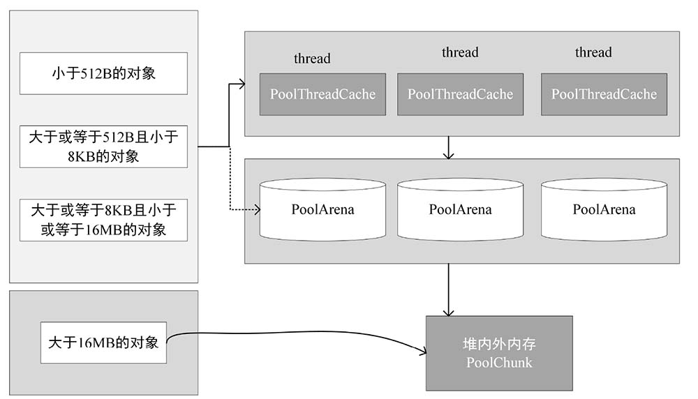

为了提高内存的使用效率，Netty引入了jemalloc内存分配算法。Netty内存管理层级结构如图6-1所示，其中右边是内存管理的3个层级，分别是本地线程缓存、分配区arena、系统内存；左边是内存块区域，不同大小的内存块对应不同的分配区，总体的分配策略如下。

• 为了避免线程间锁的竞争和同步，每个I/O线程都对应一个PoolThreadCache，负责当前线程使用非大内存的快速申请和释放。

• 当从PoolThreadCache中获取不到内存时，就从PoolArena的内存池中分配。当内存使用完并释放时，会将其放到PoolThreadCache中，方便下次使用。若从PoolArena的内存池中分配不到内存，则从堆内外内存中申请，申请到的内存叫PoolChunk。当内存块的大小默认为12MB时，会被放入PoolArea的内存池中，以便重复利用。当申请大内存时（超过了PoolChunk的默认内存大小12MB），直接在堆外或堆内内存中创建（不归PoolArea管理），用完后直接回收。本书只介绍Netty的内存池可重复利用的内存。

