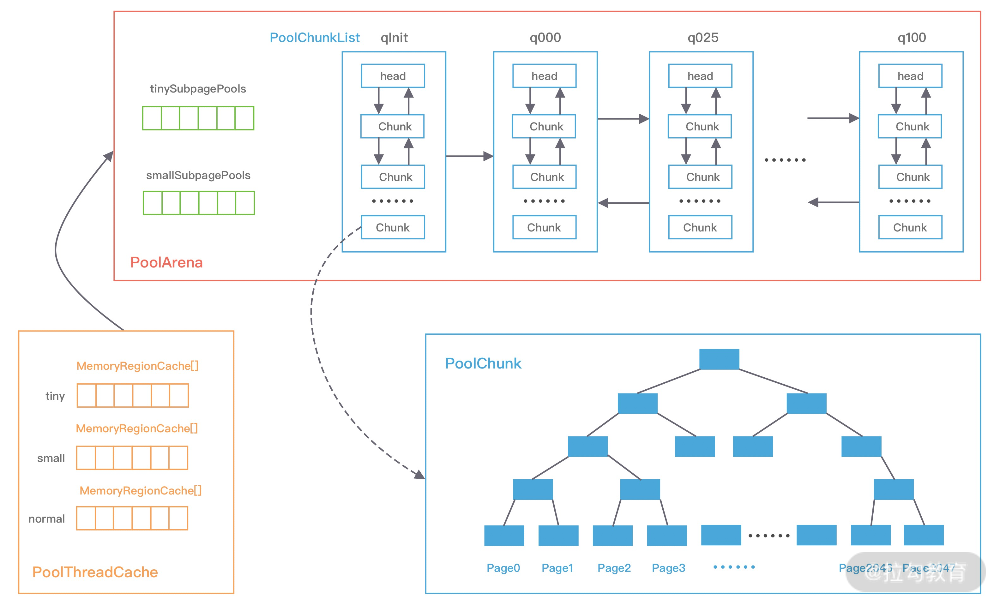

Netty 高性能的内存管理也是借鉴 jemalloc 实现的，它同样需要解决两个经典的核心问题：

- 在单线程或者多线程的场景下，如何高效地进行内存分配和回收？
- 如何减少内存碎片，提高内存的有效利用率？

# 一、内存规格

## chunk

Chunk 是 Netty向操作系统申请内存的单位，所有的内存分配操作也是基于 Chunk 完成的，Chunk 可以理解为 Page的集合，每个Chunk 默认大小为16M。

## Page

Page 是 Chunk 用于管理内存的单位，Netty 中的 Page 的大小为 8K，不要与 Linux 中的内存页 Page 相混淆了。假如我们需要分配 64K 的内存，需要在 Chunk 中选取 8 个 Page 进行分配。

## Subpage

Subpage 负责 Page 内的内存分配，假如我们分配的内存大小远小于 Page，直接分配一个 Page 会造成严重的内存浪费，所以需要将 Page 划分为多个相同的子块进行分配，这里的子块就相当于 Subpage。按照 Tiny 和 Small 两种内存规格，SubPage 的大小也会分为两种情况。在 Tiny 场景下，最小的划分单位为 16B，按 16B 依次递增，16B、32B、48B ...... 496B；在 Small 场景下，总共可以划分为 512B、1024B、2048B、4096B 四种情况。Subpage 没有固定的大小，需要根据用户分配的缓冲区大小决定，例如分配 1K 的内存时，Netty 会把一个 Page 等分为 8 个 1K 的 Subpage。

# 二、Netty内存池架构设计

