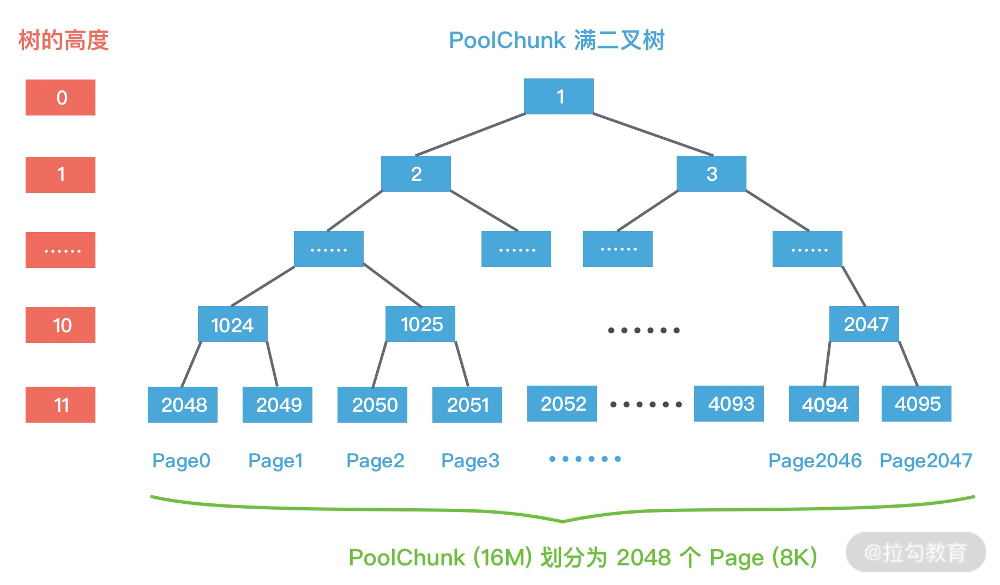

Netty 高性能的内存管理也是借鉴 jemalloc 实现的，它同样需要解决两个经典的核心问题：

- 在单线程或者多线程的场景下，如何高效地进行内存分配和回收？
- 如何减少内存碎片，提高内存的有效利用率？

# 一、内存规格


## chunk

Chunk 是 Netty向操作系统申请内存的单位，所有的内存分配操作也是基于 Chunk 完成的，Chunk 可以理解为 Page的集合，每个Chunk 默认大小为16M。

## Page

Page 是 Chunk 用于管理内存的单位，Netty 中的 Page 的大小为 8K，不要与 Linux 中的内存页 Page 相混淆了。假如我们需要分配 64K 的内存，需要在 Chunk 中选取 8 个 Page 进行分配。

## Subpage

Subpage 负责 Page 内的内存分配，假如我们分配的内存大小远小于 Page，直接分配一个 Page 会造成严重的内存浪费，所以需要将 Page 划分为多个相同的子块进行分配，这里的子块就相当于 Subpage。按照 Tiny 和 Small 两种内存规格，SubPage 的大小也会分为两种情况。在 Tiny 场景下，最小的划分单位为 16B，按 16B 依次递增，16B、32B、48B ...... 496B；在 Small 场景下，总共可以划分为 512B、1024B、2048B、4096B 四种情况。Subpage 没有固定的大小，需要根据用户分配的缓冲区大小决定，例如分配 1K 的内存时，Netty 会把一个 Page 等分为 8 个 1K 的 Subpage。

# 二、Netty内存池架构设计


## 术语

### page

```
page  - a page is the smallest unit of memory chunk that can be allocated
```

### run

~~~
run - a run is a collection of pages
~~~

### chunk

~~~
a chunk is a collection of runs
~~~

## 2.1. PoolArena

### PoolChunkList属性结构

~~~java
private final PoolChunkList<T> q050;
private final PoolChunkList<T> q025;
private final PoolChunkList<T> q000;
private final PoolChunkList<T> qInit;
private final PoolChunkList<T> q075;
private final PoolChunkList<T> q100;
~~~


PoolChunkList 用于 Chunk 场景下的内存分配，PoolArena 中初始化了六个 PoolChunkList，分别为 qInit、q000、q025、q050、q075、q100，这与 jemalloc 中 run 队列思路是一致的，它们分别代表不同的内存使用率，如下所示：

- qInit，内存使用率为 0 ~ 25% 的 Chunk。
- q000，内存使用率为 1 ~ 50% 的 Chunk。
- q025，内存使用率为 25% ~ 75% 的 Chunk。
- q050，内存使用率为 50% ~ 100% 的 Chunk。
- q075，内存使用率为 75% ~ 100% 的 Chunk。
- q100，内存使用率为 100% 的 Chunk。

PoolChunkList 负责管理多个 PoolChunk 的生命周期，同一个 PoolChunkList 中存放内存使用率相近的 PoolChunk，这些 PoolChunk 同样以双向链表的形式连接在一起。

每个 PoolChunkList 都有内存使用率的上下限：minUsage 和 maxUsage，当 PoolChunk 进行内存分配后，如果使用率超过 maxUsage，那么 PoolChunk 会从当前 PoolChunkList 移除，并移动到下一个 PoolChunkList。同理，PoolChunk 中的内存发生释放后，如果使用率小于 minUsage，那么 PoolChunk 会从当前 PoolChunkList 移除，并移动到前一个 PoolChunkList。

回过头再看下 Netty 初始化的六个 PoolChunkList，每个 PoolChunkList 的上下限都有交叉重叠的部分，如下图所示。因为 PoolChunk 需要在 PoolChunkList 不断移动，如果每个 PoolChunkList 的内存使用率的临界值都是恰好衔接的，例如 1 ~ 50%、50% ~ 75%，那么如果 PoolChunk 的使用率一直处于 50% 的临界值，会导致 PoolChunk 在两个 PoolChunkList 不断移动，造成性能损耗。


## 2.2. PoolChunkList

### 内部结构


## 2.3. PoolChunk

Netty 内存的分配和回收都是基于 PoolChunk 完成的，PoolChunk 是真正存储内存数据的地方，每个 PoolChunk 的默认大小为 16M，首先我们看下 PoolChunk 数据结构的定义：

~~~java
final class PoolChunk<T> implements PoolChunkMetric {

    final PoolArena<T> arena;

    final T memory; // 存储的数据

    private final byte[] memoryMap; // 满二叉树中的节点是否被分配，数组大小为 4096

    private final byte[] depthMap; // 满二叉树中的节点高度，数组大小为 4096

    private final PoolSubpage<T>[] subpages; // PoolChunk 中管理的 2048 个 8K 内存块

    private int freeBytes; // 剩余的内存大小

    PoolChunkList<T> parent;

    PoolChunk<T> prev;

    PoolChunk<T> next;
    // 省略其他代码

}
~~~

PoolChunk 可以理解为 Page 的集合，Page 只是一种抽象的概念，实际在 Netty 中 Page 所指的是 PoolChunk 所管理的子内存块，每个子内存块采用 PoolSubpage 表示。Netty 会使用伙伴算法将 PoolChunk 分配成 2048 个 Page，最终形成一颗满二叉树，二叉树中所有子节点的内存都属于其父节点管理，如下图所示。




## 2.4. PoolSubpage

Netty 中并没有 Page 的定义，直接使用 PoolSubpage 表示。当分配的内存小于 8K 时，PoolChunk 中的每个 Page 节点会被划分成为更小粒度的内存块进行管理，小内存块同样以 PoolSubpage 管理。从图中可以看出，小内存的分配场景下，会首先找到对应的 PoolArena ，然后根据计算出对应的 tinySubpagePools 或者 smallSubpagePools 数组对应的下标，如果对应数组元素所包含的 PoolSubpage 链表不存在任何节点，那么将创建新的 PoolSubpage 加入链表中。

第一个就是 PoolSubpage 是如何记录内存块的使用状态的呢？PoolSubpage 通过位图 bitmap 记录子内存是否已经被使用，bit 的取值为 0 或者 1，如下图所示。

