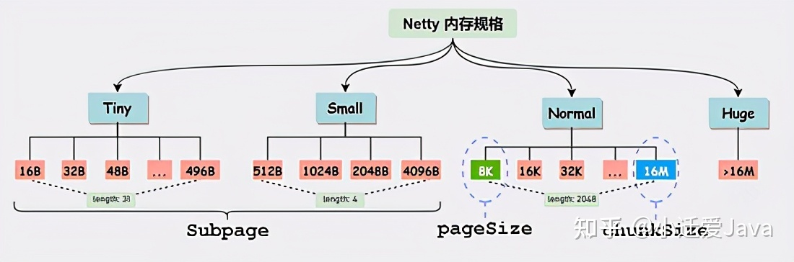
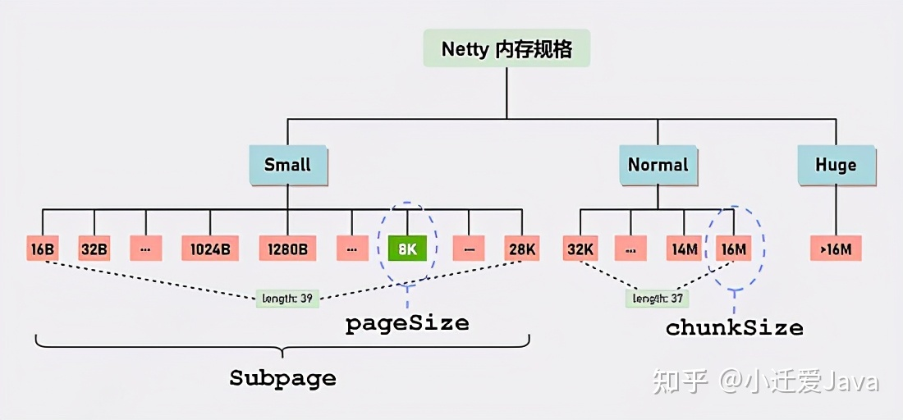
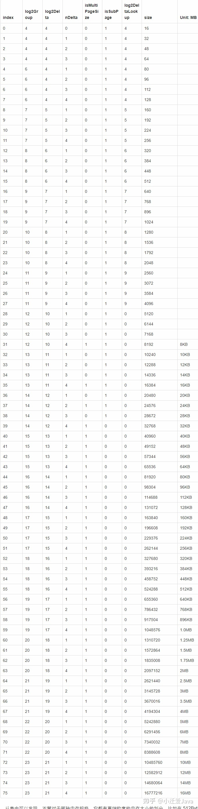

# netty4.0（基于jemalloc3）

仔细发现，在 Small 级别的内存分配中会存在大量的内存碎片: 比如用户申请内存大小为 1025，按 jemalloc3 算法会向 PoolChunk 申请 2048Byte 的内存块，这将会导致 50% 内存碎片。那我们看看 jemalloc4 是如何解决的。

# netty4.1 (基于jemalloc4)

从上图可以看出，jemalloc4 返回的规格值为 1280，因此大大减少内存碎片。也可以看出，jemalloc4 取消了 Tiny 级别，如今只有 Small、Normal 和 Huge，而 SizeClasses 就是记录 Small 和 Normal 规格值得一张表（table），这张表记录了很多有用的信息。

# **SizeClasses**

https://zhuanlan.zhihu.com/p/349119263

这是一个极其重要类，它在内部维护一个二维数组，这个数组存储与内存规格有关的详细信息。我们先看看这张表长什么样子的:

