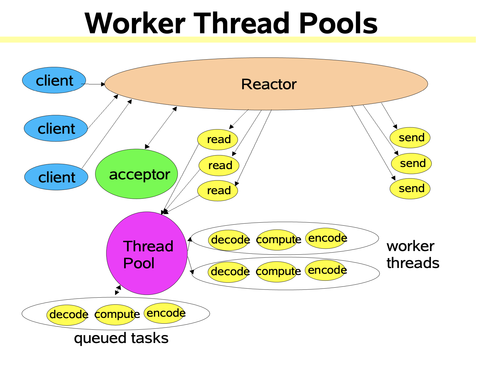
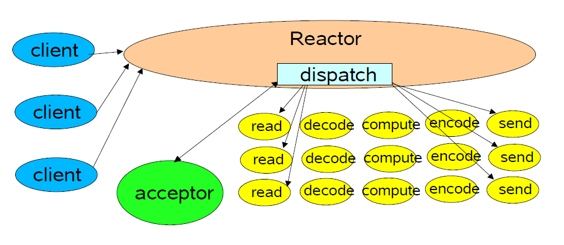
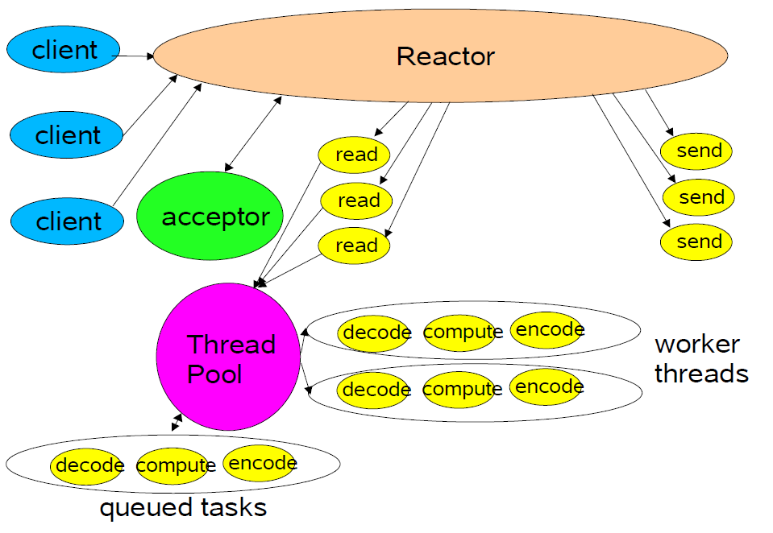
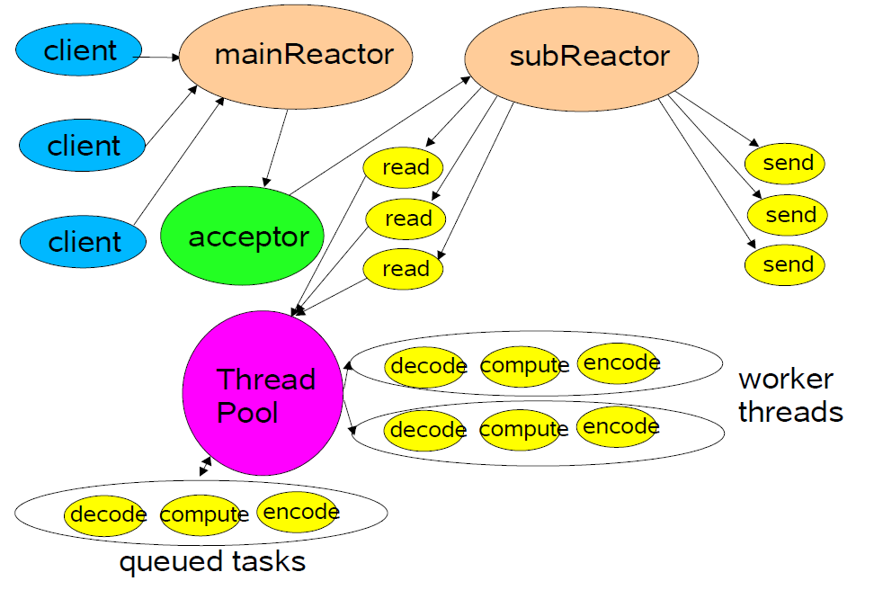
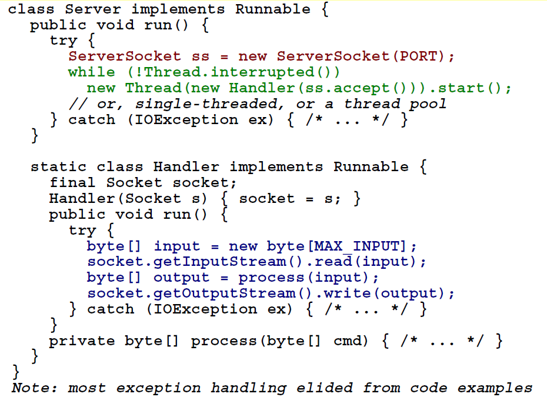

# 一、Refactor Pattern

The reactor design pattern is an event handling pattern for handling service requests delivered concurrently to a service handler by one or more inputs. The service  handler then demulitiplexes the incoming requests and dispatches them synchronously to the associated request handlers.

在介绍三种Reactor模式前，先简单地说明三个角色：

> `Reactor`：负责响应事件，将事件分发到绑定了对应事件的Handler，如果是连接事件，则分发到Acceptor。`Handler`：事件处理器。负责执行对应事件对应的业务逻辑。`Acceptor`：绑定了 connect 事件，当客户端发起connect请求时，Reactor会将accept事件分发给Acceptor处理。

## 1.1. 单Reactor单线程

## 1.2. 单Reactor多线程

## 1.3. 多Reactor多线程

# 二、Scalable IO in Java

## 2.1. Classic ServerSocket Loop

## 2.2. 基于事件驱动设计（Event-driven Designs）

Usually more efficient than alternatives

- Fewer resources

  Don't usually need a thread per client

- Less overhead

  Less context switching,  often less locking

- But dispatch can be slower

  Must manually bind actions to events

