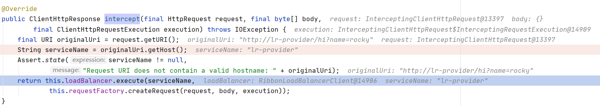

RestTemplate上加上@LoadBalanced注解。

LoadBalancerAutoConfiguration进行自动配置，所有RestTemplate通过RestTemplateCustomizer进行定制，将LoadBalancerInterceptor设置进去。

> 执行原理记忆点：RestTempalte通过@LoadBalanced注解，则会被收集到LoadBalancerAutoConfiguration中，这个通过自动化配置，对RestTemplate进行定制，将LaodBalancerInterceptor设置进去。这样RestTemplate请求会被拦截器拦截，然后走Ribbon负载均衡器选择Server的流程。

LoadBalancerInterceptor实现了ClientHttpRequestInterceptor。

使用RestTemplate进行操作，生成的Http请求对象的运行时类型为InterceptingClientHttpRequest。

调用流程如下：

org.springframework.web.client.RestTemplate#getForObject(java.lang.String, java.lang.Class<T>, java.lang.Object...)

->

org.springframework.web.client.RestTemplate#execute(java.lang.String, org.springframework.http.HttpMethod, org.springframework.web.client.RequestCallback, org.springframework.web.client.ResponseExtractor<T>, java.lang.Object...)

->

org.springframework.web.client.RestTemplate#doExecute

->

org.springframework.http.client.AbstractClientHttpRequest#execute

->

org.springframework.http.client.AbstractBufferingClientHttpRequest#executeInternal(org.springframework.http.HttpHeaders)

->

org.springframework.http.client.InterceptingClientHttpRequest#executeInternal

->

org.springframework.http.client.InterceptingClientHttpRequest.InterceptingRequestExecution#execute

->

org.springframework.cloud.client.loadbalancer.LoadBalancerInterceptor#intercept

->

org.springframework.cloud.netflix.ribbon.RibbonLoadBalancerClient#execute(java.lang.String, org.springframework.cloud.client.loadbalancer.LoadBalancerRequest<T>)

->

org.springframework.cloud.netflix.ribbon.RibbonLoadBalancerClient#execute(java.lang.String, org.springframework.cloud.client.loadbalancer.LoadBalancerRequest<T>, java.lang.Object)

->

org.springframework.cloud.netflix.ribbon.RibbonLoadBalancerClient#execute(java.lang.String, org.springframework.cloud.client.loadbalancer.LoadBalancerRequest<T>, java.lang.Object)

org.springframework.cloud.client.loadbalancer.LoadBalancerInterceptor

