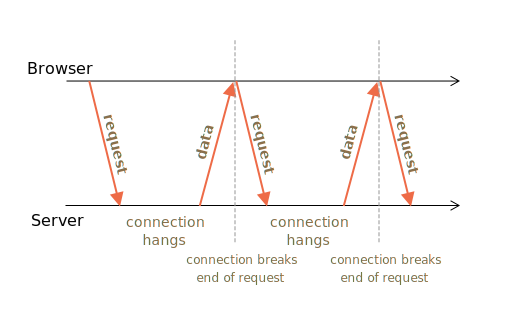

执行流程：

1. A request is sent to the server.
2. The server doesn’t close the connection until it has a message to send.
3. When a message appears – the server responds to the request with it.
4. The browser makes a new request immediately.

