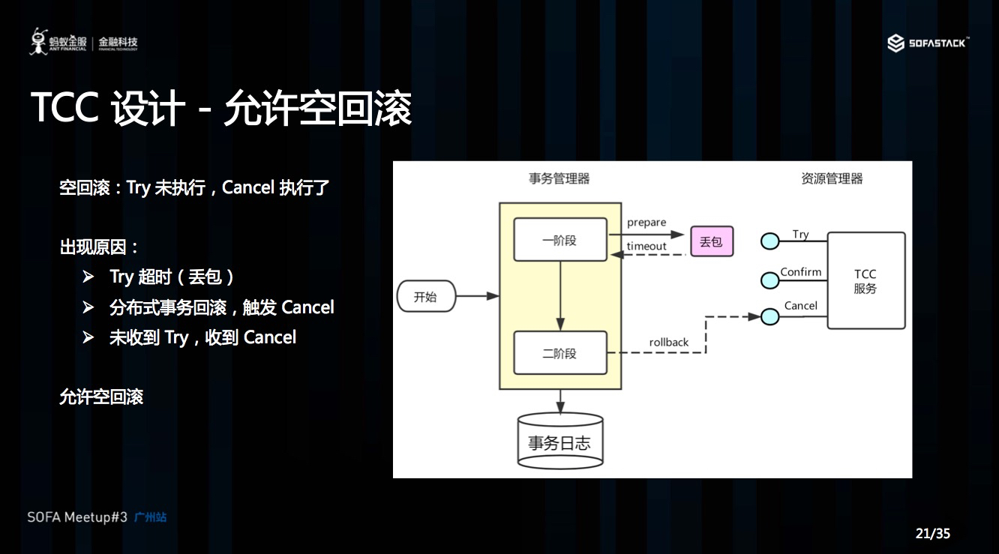
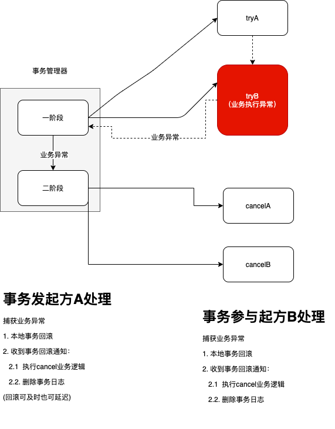

# 一、TCC方案介绍

TCC三个方法描述：

- Try：资源的检测和预留；
- Confirm：执行的业务操作提交，要求Try成功，Confirm一定要能成功；
- Cancel：预留资源释放。

# 二、TCC设计

## 2.1. 空回滚（try未执行，cancel执行）

Cancel接口设计时需要允许空回滚。在Try接口因为丢包时没有收到，事务管理器会触发回滚，这时会触发Cancel接口，这时Cancel执行时发现没有对应的事务xid或主键时，需要返回回滚成功。让事务管理器认为已回滚，否则会不断重试，而Cancel又没有对应的业务数据可以进行回滚。

比如：上面的流程图cancel操作中可以看到，首先会判断是否有库存操作流水，如果没有库存操作流程就不执行任何操作，这里在Cancel的接口设计上满足允许空回滚。

## 2.2. 防悬挂控制（cancel先执行，try后执行）

悬挂的意思是：Cancel 比 Try 接口先执行，出现的原因是 Try 由于网络拥堵而超时，事务管理器生成回滚，触发 Cancel 接口，而最终又收到了 Try 接口调用，但是 Cancel 比 Try 先到。按照前面允许空回滚的逻辑，回滚会返回成功，事务管理器认为事务已回滚成功，则此时的 Try 接口不应该执行，否则会产生数据不一致，所以我们在 Cancel 空回滚返回成功之前先记录该条事务 xid或业务主键，标识这条记录已经回滚过，Try 接口先检查这条事务xid或业务主键如果已经标记为回滚成功过，则不执行 Try 的业务操作。

# 三、执行原理

##  3.1. Try-Confirm执行流程

以下基于TCC-Transaction框架阐释Try-Confirm执行流程。

## 3.2. 自动任务保证高可用

事务发起方的try流程是同步调用，负责事务日志的初始存储。而confirm和cancel则可以使异步调用。由于网络的原因，事务发起方已经将ROOT事务状态置为CONFIRMING或者CANCELING，但是由于网络调用或者参与者应用自身得原因，导致分支事务的Confirm或Cancel未执行成功。这时候就要通过自动任务进行后台重试来解决。获取ROOR事务所在的存储中的事务日志判断其当前的状态，若为CONFIRMING则继续调用Cofirm操作；若为CANCELING则调用Cancel操作。

重试操作为有限次数或者有限时间。若在规定的策略下还是无法成功，则走人工操作。

**注意：分布式事务下的API必须保证幂等性。**

# 四、案例解析

## 4.1. 订单库存扣减

### 4.1.1. 正向流程

####  Try->Confirm执行流程

#### Try->Cancel执行流程

### 4.1.2. 异常点即处理方案

以下为TCC-Transaction分布式事务框架的处理流程。

#### tryA失败

上面应用A为事务发起方服务，tryA接口的伪代码如下：

~~~java
public AA tryA() {
    // 执行业务操作
    tryB();
}
~~~

图中已经说明了，try阶段对于事务参与方的接口的调用是显示主动调用。

tryA中业务操作执行失败，tryB未执行，则参与方未注册。执行的动作为：

| 操作    | 应用A(事务发起方) | 应用B(事务参与方) |
| ------- | ----------------- | ----------------- |
| Try     | tryA失败          | NA                |
| Confirm | NA                | NA                |
| Cancel  | cancelA           | NA                |

**数据一致性：一致。**

#### tryB失败

对tryB涉及到网络调用，会出现网络异常或者tryB接口自身的业务异常。这里分一下几种情况说明。

##### **- 情况1：tryB接口调用超时(丢包)，tryB业务未执行**

##### - 情况2：**tryB已调用：业务执行异常，tryA收到异常反馈**

##### - 情况3：**tryB已调用：业务执行异常，tryA未收到异常反馈**

##### - 情况4：**tryB已调用：业务执行成功，tryA未收到结果**

#### cancel比try先执行

这种情况和上面的空回滚的情况不同，空回滚是try未执行，执行cancel。悬挂的情况是try由于网络的暂时拥堵没有调用成功，然后因为事务发起方捕获到超时，执行了事务回滚，但是稍后事务参与方又收到了try调用，执行了业务逻辑（成功或失败）。

这就是上面说到的防悬挂空中。这种情况下如何处理呢？

在上面的异常处理中，事务发起方收到了超时异常，在上面的异常处理中，可立即回滚或延迟回滚。但是对于上面的这种情况，如果立即回滚，那么事务发起方的事务日志就已经被删除了，那么try再拥堵后又再次执行，就会导致事务参与方有事务日志，而事务发起方没有。导致事务参与方预操作的资源无法释放。

TCC-Transaction的处理方案是，对于超时异常，延期回滚。也就是说出现了超时异常，不立即回滚，而是是由事务恢复机制来处理。这样在事务恢复的这个期限内，try拥堵后执行了，那么事务恢复的时候会重新执行延期回滚的操作来进行回滚。

看上面的红色字体，如果超过延时处理时间后try才执行，那么因为事务发起方已经在延时时间到后执行了一次回滚通知，所以已经把事务日志删了，而之后事务参与方的try操作才执行。那么之后就不会再次通知，那么事务参与方的回滚通知就没办法通知到了。

TCC-Transaction目前是1.2.12版本，没有解决这个问题。在这个框架中事务恢复处理自动任务没有对分支事务事务状态为TRYING的事务进行处理。

目前有两种方案：

第一种：对于(最大次数*恢复期限)的时间期限后的分支事务中状态为TRYING的事务也做回滚处理。

第二种：人工处理。

#### 宕机

try、confirm、cancel执行的过程中，都会受到事务发起方和事务参与方集群宕机的影响。而事务恢复机制以最大努力的方式来进行处理。如果因为宕机的影响，在最大重试次数后还是无法恢复事务。那么最好的一种解决方案就是人工处理。