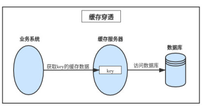
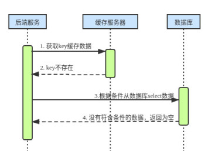
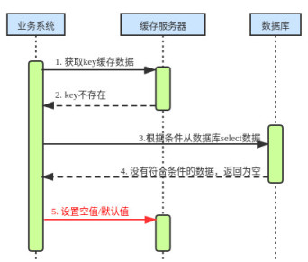
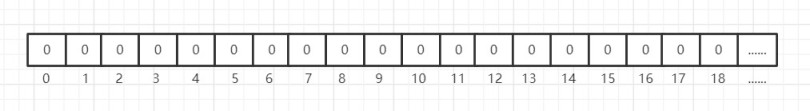
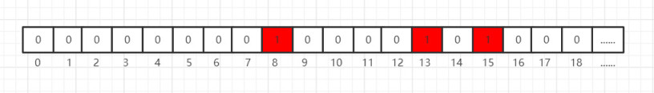
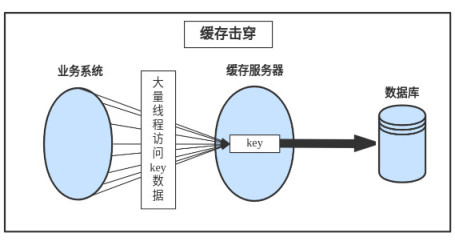
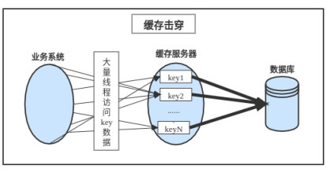

当我们进行架构设计时，缓存是提高高性能的最重要也是最常用的组件之一。数据库的瓶颈在于磁盘 I/O，虽然现如今关系数据库的部分应用场景采用了 NoSQL 作为替代，但依然没能摆脱磁盘 I/O 的性能问题。缓存的妙处就是在提高性能的同时，也保护了下游数据库，避免 I/O 压力过大导致宕机。

常用的缓存有单机版的 EhCache、分布式版的 Memcache 和 Redis，都属于 K-V 类型的存储，Key 与 Value 一一对应。当然如果较真的话他们也属于 NoSQL 范畴，比如 Redis 弥补了关系数据不能存储结构数据的缺憾。虽然这些缓存中间件已经非常成熟和稳定，也得到了广泛的应用，但设计一个良好的缓存系统还是会遇到很多问题需要解决、方案也需要取舍。

# 缓存的应用场景

每一个技术或中间件都有自己的应用场景，在这些场景中可以发挥它最大的优势。如果不熟悉他们的应用场景，愣是生搬硬套，只会事倍功半，南辕北辙。缓存的应用场景有如下几种：

- 高频访问的数据：限于磁盘 I/O 的瓶颈，对于高频访问的数据，需要缓存起来提高性能，降低下游数据库的压力冲击；
- 复杂运算的结果：对于需要耗费 CPU、经过复杂运算才能获得的结果，需要缓存来，做到“一劳长时间逸"，如 count(id)统计论坛在线人数；
- 读多写少：每次读都需要 select 甚至 join 很多表，数据库压力大，由于写得少，容易做到数据的一致性，非常适合缓存的应用；
- 一致性要求低：由于缓存的数据来源于数据库，在高并发时数据不一致性就比较凸显，不一致的问题可以解决但代价不菲；

本篇主要来讲讲架构设计中的缓存穿透、缓存击穿、缓存雪崩产生的原因和缓解措施，技术来不得半点含糊，要知其然知其所以然。

# 缓存穿透 Cache Penetration

缓存穿透是指数据库中没有符合条件的数据，缓存服务器中也就没有缓存数据，导致业务系统每次都绕过缓存服务器查询下游的数据库，缓存服务器完全失去了其应用的作用。如果黑客试图发起针对该 key 的大量访问攻击，数据库将不堪重负，最终可能导致崩溃宕机。从上图可以看出直接穿过缓存到达下游数据库，大致业务流程如下：

可采取的缓解措施：

## **1.存储空值/默认值**

虽然数据库中没有符合条件的数据，可以考虑缓存空值或适合业务的默认值，来缓解这种情况。为了降低数据的不一致需要注意两点：1. 缓存的过期时间需要设置的比较短；2. 当数据库数据更新时也需要及时更新缓存中对应的数据。

## **2.布隆过滤器(Bloom Filter)**

布隆过滤器是一种比较巧妙的概率性数据结构，它可以告诉你**数据一定不存在**或**可能存在**，相比 Map、Set、List 等传统数据结构它占用内存少、结构更高效。比如有一个下面这样的数据结构，每个存储位存储的都是一个 big，即 0 或 1。

当我们向缓存中插入 key 为 name 的缓存数据时，先使用 N 种不同的 hash 函数做 N 次 hash 得到 N 个哈希值，在上面的数据结构中找到对应哈希值的下标，并把存储数据设置为 1。假如 N=3，我们可以使用 hash1、hash2、hash3 分别计算出了哈希值为 8，15 和 13，则将其对应下标的数据设置为 1，如下图:

此时你如果想判断一个缓存 key 是否存在，就采用同样的 l 流程：3 次 hash、根据哈希值寻找下标、取出存储的数据。如果存储的数据不全都是 1，也就意味着缓存中不存在此 key，但都是 1 也只表示可能存在。不过没关系，我们只需要否定的意图就能达到目标了(O ^ ~ ^ O)。

以上两种缓解措施在不同的应用场景可以做些适当的选择：如果访问量大可以使用第一种方案简单粗暴；如果访问量低但涉及的 key 比较多，则可采用第二种方案。

# 缓存击穿 Cache Breakdown

缓存击穿是指当某一 key 的缓存过期时大并发量的请求同时访问此 key，瞬间击穿缓存服务器直接访问数据库，让数据库处于负载的情况。

缓存击穿一般发生在高并发的互联网应用场景，可采用的如下的缓解措施：

## **1.锁更新 **

可以使用(分布式)锁，只让一个线程更新 key，其他线程等待，直到缓存更新释放锁。比如简单粗暴的 synchronized 关键字:

~~~java
public synchronized String getCacheData() {
  String cacheData = "";
  //Read redis
  cacheData = getDataFromRedis();
  if (cacheData.isEmpty()) {
    //Read database
    cacheData = getDataFromDB();
    //Write redis
    setDataToCache(cacheData);
  }
  return cacheData;
}
~~~

但 synchronized 这个锁太宽泛，会造成大量的请求阻塞，性能极低，进一步优化缩小锁的范围。

~~~java
static Object lock = new Object();

public String getCacheData() {
  String cacheData = "";
  //Read redis
  cacheData = getDataFromRedis();
  if (cacheData.isEmpty()) {
    synchronized (lock) {
      //Read database
      cacheData = getDataFromDB();
      //Write redis
      setDataToCache(cacheData);
    }
  }
  return cacheData;
}
~~~

学无止境，还可以继续优化，使用互斥锁 (✧◡✧)：得到锁的线程就读数据写缓存，没得到锁的线程可以不用阻塞，继续从缓存中读数据，如果没有读到数据就休息会再来试试。

~~~java
public String getCacheData(){
  String result = "";
  //Read redis
  result = getDataFromRedis();
  if (result.isEmpty()) {
    if (reenLock.tryLock()) {
      try {
        //Read database
        result = getDataFromDB();
        //Write redis
        setDataToCache(result);
      }catch(Exception e){
        //...
      }finally {
        reenLock.unlock (); // release lock
      }
    } else {
      //Note: this can be combined with the 
      // following double caching mechanism:

      //If you can't grab the lock, 
      // query the secondary cache

      //Read redis
      result = getDataFromRedis();
      if (result.isEmpty()) {
        try {
          Thread.sleep(100);
        } catch (InterruptedException e) {
          //...
        }
        return getCacheData();
      }
    }
  }
  return result;
}
~~~

## 2.异步更新

还有个可行的方案就是把缓存设置为永久不过期，异步定时更新缓存。比如后台有个值守线程专门定时更新缓存，但一般还要定时频繁地去检测缓存，一旦发现被踢掉(比如被缓存的失效策略 FIFO、LFU、LRU 等)需要立刻更新缓存，但这个“定时”的度是比较难掌握的，实现简单但用户体验一般。

异步更新机制还比较适合缓存预热，缓存预热是指系统上线后，将相关的缓存数据直接加载到缓存系统，避免在用户请求时才缓存数据，提高了性能。

# 缓存雪崩 Cache Avalanche

缓存雪崩是指当大量缓存同时过期或缓存服务宕机，所有请求的都直接访问数据库，造成数据库高负载，影响性能，甚至数据库宕机，它和缓存击穿的区别在于失效 key 的数量。

可以采取的缓解措施：

## 1.集群

高可用方案的本质就是冗余，集群是其实现方式之一，使用集群可以避免服务单点故障，但集群也带来了复杂度，好在很多成熟的中间件都有稳妥的集群方案，比如 Redis 集群。

## 2.过期时间

为了避免大量的缓存在同一时间过期，可以把不同的 key 过期时间随机生成，但随机可能会对业务有影响，但可以根据业务特点进行设置，总之是让过期时间分散。也有是通过定时刷新过期时间，类似于 refresh token 机制。

## 3.服务降级或熔断

服务熔断：当缓存服务器宕机或超时响应时，为了防止整个系统出现雪崩，暂时停止业务服务访问缓存系统。

服务降级：当出现大量缓存失效，而且处在高并发高负荷的情况下，在业务系统内部暂时舍弃对一些非核心的接口和数据的请求，而直接返回一个提前准备好的 fallback（退路）错误处理信息。

熔断和降级都可以间接保证了整个系统的稳定性和可用性。