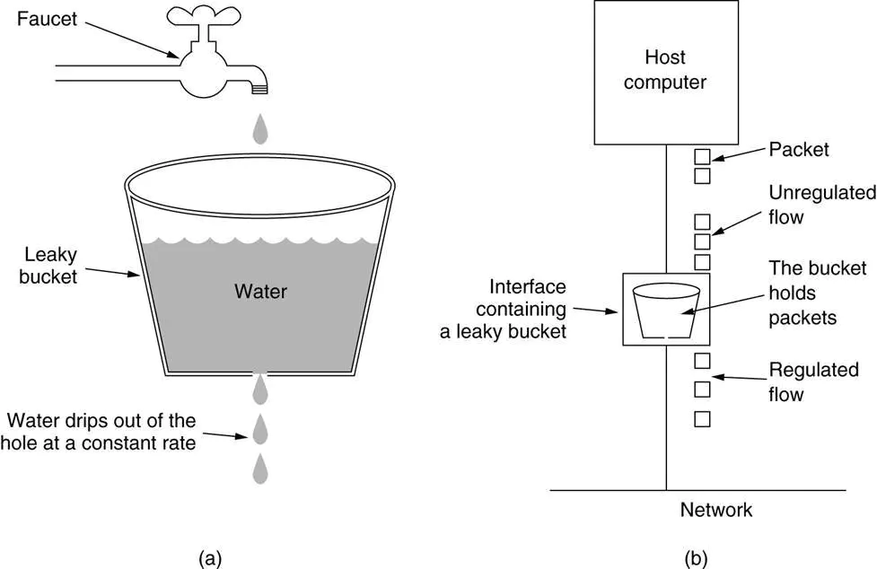
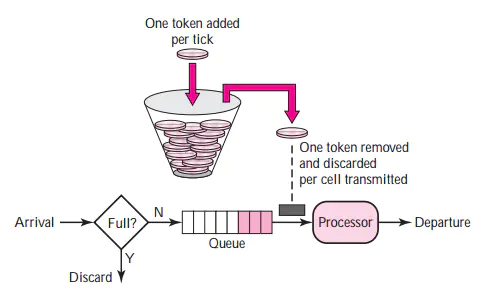

> 电梯限速器，是电梯安全保护系统中的安全控制部件之一。当电梯在运行中无论何种原因使轿厢发生超速，甚至发生坠落的危险，而所有其他安全保护装置不起作用的情况下，则限速器和安全钳发生联动动作，使电梯轿厢停住。

# 一、限流基础

## 限流是什么

当请求压力过大的时候，通过排队或丢弃的方式，限制进入系统的请求数，防止系统崩溃，这是限流。

## 限流目的

限流的目的是防止恶意请求流量、恶意攻击，或者防止流量超过系统峰值。

## 限流措施

当资源成为瓶颈时，服务框架需要对消费者的访问请求做限流，启动流控保护机制。在服务消费者端和提供者端均可进行流量控制。在服务消费端，可以限制发往某个微服务提供者的请求频率；在服务提供端，可以限制每个微服务消费端发过来的请求频率，也可以根据服务提供端资源消耗情况确定总的请求频率限制，防止服务因资源耗尽而崩溃。

- 限制总并发数（比如数据库连接池、线程池）
- 限制瞬时并发数（如nginx的limit_conn模块，用来限制瞬时并发连接数）
- 限制时间窗口内的平均速率（如Guava的RateLimiter、nginx的limit_req模块，限制每秒的平均速率）
- 限制远程接口调用速率
- 限制消息队列的消费速率
- 根据网络连接数、网络流量、CPU或内存负载等来限流

# 二、限流算法

常见限流算法： 漏桶（Leaky Bucket）算法和令牌桶（Token Bucket）算法。

## 漏桶（Leaky Bucket）算法

漏桶算法(Leaky Bucket)是网络世界中流量整形（Traffic Shaping）或速率限制（Rate Limiting）时经常使用的一种算法，它的主要目的是控制数据注入到网络的速率，平滑网络上的突发流量。漏桶算法提供了一种机制，通过它，突发流量可以被整形以便为网络提供一个稳定的流量。

漏桶可以看作是一个带有常量服务时间的单服务器队列，如果漏桶（包缓存）溢出，那么数据包会被丢弃。

在网络中，漏桶算法可以控制端口的流量输出速率，平滑网络上的突发流量，实现流量整形，从而为网络提供一个稳定的流量。

无论输入的突发情况如何，漏桶都会强制执行恒定的输出速率。输入空闲时不做任何操作。

## 令牌桶（Token Bucket）算法

令牌桶算法是网络流量整形（Traffic Shaping）和速率限制（Rate Limiting）中最常使用的一种算法。典型情况下，令牌桶算法用来控制发送到网络上的数据的数目，并允许突发数据的发送。

令牌桶算法的原理是系统以恒定的速率产生令牌，然后把令牌放到令牌桶中，令牌桶有一个容量，当令牌桶满了的时候，再向其中放令牌，那么多余的令牌会被丢弃；当想要处理一个请求的时候，需要从令牌桶中取出一个令牌，如果此时令牌桶中没有令牌，那么则拒绝该请求。

### 漏桶算法和令牌桶算法的区别

漏桶算法与令牌桶算法在表面看起来类似，很容易将两者混淆。但事实上，这两者具有截然不同的特性，且为不同的目的而使用。漏桶算法与令牌桶算法的区别在于：

- 漏桶算法能够强行限制数据的传输速率。
- 令牌桶算法能够在限制数据的平均传输速率的同时还允许某种程度的突发传输。

需要说明的是：在某些情况下，漏桶算法不能够有效地使用网络资源。因为漏桶的漏出速率是固定的，所以即使网络中没有发生拥塞，漏桶算法也不能使某一个单独的数据流达到端口速率。因此，漏桶算法对于存在突发特性的流量来说缺乏效率。而令牌桶算法则能够满足这些具有突发特性的流量。通常，漏桶算法与令牌桶算法结合起来为网络流量提供更高效的控制。

