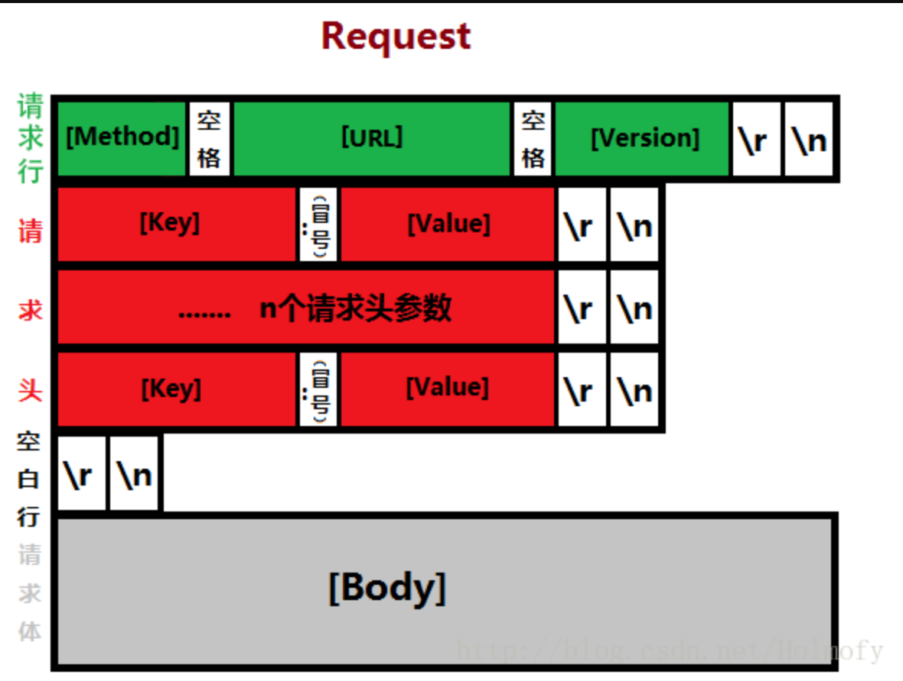
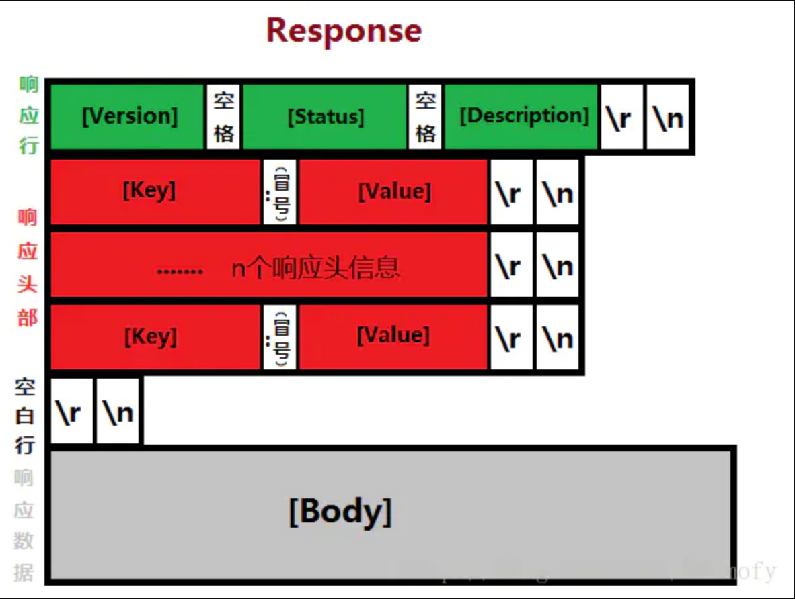

http://www.ruanyifeng.com/blog/2016/08/http.html

# 一、请求和响应格式

# 二、http1.1

改进HTTP的性能是HTTP1.1工作组的一个重要目标，后来这个版本也引入了大量增强性能的重要特性，其中一些大家比较熟知的有：

- 持久化连接以支持连接重用；
- 分块传输编码以支持流式响应；
- 请求管道以支持并行请求处理；
- 字节服务以支持基于范围的资源请求；
- 改进的更好的缓存机制。

