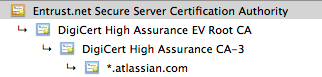

Whenever Java attempts to connect to another application over SSL (e.g.: HTTPS, IMAPS, LDAPS), it will *only* be able to connect to that application if it can trust it. The way trust is handled in the Java world is that you have a keystore (typically `$JAVA_HOME/lib/security/cacerts`), also known as the truststore. This contains a list of all known Certificate Authority (CA) certificates, and Java will only trust certificates that are signed by one of those CAs or public certificates that exist within that keystore. For example, if we look at the certificate for Atlassian, we can see that the ***.atlassian.com** certificate has been signed by the intermediate certificates, **DigiCert High Assurance EV Root CA** and **DigiCert High Assurance CA-3**. These intermediate certificates have been signed by the root ***\*[Entrust.net](http://entrust.net/) Secure Server CA\**** :

These three certificates combined are referred to as the certificate chain, and, as they are all within the Java keystore (`cacerts`), Java will trust any certificates signed by them (in this case, ***.atlassian.com**). Alternatively, if the ***.[ atlassian.com ](http://atlassian.com/)** certificate had been in the keystore, Java would also trust that site.

This problem is therefore caused by a certificate that is self-signed (a CA did not sign it) or a certificate chain that does not exist within the Java truststore. Java does not trust the certificate and fails to connect to the application.