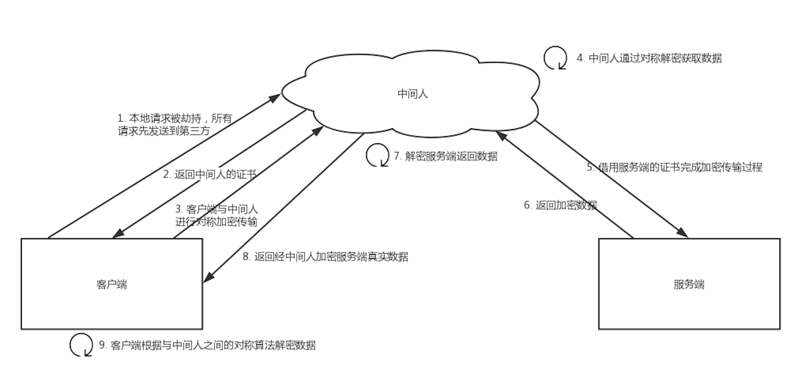

过程原理：

1. 本地请求被劫持（如DNS劫持等），所有请求均发送到中间人的服务器
2. 中间人服务器返回中间人自己的证书
3. 客户端创建随机数，通过中间人证书的公钥对随机数加密后传送给中间人，然后凭随机数构造对称加密对传输内容进行加密传输
4. 中间人因为拥有客户端的随机数，可以通过对称加密算法进行内容解密
5. 中间人以客户端的请求内容再向正规网站发起请求
6. 因为中间人与服务器的通信过程是合法的，正规网站通过建立的安全通道返回加密后的数据
7. 中间人凭借与正规网站建立的对称加密算法对内容进行解密
8. 中间人通过与客户端建立的对称加密算法对正规内容返回的数据进行加密传输
9. 客户端通过与中间人建立的对称加密算法对返回结果数据进行解密

由于缺少对证书的验证，所以客户端虽然发起的是 HTTPS 请求，但客户端完全不知道自己的网络已被拦截，传输内容被中间人全部窃取。

