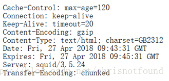
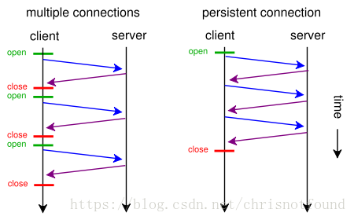

https://tldp.org/HOWTO/html_single/TCP-Keepalive-HOWTO/

TCP 的连接，实际上是一种纯软件层面的概念，在物理层面并没有“连接”这种概念。TCP 通信双方建立交互的连接，但是并不是一直存在数据交互，有些连接会在数据交互完毕后，主动释放连接，而有些不会。在长时间无数据交互的时间段内，交互双方都有可能出现掉电、死机、异常重启等各种意外，当这些意外发生之后，这些 TCP 连接并未来得及正常释放，在软件层面上，连接的另一方并不知道对端的情况，它会一直维护这个连接，长时间的积累会导致非常多的半打开连接，造成端系统资源的消耗和浪费，为了解决这个问题，在传输层可以利用 TCP 的 KeepAlive 机制实现来实现。主流的操作系统基本都在内核里支持了这个特性。

TCP KeepAlive 的基本原理是，隔一段时间给连接对端发送一个探测包，如果收到对方回应的 ACK，则认为连接还是存活的，在超过一定重试次数之后还是没有收到对方的回应，则丢弃该 TCP 连接。

这里主要说一下，TCP KeepAlive 的局限。首先 TCP KeepAlive 监测的方式是发送一个 probe 包，会给网络带来额外的流量，另外 TCP KeepAlive 只能在内核层级监测连接的存活与否，而连接的存活不一定代表服务的可用。例如当一个服务器 CPU 进程服务器占用达到 100%，已经卡死不能响应请求了，此时 TCP KeepAlive 依然会认为连接是存活的。因此 TCP KeepAlive 对于应用层程序的价值是相对较小的。需要做连接保活的应用层程序，例如 QQ，往往会在应用层实现自己的心跳功能。

# 1. 什么是TCP keepalive?

The keepalive concept is very simple: when you set up a TCP connection, you associate a set of timers. Some of these timers deal with the keepalive procedure. When the keepalive timer reaches zero, you send your peer a keepalive probe packet with no data in it and the ACK flag turned on. You can do this because of the TCP/IP specifications, as a sort of duplicate ACK, and the remote endpoint will have no arguments, as TCP is a stream-oriented protocol. On the other hand, you will receive a reply from the remote host (which doesn't need to support keepalive at all, just TCP/IP), with no data and the ACK set.

If you receive a reply to your keepalive probe, you can assert that the connection is still up and running without worrying about the user-level implementation. In fact, TCP permits you to handle a stream, not packets, and so a zero-length data packet is not dangerous for the user program.

This procedure is useful because if the other peers lose their connection (for example by rebooting) you will notice that the connection is broken, even if you don't have traffic on it. If the keepalive probes are not replied to by your peer, you can assert that the connection cannot be considered valid and then take the correct action.

# 2.  Why use TCP keepalive?

You can live quite happily without keepalive, so if you're reading this, you may be trying to understand if keepalive is a possible solution for your problems. Either that or you've really got nothing more interesting to do instead, and that's okay too. :)

Keepalive is non-invasive, and in most cases, if you're in doubt, you can turn it on without the risk of doing something wrong. But do remember that it generates extra network traffic, which can have an impact on routers and firewalls.

In short, use your brain and be careful.

In the next section we will distinguish between the two target tasks for keepalive:

- Checking for dead peers
- Preventing disconnection due to network inactivity

# 3. 开启和设置

1. KeepAlive默认情况下是关闭的，可以被上层应用开启和关闭
2. **tcp_keepalive_time**: KeepAlive的空闲时长，或者说每次正常发送心跳的周期，默认值为7200s（2小时）
3. **tcp_keepalive_intvl**: KeepAlive探测包的发送间隔，默认值为75s
4. **tcp_keepalive_probes**: 在tcp_keepalive_time之后，没有接收到对方确认，继续发送保活探测包次数，默认值为9（次）

# 4. TCP Keepalive和HTTP Keep-Alive 的关系

很多人会把TCP Keepalive 和 HTTP Keep-Alive 这两个概念搞混淆。

这里简单介绍下HTTP Keep-Alive 。

在HTTP/1.0中，默认使用的是短连接。也就是说，浏览器和服务器每进行一次HTTP操作，就建立一次连接，但任务结束就中断连接。如果客户端浏览器访问的某个HTML或其他类型的 Web页中包含有其他的Web资源，如JavaScript文件、图像文件、CSS文件等；当浏览器每遇到这样一个Web资源，就会建立一个HTTP会话。

但从 HTTP/1.1起，默认使用长连接，用以保持连接特性。使用长连接的HTTP协议，会在响应头加上Connection、Keep-Alive字段.如下图所示：

HTTP 1.0 和 1.1 在 TCP连接使用方面的差异如下图所示：

上面说明后，其实就可以知道这两者的区别了。

HTTP协议的Keep-Alive意图在于TCP连接复用，同一个连接上串行方式传递请求-响应数据；

TCP的Keepalive机制意图在于探测连接的对端是否存活。

> TCP Keep Alive用于探测对端是否存在，而HTTP Keep Alive用于协商以复用 TCP 连接。即便一个TCP连接未启用Keep Alive 功能，也不妨碍 HTTP层面开启长连接。

