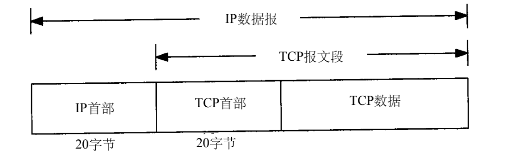
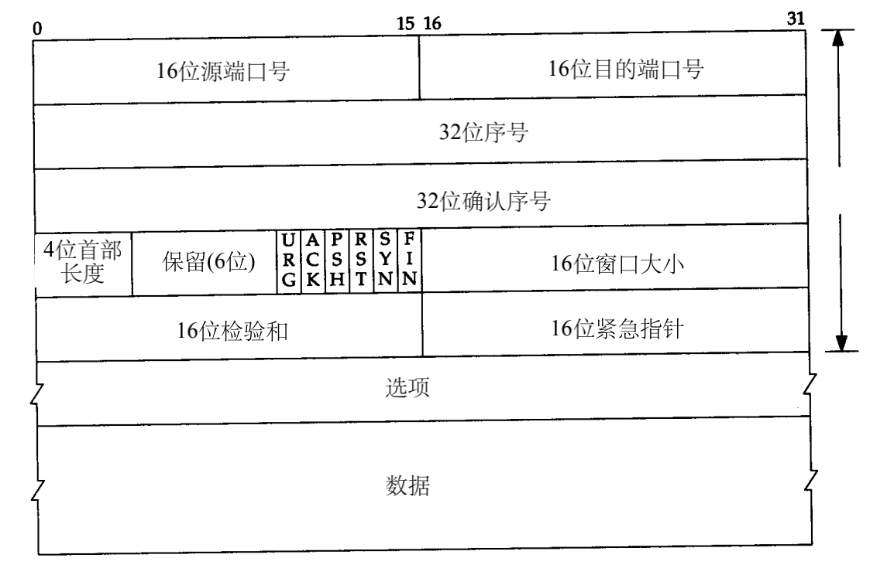
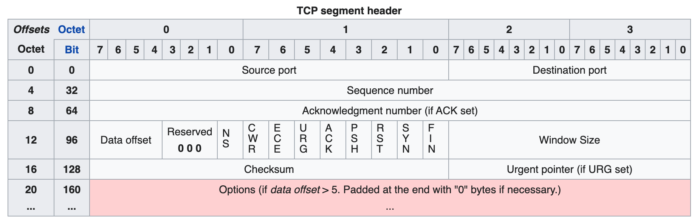

# TCP的首部

TCP数据被封装在一个IP数据报中，如图所示：

下图显示首部的数据格式。如果不计任选字段，它通常是20个字节。

## 源端口号（Source port）和目的端口号（Destination port）

每个TCP段都包含源端和目的端的端口号，用于寻找发端和收端应用进程。这两个值加上IP首部中的源端IP地址和目的端IP地址唯一确定一个TCP连接。

> 有时，一个IP地址和一个端口号也称为一个插口（socket）。

## 序号（Sequence Number）

序号有双重作用：

- 如果SYN标志被设置为(1)，那么这就是初始序列号。然后，实际的第一个数据字节的序列号和相应ACK中的确认数字是这个序列号加1。
- 如果SYN标志是clear(0)，那么这是当前会话的这个段的第一个数据字节的累积序列号。

## 确认序号（Acknowledgment number (32 bits)）

如果设置了ACK标志，那么该字段的值就是ACK发送者所期望的下一个序列号。这确认收到了所有之前的字节(如果有的话)。每端发送的第一个ACK确认对方的初始序列号本身，但不确认数据。

If the ACK flag is set then the value of this field is the next sequence number that the sender of the ACK is expecting. This acknowledges receipt of all prior bytes (if any). The first ACK sent by each end acknowledges the other end's initial sequence number itself, but no data.

## Data offset (4 bits)

## Reserved (3 bits)

## **Flags (9 bits)**

包含9个1位标志(控制位)，如下:

- NS (1 bit)

- CWR (1 bit)

- ECE (1 bit)

- URG (1 bit)

- ACK (1 bit)

  表示“确认”字段是有效的。客户端发送的初始SYN数据包之后的所有数据包都应设置此标志。

  Indicates that the Acknowledgment field is significant. All packets after the initial SYN packet sent by the client should have this flag set.

- PSH (1 bit)

  Push function. Asks to push the buffered data to the receiving application.

- RST (1 bit)

  Reset the connection.

- SYN (1 bit)

  同步序列号。仅从两端发送的第一个数据包应设置此标志。其他一些标志和字段会根据此标志更改含义，一些仅在设置时有效，而其他一些则在清除时有效。

  Synchronize sequence numbers. Only the first packet sent from each end should have this flag set. Some other flags and fields change meaning based on this flag, and some are only valid when it is set, and others when it is clear.

- FIN (1 bit)

  发送方的最后封包（Last packet from sender）。

> 这是标志位，从这个角度理解。

