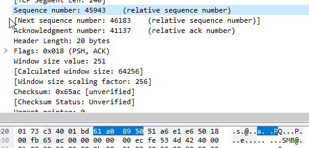

https://www.ruanyifeng.com/blog/2017/06/tcp-protocol.html

# 1. TCP数据包的大小

以太网数据包（packet）的大小是固定的，最初是1518字节，后来增加到1522字节。其中， 1500 字节是负载（payload），22字节是头信息（head）。

IP 数据包在以太网数据包的负载里面，它也有自己的头信息，最少需要20字节，所以 IP 数据包的负载最多为1480字节。

（图片说明：IP 数据包在以太网数据包里面，TCP 数据包在 IP 数据包里面。）

TCP 数据包在 IP 数据包的负载里面。它的头信息最少也需要20字节，因此 TCP 数据包的最大负载是 1480 - 20 = 1460 字节。由于 IP 和 TCP 协议往往有额外的头信息，所以 TCP 负载实际为1400字节左右。

因此，一条1500字节的信息需要两个 TCP 数据包。HTTP/2 协议的一大改进， 就是压缩 HTTP 协议的头信息，使得一个 HTTP 请求可以放在一个 TCP 数据包里面，而不是分成多个，这样就提高了速度。

（图片说明：以太网数据包的负载是1500字节，TCP 数据包的负载在1400字节左右。）

# 2. TCP数据包的编号

一个包1400字节，那么一次性发送大量数据，就必须分成多个包。比如，一个 10MB 的文件，需要发送7100多个包。

发送的时候，TCP 协议为每个包编号（sequence number，简称 SEQ），以便接收的一方按照顺序还原。万一发生丢包，也可以知道丢失的是哪一个包。

第一个包的编号是一个随机数。为了便于理解，这里就把它称为1号包。假定这个包的负载长度是100字节，那么可以推算出下一个包的编号应该是101。这就是说，每个数据包都可以得到两个编号：自身的编号，以及下一个包的编号。接收方由此知道，应该按照什么顺序将它们还原成原始文件。

（图片说明：当前包的编号是45943，下一个数据包的编号是46183，由此可知，这个包的负载是240字节。）

# 3. TCP 数据包的组装

收到 TCP 数据包以后，组装还原是操作系统完成的。应用程序不会直接处理 TCP 数据包。

对于应用程序来说，不用关心数据通信的细节。除非线路异常，收到的总是完整的数据。应用程序需要的数据放在 TCP 数据包里面，有自己的格式（比如 HTTP 协议）。

TCP 并没有提供任何机制，表示原始文件的大小，这由应用层的协议来规定。比如，HTTP 协议就有一个头信息`Content-Length`，表示信息体的大小。对于操作系统来说，就是持续地接收 TCP 数据包，将它们按照顺序组装好，一个包都不少。

操作系统不会去处理 TCP 数据包里面的数据。一旦组装好 TCP 数据包，就把它们转交给应用程序。TCP 数据包里面有一个端口（port）参数，就是用来指定转交给监听该端口的应用程序。

应用程序收到组装好的原始数据，以浏览器为例，就会根据 HTTP 协议的`Content-Length`字段正确读出一段段的数据。这也意味着，一次 TCP 通信可以包括多个 HTTP 通信。