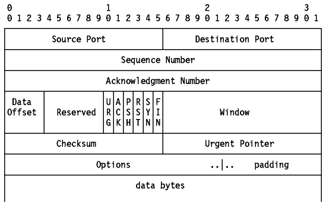
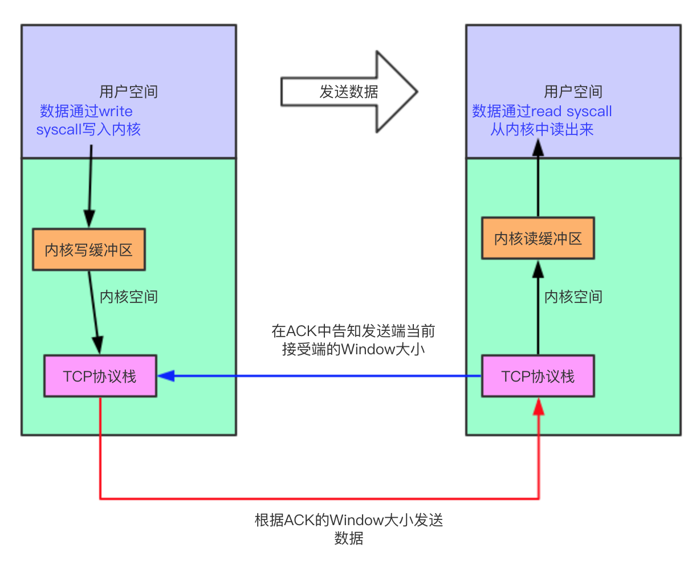

https://zhuanlan.zhihu.com/p/37379780

# 流量控制

什么是流量控制？流量控制的目的？

如果发送者发送数据过快，接收者来不及接收，那么就会有分组丢失。为了避免分组丢失，控制发送者的发送速度，使得接收者来得及接收，这就是流量控制。流量控制根本目的是防止分组丢失，它是构成TCP可靠性的一方面。

如何实现流量控制？

由滑动窗口协议（连续ARQ协议）实现。滑动窗口协议既保证了分组无差错、有序接收，也实现了流量控制。主要的方式就是接收方返回的 ACK 中会包含自己的接收窗口的大小，并且利用大小来控制发送方的数据发送。

流量控制引发的死锁？怎么避免死锁的发生？

当发送者收到了一个窗口为0的应答，发送者便停止发送，等待接收者的下一个应答。但是如果这个窗口不为0的应答在传输过程丢失，发送者一直等待下去，而接收者以为发送者已经收到该应答，等待接收新数据，这样双方就相互等待，从而产生死锁。

为了避免流量控制引发的死锁，TCP使用了持续计时器。每当发送者收到一个零窗口的应答后就启动该计时器。时间一到便主动发送报文询问接收者的窗口大小。若接收者仍然返回零窗口，则重置该计时器继续等待；若窗口不为0，则表示应答报文丢失了，此时重置发送窗口后开始发送，这样就避免了死锁的产生。

# 摘抄

https://www.nosuchfield.com/2018/08/01/TCP-Flow-Control-And-Linux-Socket-Buffer/

TCP协议为了协调发送端和接受端的数据发送和接收速度，需要实现对流量的控制，这就是TCP协议的流量控制。TCP报文的格式见下表，其中的**Window**部分叫做接收窗口，TCP的流量控制就是通过它来实现的：

## 发送端发送的数据的类型

考虑到接收端的数据处理速度，发送端不能无节制的发送数据，发送端的数据可以分为以下3种类型：

- 已发送已确认，数据已经发送给接收端并且接收端已经发送了该数据的ACK
- 已发送未确认，数据已经发送给接收端但是还未获取到接收端的确认信息
- 待发送数据，发送端已经准备好可以发送但是还没有发送的数据，这是我们接下来要重点讨论的数据

## Linux的读缓冲区和TCP ACK报文中的Window

Liunx在内核中有一个socket的读缓冲区，操作系统的TCP协议栈在接收到数据之后会把数据存放在这里，因为操作系统会为每一个TCP连接维护一个状态机，所以每一个连接都拥有自己的读缓冲区。读缓冲区的大小依据操作系统不同而不同，用户也可以自行设定其大小。假设发送端不断地向接收端发送数据，但是接收端的用户处理程序却没能及时的从读缓冲区中把数据读走，那么读缓冲区的数据就会越来越多。接收端会根据此连接读缓冲区的剩余可用空间来判断接收端还能接受多少数据，公式如下：

~~~
Window = MaxReadBuffer – ReadedBuffer
~~~

根据可接受数据的大小，操作系统会在回复给发送端的ACK报文中通过Window告知发送端接收端自己当前还能接受的数据量。

## 发送端如何根据TCP ACK报文中的Window控制流量

让我们回到发送端，发送端在发送完数据接收到接收端的ACK之后，可以从ACK中得到接收端设定的窗口大小，根据接收端设置的窗口大小，发送端需要计算得到自己还能发送多少数据给接收端。

得到了Window的大小之后，发送端知道自己还能够发送多少数据。最极端的情况下，接收端的用户程序一直没去读取读缓冲区的数据，那么读缓冲区的数据不断增加最终导致接收端的读缓冲区满，此时接收端会在ACK报文中把Window的大小设置为0，发送端在发现接收端的Window为0之后就会停止向接收端发送数据。此时发送端当前连接的写缓冲区就不会再有数据被TCP协议栈取出，如果用户程序仍然在向这个连接发送数据，那么发送端的写缓冲区最终会满，此时`write`系统调用无法再继续写数据。此时`write syscall`分为两种情况：

- write为阻塞：用户程序将被阻塞直到写缓冲区有足够的空间接受当前写入的数据，此时数据被写到写缓冲区内，write方法返回；
- write为非阻塞：直接报错，告诉用户当前连接不可写；

与上面类似，如果发送端一直没发数据，那么接收端的读缓冲区的数据会不断减少，此时接收端的用户程序在调用`read syscall`的时候也会分为两种情况：

- read为阻塞：阻塞直到用户能从内核中读到足够的数据为止；
- read为非阻塞：直接报错，告诉用户当前连接不可读；

顺便说一下，发送端在发现接收端的窗口为0之后，会每隔一段时间发送一个Zero Window Probe(ZWP)包给接收端，接收端在这个包ACK中告诉发送端当前接收端最新的Window大小，以避免发送端无止境的等待下去。

对于单个连接，我们可以用下图来了解TCP的流量控制与Linux Socket缓冲区之间的关系：

需要注意的是，我们在创建一个TCP连接的时候会有client和server上的概念。但是一旦当TCP连接创建完成，由于TCP是全双工的，所以我们上面所说的发送端和接收端都既可以是客户端也可以是发送端。当客户端发送数据的时候它就是发送端，当客户端接受数据的时候它就是接收端，服务端同理。

