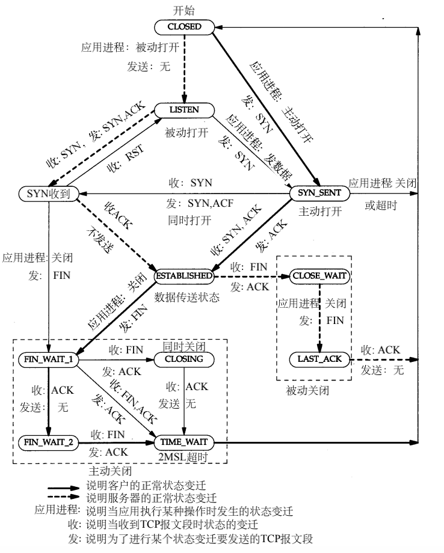

# 一、TCP状态

TCP协议操作可以分为三个阶段。在进入数据传输阶段之前，必须在多步握手过程（连接建立）中正确建立连接。数据传输完成后，连接终止将关闭已建立的虚拟电路并释放所有分配的资源。

TCP连接由操作系统通过代表通信本地端点（即Internet套接字）的资源进行管理。在TCP连接的生存期内，本地端点会发生一系列状态变化：

## LISTEN

(server) represents waiting for a connection request from any remote TCP and port.

（服务器）表示等待来自任何远程TCP和端口的连接请求。

## SYN-SENT

(client) represents waiting for a matching connection request after having sent a connection request.

（客户端）表示发送连接请求后等待匹配的连接请求。

## SYN-RECEIVED

(server) represents waiting for a confirming connection request acknowledgment after having both received and sent a connection request.

（服务器）代表在接收到并发送了连接请求之后，等待确认连接请求。

## ESTABLISHED

(both server and client) represents an open connection, data received can be delivered to the user. The normal state for the data transfer phase of the connection.

（服务器和客户端）代表一个开放的连接，接收到的数据可以传递给用户。连接的数据传输阶段的正常状态。

## FIN-WAIT-1

(both server and client) represents waiting for a connection termination request from the remote TCP, or an acknowledgment of the connection termination request previously sent.

（服务器和客户端）代表等待来自远程TCP的连接终止请求，或者等待先前发送的连接终止请求的确认。

## FIN-WAIT-2

(both server and client) represents waiting for a connection termination request from the remote TCP.

(服务器和客户端)表示等待来自远程TCP的连接终止请求。

## CLOSE-WAIT

(both server and client) represents waiting for a connection termination request from the local user.

（服务器和客户端）都表示正在等待本地用户的连接终止请求。

## LAST-ACK

(both server and client) represents waiting for an acknowledgment of the connection termination request previously sent to the remote TCP (which includes an acknowledgment of its connection termination request).

（服务器和客户端）代表等待先前发送到远程TCP的连接终止请求的确认（其中包括其连接终止请求的确认）。

## TIME-WAIT

(either server or client) represents waiting for enough time to pass to be sure the remote TCP received the acknowledgment of its connection termination request.

（服务器或客户端）代表等待足够的时间以确保远程TCP收到其连接终止请求的确认。

## **CLOSED**

(both server and client) represents no connection state at all.

(服务器和客户端)表示根本没有连接状态。

# 二、TCP状态转移图

