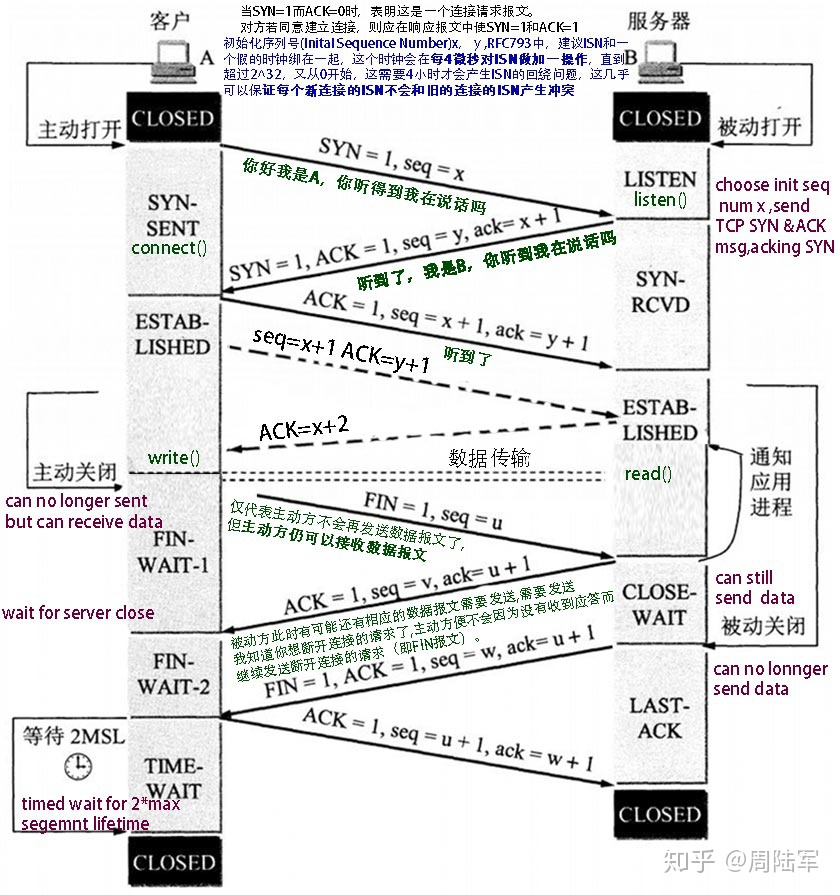

# 一、连接建立和终止

为了建立连接，TCP使用三次握手。在客户端尝试与服务器连接之前，服务器必须首先绑定并侦听端口以打开其连接：这称为被动打开。一旦建立了被动打开，客户端就可以发起主动打开。要建立连接，需要进行三次（或三步）握手：

- **SYNC**：The active open is performed by the client sending a SYN to the server. The client sets the segment's sequence number to a random value A.
- **SYN-ACK**: In response, the server replies with a SYN-ACK. The acknowledgment number is set to one more than the received sequence number i.e. A+1, and the sequence number that the server chooses for the packet is another random number, B.
- **ACK**: Finally, the client sends an ACK back to the server. The sequence number is set to the received acknowledgement value i.e. A+1, and the acknowledgement number is set to one more than the received sequence number i.e. B+1.

# 二、TCP为什么是四次挥手，而不是三次挥手

因为TCP是全双工通信的。

   （1）第一次挥手

​     因此当主动方发送断开连接的请求（即FIN报文）给被动方时，仅仅代表主动方不会再发送数据报文了，但主动方仍可以接收数据报文。

​    （2）第二次挥手

​     被动方此时有可能还有相应的数据报文需要发送，因此需要先发送ACK报文，告知主动方“我知道你想断开连接的请求了”。这样主动方便不会因为没有收到应答而继续发送断开连接的请求（即FIN报文）。

   （3）第三次挥手

​    被动方在处理完数据报文后，便发送给主动方FIN报文；这样可以保证数据通信正常可靠地完成。发送完FIN报文后，被动方进入LAST_ACK阶段（超时等待）。

   （4）第四挥手

​    如果主动方及时发送ACK报文进行连接中断的确认，这时被动方就直接释放连接，进入可用状态

# 三、为什么需要TIME_WAIT状态

假设最后的ACK丢失，server将重发FIN，client必须维护TCP状态信息以便可以重发最后的ACK，否则将会发送RST，结果server认为发生错误。TCP实现必须可靠地终止连接的两个方向，所以client必须进入TIME_WAIT状态。

此外，考虑一种情况，TCP实现可能面临着先后两个相同的五元组。如果前一个连接处于TIME_WAIT状态，而允许另一个拥有相同五元组连接出现，可能处理TCP报文时，两个连接互相干扰。所以使用SO_REUSEADDR选项就需要考虑这种情况。

# 四、什么是2MSL

MSL是Maximum Segment Lifetime,译为“报文最大生存时间”，他是任何报文在网络上存在的最长时间，超过这个时间报文将被丢弃。
因为TCP报文（segment）是IP数据报（datagram）的数据部分，而IP头中有一个TTL域，TTL是time to live的缩写，中文可以译为“生存时间”，这个生存时间是由源主机设置初始值但不是存的具体时间，而是存储了一个IP数据报可以经过的最大路由数，每经过一个处理他的路由器此值就减1，当此值为0则数据报将被丢弃，同时发送ICMP报文通知源主机。
RFC 793中规定MSL为2分钟，实际应用中常用的是30秒，1分钟和2分钟等
2MSL即两倍的MSL，TCP的TIME_WAIT状态也称为2MSL等待状态，当TCP的一端发起主动关闭，在发出最后一个ACK包后，即第3次握手完成后发送了第四次握手的ACK包后就进入了TIME_WAIT状态，必须在此状态上停留两倍的MSL时间。
等待2MSL时间主要目的是怕最后一个ACK包对方没收到，那么对方在超时后将重发第三次握手的FIN包，主动关闭端接到重发的FIN包后可以再发一个ACK应答包。
在TIME_WAIT状态时两端的端口不能使用，要等到2MSL时间结束才可继续使用。
当连接处于2MSL等待阶段时任何迟到的报文段都将被丢弃。不过在实际应用中可以通过设置SO_REUSEADDR选项达到不必等待2MSL时间结束再使用此端口。

TTL与MSL是有关系的但不是简单的相等的关系，MSL要大于等于TTL。

# 四、TIME_WAIT和CLOSE_WAIT状态区别

TIME_WAIT 是主动关闭链接时形成的，等待2MSL时间，约4分钟。主要是防止最后一个ACK丢失。 由于TIME_WAIT 的时间会非常长，因此server端应尽量减少主动关闭连接。

CLOSE_WAIT是被动关闭连接是形成的。根据TCP状态机，服务器端收到客户端发送的FIN，则按照TCP实现发送ACK，因此进入CLOSE_WAIT状态。但如果服务器端不执行close()，就不能由CLOSE_WAIT迁移到LAST_ACK，则系统中会存在很多CLOSE_WAIT状态的连接。此时，可能是系统忙于处理读、写操作，而未将已收到FIN的连接，进行close。此时，recv/read已收到FIN的连接socket，会返回0。

# 四、为什么TCP4次挥手时等待为2MSL？

> MSL 是Maximum Segment Lifetime英文的缩写，中文可以译为“报文最大生存时间”，他是任何报文在网络上存在的最长时间，超过这个时间报文将被丢弃。
>
> MSL时间是规定，不是算出来的，至少是分钟级别的。
>
> 而你所说的超时其实是重传定时器 这个是算法给出来的单位是秒。 在一个msl里肯定至少重传了一次。

