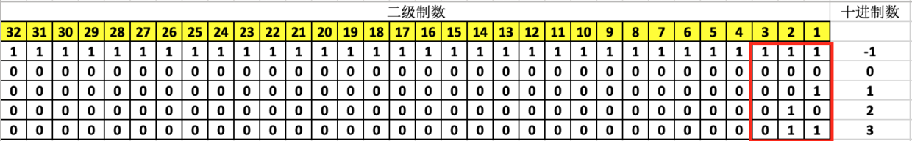
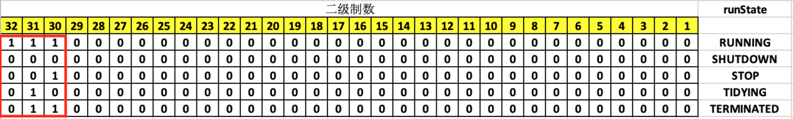

# 一、ctl

## 1.1. ctl变量含义

ThreadPoolExecutor定义了一个整型的变量ctl：

~~~java
private static final AtomicInteger ctl = new AtomicInteger(ctlOf(RUNNING, 0));
~~~
这个变量存储两种信息：
- workerCount: 当前的工作线程数量
- runState：线程池的状态

一个变量表示存储两种信息的方法：按位切割使用。

>就像ReentrantReadWriteLock一样，state变量的高16位表示读锁被获取次数，低16位表示写锁被获取次数。

## 1.2. 线程池状态
线程池的状态有6种，如下表所示：

|参数|含义|
|---|---|
|RUNNING|接受新任务，处理队列中的任务|
|SHUTDOWN|不接受新任务，处理队列中的任务|
|STOP|不接受新任务、不处理队列中的任务，并且会中断进行中的任务|
|TIDYING|所有任务已停止，任务线程为0，线程转换到TIDYING|
|TERMINATED|线程池已结束，即terminated()方法执行完|

## 1.3. 状态十进制表示
如果是用十进制数表示这些状态的值，可以是这样的：

~~~java
RUNNING        = -1;
SHUTDOWN       =  0;
STOP           =  1;
TIDYING        =  2;
TERMINATED     =  3;
~~~

## 1.4. 状态二进制表示
这也是我们自己写代码的时候的常用方式，现在来看看这些数在机器中存储的二进制数表示：

按照上面说的按位切割的方式，可以使用3个bit位来表示5个状态，其他的bit位用于表示工作线程数量。

## 1.5. 按位切割表示
ThreadPoolExecutor规定高3位表示状态，低29位表示工作线程数量。按照这种规定，状态变量的表示如下：

我们可以发现通过在十进制实际二进制的基础上左移29位可以实现。代码中也是这样处理的:
~~~
private static final int RUNNING    = -1 << COUNT_BITS;
private static final int SHUTDOWN   =  0 << COUNT_BITS;
private static final int STOP       =  1 << COUNT_BITS;
private static final int TIDYING    =  2 << COUNT_BITS;
private static final int TERMINATED =  3 << COUNT_BITS;
~~~
> COUNT_BITS = Integer.SIZE - 3
> Integer.SIZE = 32 （4个byte表示整型）

这样处理后各状态十进制数为：
~~~
RUNNING = -536870912
SHUTDOWN = 0
STOP = 536870912
TIDYING = 1073741824
TERMINATED = 1610612736
~~~

## 1.6. 工作线程总数
低29位表示工作线程的数量也就是29个1表示：

~~~java
00011111111111111111111111111111 = 536870911
~~~

1左移29位然后减1得到的就是这个数，代码中是这样计算的：

~~~java
private static final int CAPACITY   = (1 << COUNT_BITS) - 1;
~~~

## 1.7. ctl获取状态

ctl表示了两部分信息，状态信息只有前3位有效，用它表示状态，那么就忽略低29位，也就是低29位为0即可，代码中通过这样的方式从ctl中获取当前状态的值：

~~~java
private static int runStateOf(int c)     {
    return c & ~CAPACITY; 
}
~~~
~CAPACITY的二进制表示为：

~~~java
~CAPACITY = 11100000000000000000000000000000
~~~
"与"上ctl后ctl低29位为0。

## 1.8. ctl获取工作线程数量

与上面类似，要从ctl中获取工作线程的数量，那么高3位就要为全0。

代码中是这样操作的：

~~~
private static int workerCountOf(int c)  { 
    return c & CAPACITY; 
}
~~~

CAPACITY的二进制表示为：

~~~
CAPACITY = 00011111111111111111111111111111
~~~
"与"上ctl后高3位全为0。

## 1.9. 重设ctl

我们在代码中会获取上面两部分之后单独操作，那么改变之后就要重设ctl，重设的方式如下：

~~~
private static int ctlOf(int rs, int wc) { 
    return rs | wc; 
}
~~~
按位"或"，两个位只要有一个为1，那么结果就是1，否则就为0。

