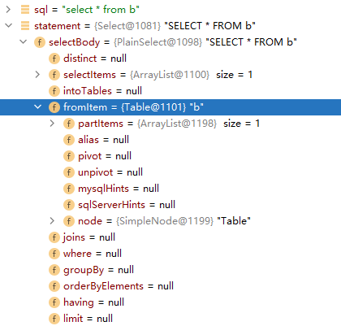

# Select

## PlainSelect

### SelectBody

#### SelectItem

##### AllColumns

##### SelectExpressionItem

##### AllTableColumns

#### FromItem

##### Table

##### ParenthesisFromItem

##### SubJoin

