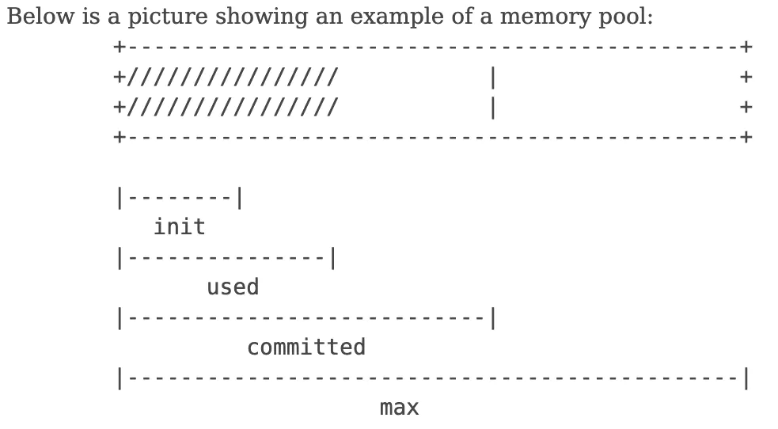

*"Why is my “Committed” memory so much higher than my actual RAM space?"* Because "committed" is mostly process-private *virtual* address space, and some of this can be in RAM and some in the pagefile.

And some might not occupy any storage at all! That's if it's been allocated but never accessed, hence not "faulted in", yet. But it still counts against the "commit limit" because if it's it accessed in the future, it will occupy storage *then*. And that's too late for the system to say "sorry, we're all out of room."

**Committed memory(jvm.memory.committed): It is the amount of memory that is guaranteed to be available for use by the Java virtual machine. The amount of committed memory can easily change over time. The Java virtual machine may release memory to the system and committed memory could be less than initial memory. Committed memory will always be greater than or equal to the used memory.**

