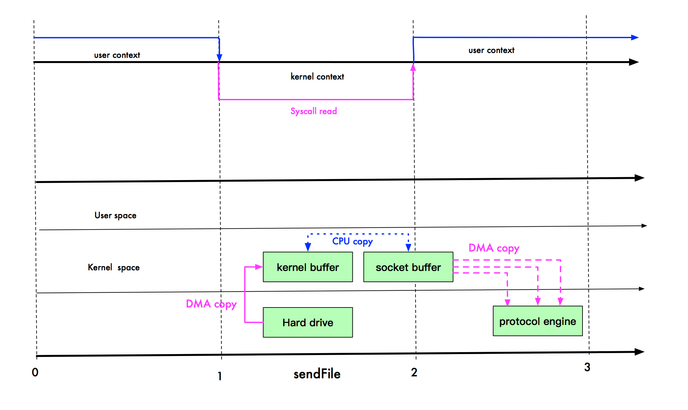

# 零拷贝

https://man7.org/linux/man-pages/man2/sendfile.2.html

https://xunnanxu.github.io/2016/09/10/It-s-all-about-buffers-zero-copy-mmap-and-Java-NIO/

https://medium.com/swlh/linux-zero-copy-using-sendfile-75d2eb56b39b

https://developer.ibm.com/languages/java/articles/j-zerocopy/#trad

https://ducmanhphan.github.io/2020-04-06-Understanding-about-Zero-copy/

https://www.cnblogs.com/xiaolincoding/p/13719610.html

You may say OS still has to make a copy of the data in kernel memory space. Yes but from OS’s perspective this is already zero-copy because there’s no data copied from kernel space to user space. The reason why kernel needs to make a copy is because general hardware DMA access expects consecutive memory space (and hence the buffer). However this is avoidable if the hardware supports scatter-n-gather.

# 零拷贝示意图

## 普通IO

## mmap

## sendFile

