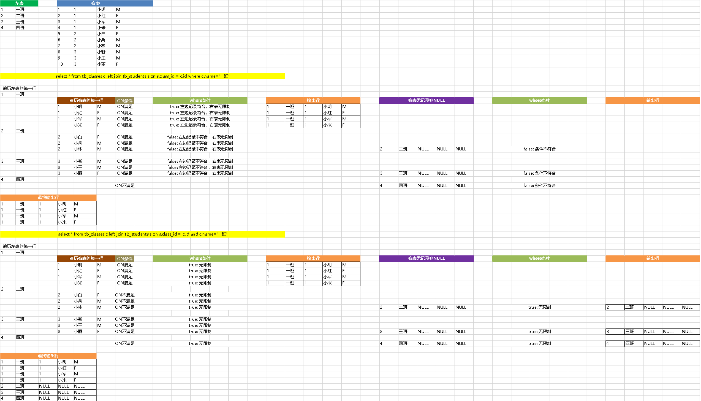

# 一、LEFT JOIN使用示例

## 一对多

~~~sql
SELECT * FROM classes;

id    name
1    一班
2    二班
3    三班
4    四班

SELECT * FROM students;

id  class_id  name   gender
1    1        小明        M
2    1        小红        F
3    1        小军        M
4    1        小米        F
5    2        小白        F
6    2        小兵        M
7    2        小林        M
8    3        小新        F
9    3        小王        M
10    3        小丽       F
~~~

~~~sql
select * from tb_classes c left join tb_students s on s.class_id=c.id

id  name id(1) class_id name(1) gender
1	一班	1	1	小明	M
1	一班	2	1	小红	F
1	一班	3	1	小军	M
1	一班	4	1	小米	F
2	二班	5	2	小白	F
2	二班	6	2	小兵	M
2	二班	7	2	小林	M
3	三班	8	3	小新	M
3	三班	9	3	小王	M
3	三班	10	3	小丽	F
4	四班				
~~~

# 二、Where和ON使用对比

~~~sql
select * from tb_classes c left join tb_students s on s.class_id = c.id where c.name='一班'

1	一班	1	1	小明	M
1	一班	2	1	小红	F
1	一班	3	1	小军	M
1	一班	4	1	小米	F
~~~

~~~sql
select * from tb_classes c left join tb_students s on s.class_id = c.id and c.name='一班'

1	一班	1	1	小明	M
1	一班	2	1	小红	F
1	一班	3	1	小军	M
1	一班	4	1	小米	F
2	二班				
3	三班				
4	四班				
~~~

结果解析（先看第三节内容）：

# 三、 LEFT JOIN实现原理

**mysql** 对于`left join`的采用类似**嵌套循环**的方式来进行从处理，以下面的语句为例：

~~~sql
SELECT * FROM LT LEFT JOIN RT ON P1(LT,RT)) WHERE P2(LT,RT)
~~~

其中`P1`是`on`过滤条件，缺失则认为是`TRUE`，`P2`是`where`过滤条件，缺失也认为是`TRUE`，该语句的执行逻辑可以描述为：

~~~
FOR each row lt in LT {// 遍历左表的每一行
  BOOL b = FALSE;
  FOR each row rt in RT such that P1(lt, rt) {// 遍历右表每一行，找到满足join条件的行
    IF P2(lt, rt) {//满足 where 过滤条件
      t:=lt||rt;//合并行，输出该行
    }
    b=TRUE;// lt在RT中有对应的行
  }
  IF (!b) { // 遍历完RT，发现lt在RT中没有有对应的行，则尝试用null补一行
    IF P2(lt,NULL) {// 补上null后满足 where 过滤条件
      t:=lt||NULL; // 输出lt和null补上的行
    }         
  }
}
~~~

当然，实际情况中MySQL会使用buffer的方式进行优化，减少行比较次数，不过这不影响关键的执行流程，不在本文讨论范围之内。

从这个伪代码中，我们可以看出两点：

1. 如果想对右表进行限制，则一定要在`on`条件中进行，若在`where`中进行则可能导致数据缺失，导致左表在右表中无匹配行的行在最终结果中不出现，违背了我们对`left join`的理解。因为对左表无右表匹配行的行而言，遍历右表后`b=FALSE`,所以会尝试用`NULL`补齐右表，但是此时我们的`P2`对右表行进行了限制，NULL若不满足`P2`(`NULL`一般都不会满足限制条件，除非`IS NULL`这种)，则不会加入最终的结果中，导致结果缺失。
2. 如果没有`where`条件，无论`on`条件对左表进行怎样的限制，左表的每一行都至少会有一行的合成结果，对左表行而言，若右表若没有对应的行，则右表遍历结束后`b=FALSE`，会用一行`NULL`来生成数据，而这个数据是多余的。所以对左表进行过滤必须用where。

