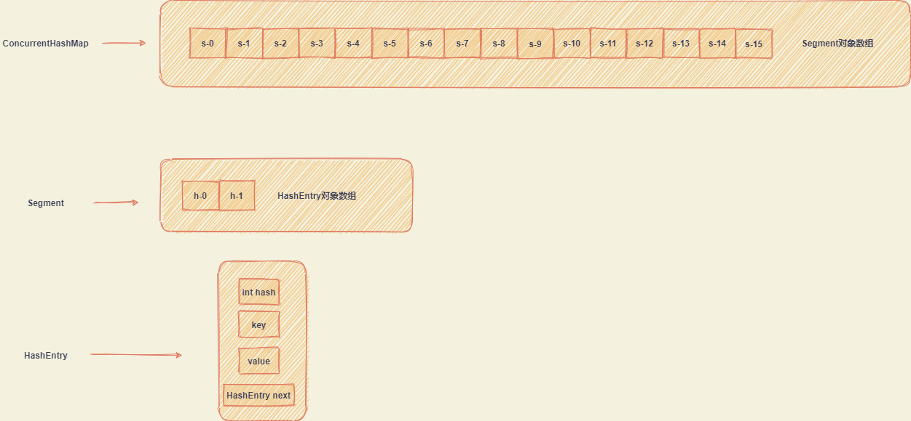

# 一、1.7

## 1.1. 内部结构

## 1.2. 初始化

上面已经介绍了ConcurrentHashMap的内部数据结构，可以看到有两个数组：Segment数组和Sgement对象内的HashEntry数组。

初始化的过程主要是对这两个数组进行初始化，确定数组的大小。

初始化逻辑如下：

~~~java
public ConcurrentHashMap(int initialCapacity,
                             float loadFactor, int concurrencyLevel) {
        if (!(loadFactor > 0) || initialCapacity < 0 || concurrencyLevel <= 0)
            throw new IllegalArgumentException();
        if (concurrencyLevel > MAX_SEGMENTS)
            concurrencyLevel = MAX_SEGMENTS;
        // Find power-of-two sizes best matching arguments
        int sshift = 0;
        int ssize = 1;
        while (ssize < concurrencyLevel) {
            ++sshift;
            ssize <<= 1;
        }
        this.segmentShift = 32 - sshift;
        this.segmentMask = ssize - 1;
        if (initialCapacity > MAXIMUM_CAPACITY)
            initialCapacity = MAXIMUM_CAPACITY;
        int c = initialCapacity / ssize;
        if (c * ssize < initialCapacity)
            ++c;
        int cap = MIN_SEGMENT_TABLE_CAPACITY;
        while (cap < c)
            cap <<= 1;
        // create segments and segments[0]
        Segment<K,V> s0 =
            new Segment<K,V>(loadFactor, (int)(cap * loadFactor),
                             (HashEntry<K,V>[])new HashEntry[cap]);
        Segment<K,V>[] ss = (Segment<K,V>[])new Segment[ssize];
        UNSAFE.putOrderedObject(ss, SBASE, s0); // ordered write of segments[0]
        this.segments = ss;
    }
~~~

### Segment数组长度

Segment数组默认大小是16，要求是2次幂。

> 关于为什么是二次幂，参考上一篇HashMap的介绍。

ConcurrentHashMap采用分段锁的方式来解决并发问题，Segment数组的长度就是预估的同时操作ConcurrentHashMap的线程的个数。比如说初始值为16，就假定了有16个不同的线程同时操作ConcurrentHashMap。

用户可以通过上面构造方法中的concurrencyLevel参数来指定预估的线程数。

线程数对应于Segment数组的长度，而Segment的长度要求为2次幂，所以当指定的concurrencyLevel参数不是2次幂的结果时就需要寻找出最接近的大于此参数值的2次幂的数。

> 找出的值大于concurrencyLevel，是因为本身预估会有这么多线程，不能重新确定的数组长度小于这个值吧。

比如说concurrencyLevel指定为15，那么找出来的数就是2^4 = 16。

逻辑如下：

~~~java
// Find power-of-two sizes best matching arguments
int sshift = 0;
int ssize = 1;
while (ssize < concurrencyLevel) {
    ++sshift;
    ssize <<= 1;
}
~~~

sshift表示左移的次数。

ssize表示最终确定的Segment的长度（2次幂）。

### Segment对象内的HashEntry数组长度

Segment数组的长度确定了，下面就是确定Segment对象内的HashEntry数组的长度。

ConcurrentHashMap存储数据，就是把元素分散开来存储到这一个个HashEntry数组中。那么每个HashEntry平均存几个呢？

> Segment中HashEntry长度初始值为2

这里可以看到HashEntry数组的大小与ConcurrentMap要存的元素的个数有关系，也就是说与ConcurrentHashMap的容量有关系，即initialCapacity参数。

假设initialCapacity=32，也就是说ConcurrentHashMap要存储32个数，Segment数组长度为16，那么每个Segment存储的元素的个数就为：

~~~java
32  / 16 = 2
~~~

即Segment对象的HashEntry数组长度为2。

再假设initialCapacity=33，HashEntry长度为2的话，不能放下，那么就需要重新确定长度，HashEntry是Segment内的数组，Segment相当于就是一个HashMap对象，也是要求其内部数组的长度是2次幂的，所以HashEntry长度进行增加，也应该满足增加后还是2次幂。那么长度就确定为4，Segment对象的HashEntry数组长度的计算逻辑如下：

~~~java
if (initialCapacity > MAXIMUM_CAPACITY)
            initialCapacity = MAXIMUM_CAPACITY;
        int c = initialCapacity / ssize;
        if (c * ssize < initialCapacity)
            ++c;
        int cap = MIN_SEGMENT_TABLE_CAPACITY;
        while (cap < c)
            cap <<= 1;
        // create segments and segments[0]
        Segment<K,V> s0 =
            new Segment<K,V>(loadFactor, (int)(cap * loadFactor),
                             (HashEntry<K,V>[])new HashEntry[cap]);
 ...
 UNSAFE.putOrderedObject(ss, SBASE, s0); // ordered write of segments[0]
~~~

### segmentMask

这个值 =  segment数组长度 - 1。用于确定数组的索引。与HashMap中索引确定类似：

~~~java
static int indexFor(int h, int length) {
    // assert Integer.bitCount(length) == 1 : "length must be a non-zero power of 2";
    return h & (length-1);
}
~~~

segmentMask的值就是这里的length-1。

#### segmentShift

segmentMask = 2^k - 1，低k位为1，其余位为0，ConcurrentHashMap存储值时，根据key计算出hashcode，然后通过hashcode再来计算存储到哪个Segment中，hashcode是一个32位的int数，如果直接通过hashcode与2^k - 1进行&操作，那么hashcode中高位的特征信息就会丢失，hashcode中高位信息比低位信息更具有价值性，所以为了保留hashcode的高k位信息，就需要计算出hashcode之后，再右移32-k，再与2^k-1进行&运算。

~~~java
this.segmentShift = 32 - sshift;
~~~

确定在Segment数组中的索引：

~~~java
int hash = hash(key);
int j = (hash >>> segmentShift) & segmentMask;
~~~

## 1.3. put操作

### 1.3.1. 选择Segment数组索引

~~~java
int hash = hash(key);
int j = (hash >>> segmentShift) & segmentMask;
~~~

这个确认逻辑上面已经介绍过。

### 1.3.2. 指定索引的Segment对象不存在则创建

初始化ConcurrentHashMap时候，Segment数组初始化后，只设置了0索引的Segment对象，如果上面计算出的索引内不存在Segment对象，则进行创建。Segment内HashEntry的数组长度大小，取第0索引的Segment对象的HashEntry的数组大小，也就是说在创建非0索引为的Segment对象时，创建对象所需的信息都来自于第0索引的Segment对象。

多线程的情况下可能会有多个线程同时操作Segment的创建，所以需要同步操作，内部源码使用的是CAS来保证Segment对象在多线程环境下的创建。

~~~java
while ((seg = (Segment<K,V>)UNSAFE.getObjectVolatile(ss, u))
       == null) {
    if (UNSAFE.compareAndSwapObject(ss, u, null, seg = s))
        break;
}
~~~

### 1.3.3. 

