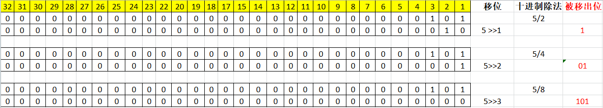
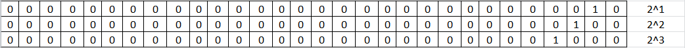
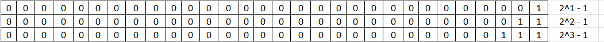

# 一、HashMap属性

## 1.1. DEFAULT_INITIAL_CAPACITY

~~~java
/**
 * The default initial capacity - MUST be a power of two.
*/
static final int DEFAULT_INITIAL_CAPACITY = 1 << 4; // aka 16
~~~

这里讨论的是为什么容量规定为2次幂。

这里先下结论：因为要对key求其在数组的索引，执行的操作是求余操作，而如果数组的长度是2次幂的话就可以使用&操作，这样性能更好。

具体分析如下：

### 位运算(&)来实现取模运算(%)

我们知道乘除法使用位运算进行替换时有这样的规律：对二进制数左移一位相当于其对应的十进制数值乘以2，右移一位相当于除以2。

**有求商操作**：被除数为X，除数为2^K，求 （X / 2^K ）。

根据上面的规则我们使用位运算来进行操作，也就是说X的二进制右移K位即可。

~~~java
System.out.println("5/2=" + (5 >> 1) );
System.out.println("5/4=" + (5 >> 2) );
System.out.println("5/8=" + (5 >> 3) );
~~~

执行结果为：

~~~java
5/2=2
5/4=1
5/8=0
~~~

**有求余操作**：被除数为X，除数为2^K，求 （X % 2^K ）。

仍然从位操作的角度来思考，我们来看一下下面的操作展示：

通过上面的图示我们可以发现一个规律，通过位移操作后，被移出的位所对应的十进制数值即为余数。

也就是说求(X%2^K)，通过位操作来运算的话就是保留X后K位。

5%2^1 = 保留5的二进制数的后1位
5%2^2 = 保留5的二进制数的后2位
5%2^3 = 保留5的二进制数的后3位

被除数是2的K次方，相对应的2进制有如下的表示形式：

后K全为0。做2^K-1操作，二进制形式如下：

后K为全为1。那么就可以想到要保留X的后K位的话，就可以与上面的二进制数进行&操作即可。

**总结：当a=2^k(k为自然数)时，x % a = x & (a - 1 )**

注意用位运算代替取模运算有两个限制：

- 被除数为正整数
- 除数为2^k（k为自然数）

JDK的HashMap的源码中，也是采用位操作代替取模这种方式来确定键值在哈希表中的索引：

~~~java
i = (n - 1) & hash
~~~

## 1.2. DEFAULT_LOAD_FACTOR

加载因子也叫作扩容因子，用来判断什么时候进行扩容，假设加载因子为0.75，HashMap的初始容量为16，当HashMap中有16 * 0.75 = 12个容量时，HashMap就会进行扩容。

如果加载因子越大，扩容发生的频率就会比较低，占用空间比较小，但是发生hash冲突的几率会提升，对元素操作时间会增加，运行效率降低；

如果加载因子太小，那么表中的数据将过于稀疏（很多空间还没用，就开始扩容了），对空间造成严重浪费；

为什么取0.75呢？首先，加载因子肯定是(0,1]在这个区间。之所以考虑设为0.75，是性能和空间的一个最好的折中吧。

# 二、HashMap方法

## 2.1. hash(Object key)

方法如下：

~~~java
static final int hash(Object key) {
  int h;
  return (key == null) ? 0 : (h = key.hashCode()) ^ (h >>> 16);
}
~~~

首先有一点，后面计算在数组中的索引，我们上面分析了是和数组长度-1进行与操作，数组长度是2次幂，设为2^k。

~~~java
索引 = hash & (2^K - 1)
~~~

2^k-1，根据我们上面的分析，后k位为1。

假设我们直接使用key本身的hashcode来进行&操作，那么高位部分所代表的特征就丢失了。

~~~java
(h = key.hashCode()) ^ (h >>> 16)
~~~

HashMap的hash算法的操作是：高16位与低16位进行异或操作。

~~~

0011 1100
0000 1111 // 无符号右移2位
---------
0011 0011 ^
0011 1111 | 向1靠拢
0000 1100 & 向0靠拢
~~~

异或操作相对于其他两个操作，能更大程度保留高低本来的特征。

所以高16位与低16位进行异或操作，然后再与2^k进行&操作，能够再得到索引的同时更好的保留key的hash code的差异性，减少hash冲突。

> 为什么用异或？

# 三、为什么采用尾插法

头插入法在多线程情况下会出现环。

